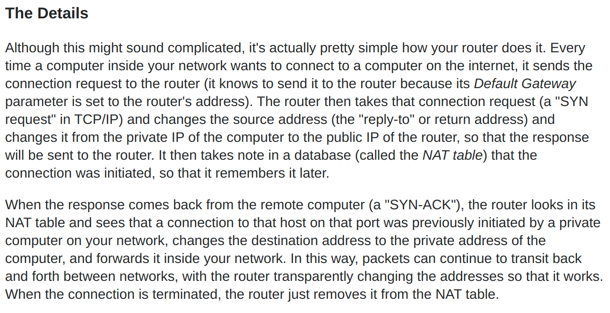
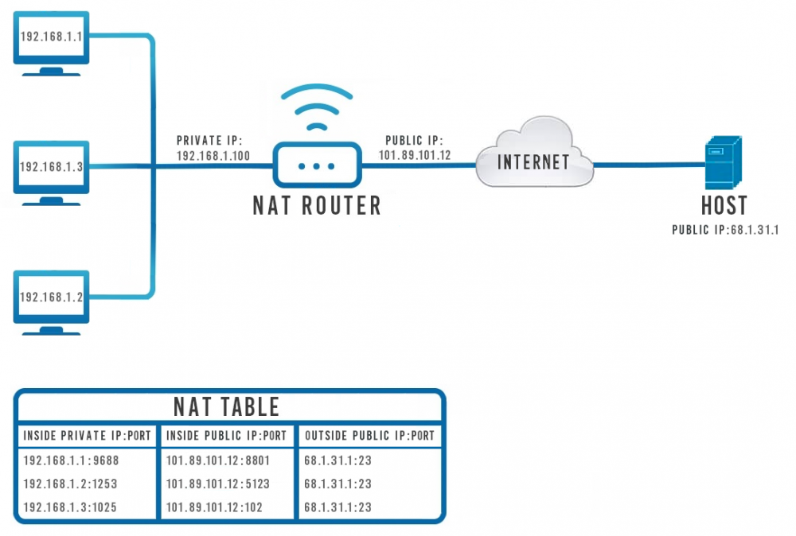

#Basics of Computer Networking

- **Computer Network:** The interconnetcion of multiple devices, generally termed as hosts, for the purpose of sharing data.
- **Network Devices:** Router, Switch, Hub, Bridge
- **Protocol:** a set of rules or algorithms which define how two entities can communicate across the Network

#### Unique Identifiers of Network
- **Hostname:** each device in the networj is associated with a unique device name known as the Hostname
  - Coommand `hostname` in terminal, output is the hostname of the device
- **IP Address:** Number that identifies a machine on the network and across the internet
  - Command ipconfig gives us the IP address of the device
- **MAC address:** a unique indentifier of each host and is associated with the Network Interface Card. It is assigned to the NIC at the time of manufacturing
- **Port:** Logical channel through which data can be sent/received to an application
  - Any host may have multiple applications running, and each of the apps is identified using the port number on which they are running.
- **Socket:** The unique combination of IP address and Port number together termed as Socket

#### Few More Concepts
- **DNS (Domain Name Server):** A server in charge of mapping domain name humans use into ip address

#### Public vs Private IP addresses

###### Public IP Addresses

- `Public IP address` is assigned to router by ISP
  - Router uses this IP address to interface/connect/communicate with other computers in the internet
###### Private IP Addresses
- assigned to computers in private network by Router
- Router assigns `private/reserved IP addresses` to devices within your private network via `DHCP protocol`
  - `private Ips` are how computers in the network communicate with each other and the router
- Computers outside network can not communicate directly with local computers just by using their private addresses

