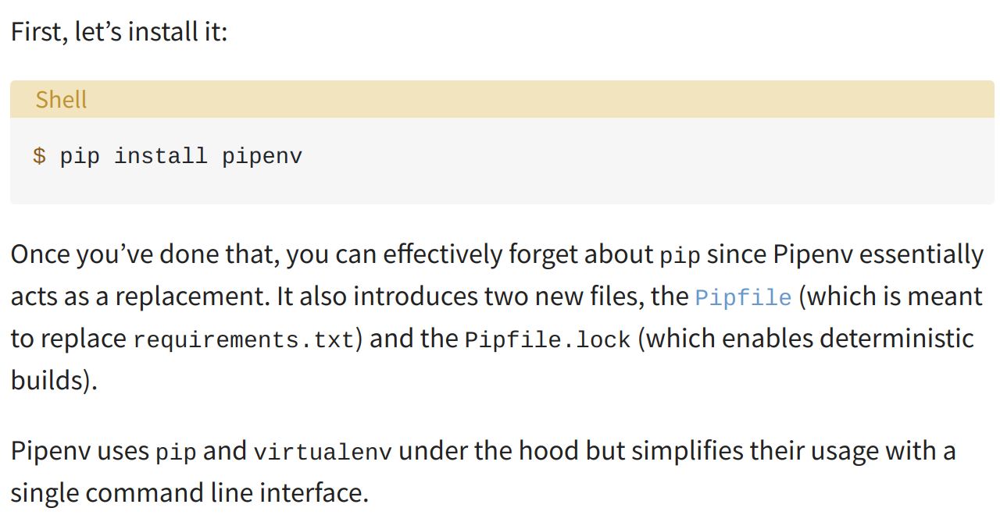
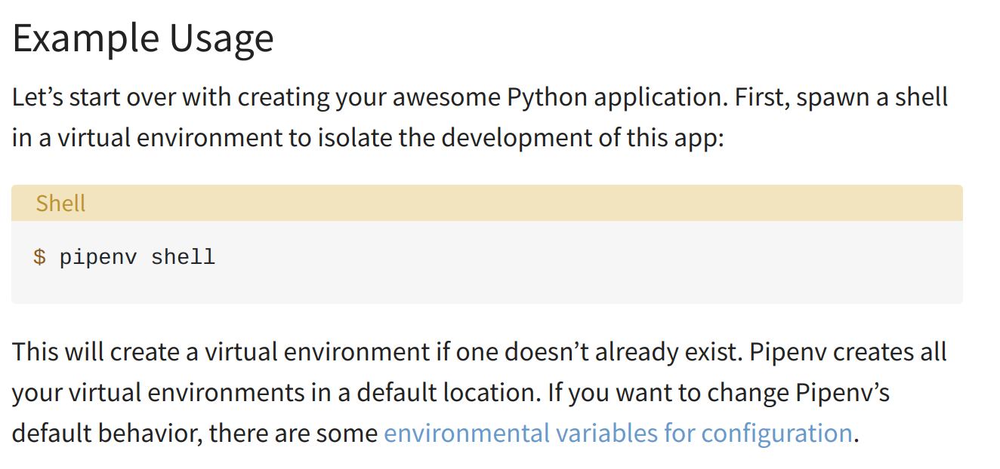
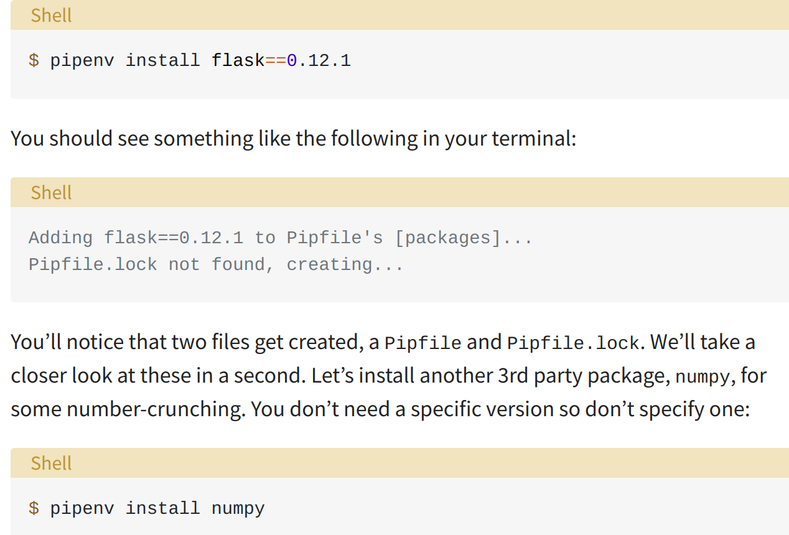
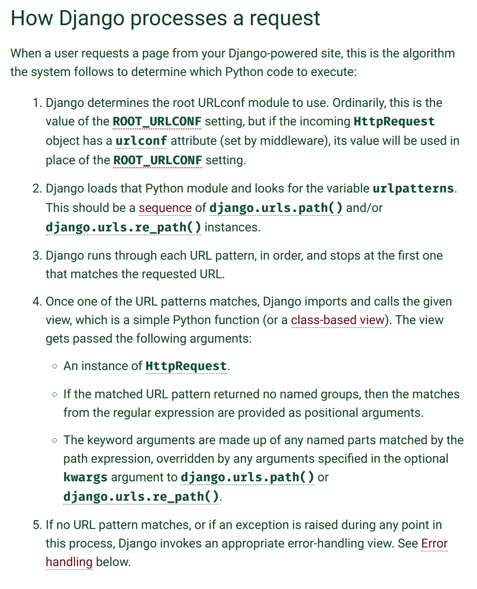

### Virtual Environment
https://realpython.com/pipenv-guide/
- isolated containers containing all software dependencies for a given project
- helpful if we want to use different versions of django or modules for different projects
- Project A can use Django 1.8 and Project B can use Django 2 without a
problem
- **You should have a dedicated virtual environment for each project**
- historically, `virtualenv` or `pyenv` has been used to configure virtual environment
  - we will use the new officially recommended `pipenv`


#### How does `pipenv` work?
- it creates two files
  - `Pipfile` containing software dependencies
  - `Pipfile.lock` for ensuring deterministic builds

#### How to use?

Summary:
1) `pipenv shell` to activate it (and create it if it is not created)
2) `pip install django==2.1 or some other module` to install packages within isolated container
3) `exit` to quit virtual environment
<br>
##### install pipenv




##### create a virtual environment




##### install modules



<br>

## Django
- a web framework with many out of the box featured

In Django Lnaguage:
- **Views** = **Controller**
- **Templates** = **Views**
- **View Function** = **Handler Method**


### Using Django
- Django divides all of its web application into `projects`
- each `project` is composed of one or more `apps`
- to start a new project, run `django-admin startproject projectname`

### Project Components
- Django creates a number of files with a new project
  - `__init__.py` : defines the directory `projectname` as a python `package`, a collection of `.py` files
  - `manage.py` : a python script that can be used to perform useful operations on a web application
  - `settings.py` : basic settings, like time zone, other apps installed in the project, what sort of DB, etc
  - `urls.py` : determines what URLs/routes can be accesed using the web application
  - `wsgi.py` : a file that helps to deploy an application to a web server
  - `project_name/` : the directory for the project that contains all of the above files by default

### A basic Application
- to create an app inside the project directory run `python manage.py startapp appname`
- this creates a directory `appname` inside of the project directory
- `appname` will contain a number of files automatically


### Mapping Urls to View Functions
- this is done in `urls.py`

#### Why do we need project level and app level `urls.py`
- this gives developers more flexibility and ability to plug and play (re use apps in various projects)
- apps can be reused in various projects
- This allows us to define url --> view Function mapping at app level
- we need to load the app mapping to the project we are in by refering the app level `urls.py` file in the project level `urls.py` file as such:

```python
from django.contrib import admin
from django.urls import path, include

urlpatterns = [
    path('admin/', admin.site.urls),
    path('', include('pages.urls')),
]
```


#### More  Django Jargon
- `URLconf` (aka `urls.py`) : this module is pure python code and maps URL path expressions to Python functions (your view functions)


#### How Django Processes a request


