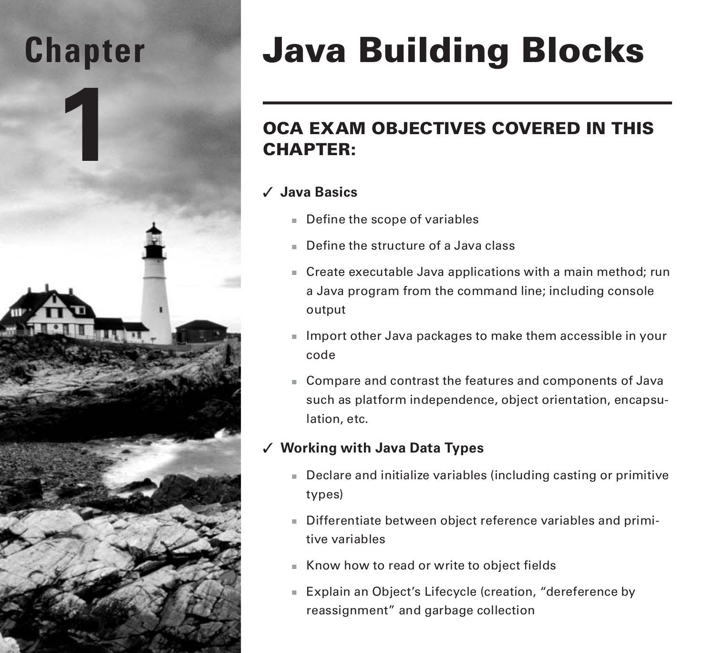

## Understanding the Java Class Structure
- **classes** are the basic building blocks
- To use most classes you have to create objects
- **Object** a runtime instance of a class
- All various objects of all classes represent state of your program

### Fields and Methods
- Java classes have two main members
  - fields (variables)
  - methods (functions/procedures)
- Variables **hold the state of the class**
- Methods **operate on that state**


Example of a class:

```java
1: public class Animal {
2: String name;
3: }
```

- `public` and `class` are  **keywords**, a special words in java
- `public` specifies class can be used by other class
- `class` specifies we are defining a class


Defining a method in a class:

```java
1: public class Animal {
2: String name;
//method
3: public String getName() {
4:return name;
5: }

6: public void setName(String newName) {
7:
name = newName;
8: }
9: }
```

- on lines 3-5 we define a method called `getName()`
  - takes in no arguments and returns a String
  - `public String getNname()` is called the method signature
- on lined 6-8 we define another method called setName(..)
  - takes a String argument and has no return value


### Classes vs Files
- Most of the time, each java class is defined in its own `.java` file
- We can define multiple classes in a single file but there can only be one public class and the name of the class must match the file name

<br>

**Permitted**
`Animal.java`


```java

public class Animal {
private String name;
}
class Animal2 {
}

```


#### Questions
- what can the file name be if we have two non public classes?


### Writing a main() Method
- a Java program begins execution with its `main()` method
- main() is the gateway between the statup process managed by the JVM and the programmers code
- The JVM calls the underlying system to allocate CPU time, memory, etc
- main() method lets us hook ur code into this process


Simple class with main method:

```java
1: public class Zoo {
2: public static void main(String[] args) {
3:
4: }
5:}
```

<br>

**to compile the code:**

`javac Zoo.java`

- this command generates a file called `Zoo.class`
- the `.class` file contains bytecode that the JVM can execute

**to execute the code:**

`java Zoo.java`

#### Review of Keywords in Main()

- `public` access modifier that allows other classes to access the method.
- `static` defines that the method belongs to the whole class
  - no need to instantiate an object to execute the method
  - in contrast with `instance methods` which are methods that belong to the objects of the class
