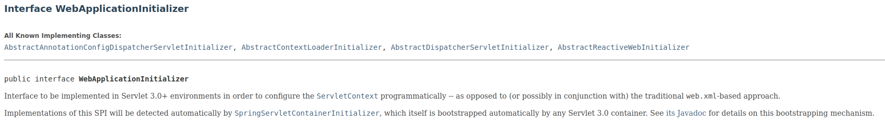

## WebApplicationInitializer

### Intro
- interface
- Used in order to configure `ServletContext` programmatically which is used by Servlet Container (Tomcat) at start up
- provides a way for programmatically creating a web app (**replacement for web.xml**)
- Purely relevant in a Servlet 3.0 + spec compliant servlet container
- Implementations will be detected by `SpringServletContainerInitializer`
  - Which itself is bootstrapped automatically by any servlet 3.0 container

## ServletContext

### Intro
- Interface

#Springboot with EnableAutoConfiguration

# Manual COnfiguration with EnableWebMvc

