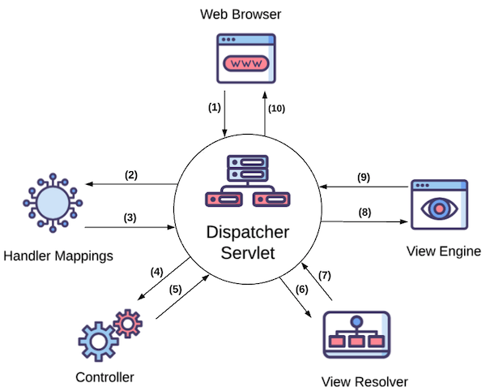
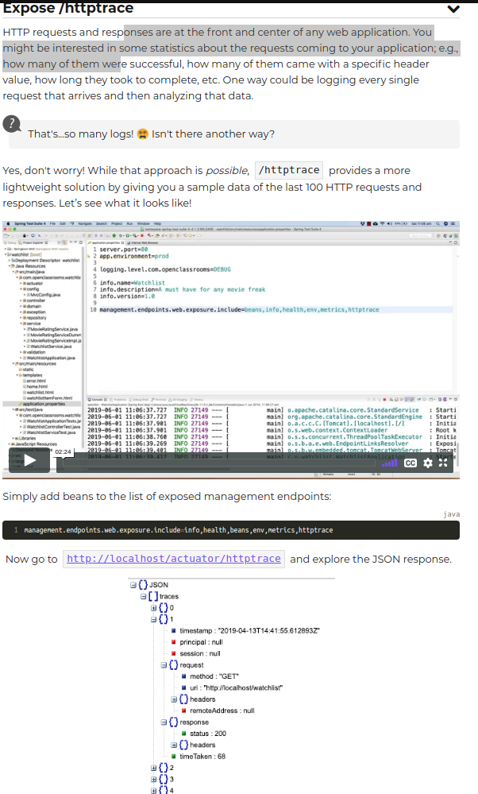

# MVC
* a design pattern that divides a user interface into three separate components

  **Model**:

    - objects contains the data to be displayed to the user

  **View**:
  - a visual representation of the data (HTML)

  **Controller**:
  - receives user requests and changes the state of the model


     

---


# Understanding Spring MVC Architecture
- the Architecture of spring mvc consists of a few cleanly separated components
- these components have well defined responsibilities
- Any of these component can be configured


####  Let's review how web apps work to understand Spring MVC
<br>

- Sole purpose of web app is to serve web requests
- HTTP requests are received and responses sent back

#### Analogy: A web app is like a marketing firm that serves its clients
<br>

1. request for new ad comes in
2. director/coordinator finds someone specialized in the content type of requested ad
3. director/coordinator asks them to come up with ideas
4. director takes ideas to graphic designers
5. graphic designer generates content for client
6. Finally, director hands result to client


#### Spring MVC follows a similar workflow to serve HTTP requests
<br>


* **DispatcherServlet** is at the center of Spring MVC




<br>

#### Function of **DispatcherServlet**
<br>

Overview:
- receives HTTP request from browser and coordinates all major components of Spring MVC to produce response for browser


Detailed:
1. A request from a web browser is sent to our Watchlist application. For example, an `HTTP GET`  request to the URL  `/Watchlist`. This request will be received by the DispatcherServlet.

2. The DispatcherServlet asks **handler mappings** to see which method of which class is responsible for processing this request. A handler mapping is like a database or a person who has records of each person’s responsibility in a company. It also maps incoming requests to **handler methods**. A handler method is a method in a Java class that handles incoming HTTP requests. The Java class that contains these methods is called a **controller class**.

3. Handler mappings send back the handler method's details to the DispatcherServlet.

4. Now that DispatcherServlet knows which method is responsible for handling this request, it makes a call to that method. The HTTP request data will also be passed to the handler method as parameters.

5. The handler method (which is written by us) processes the input. For example, it loads the name of the movies in the user’s watch list based on the input, and returns two things to the dispatcher: the name of the HTML template (view), e.g.,  watchlist.html and the data needed to render it (model), e.g., a list of watch list items.

6. Dispatcher gives the view name to the **view resolver** to get the actual view content.

7. View resolver returns the actual HTML template content back. Note that views are also written by developers while other components are parts of the framework.

8. Dispatcher gives the model and view to the **view engine** (Thymeleaf **template engine**, for example).

9. View engine merges the view template with the data and produces plain old HTML and sends it back to DispatcherServlet.

10. Finally, DispatcherServlet sends the generated HTML back to the browser.

---
# Template engine
* A program used to combine your HTML or front end code with data from the backend in order to create dynamic web pages

#### Template Engine Analogy to weeding invitations
<br>

* A wedding invitation has a specific structure (wording, paragraphs and images) but blanks are left to personalize each invitation to each attendee
* the attendee's name is filled in an invitation
* **_each attendee's name is the model/data and the raw letters are the view templates and the person/computer that merges both is the template engine_**

#### Template engine in the context of web apps
<br>

- An engine parses HTML pages that contain special tags or attributes bound to variables (template language, which is special language found embedded within a document)
- It resolves/replaces those variables with their values based on data passed into template engine
- The special tags in the HTML template are replaced with actual data to produce a normal HTML page that does not possess these special tags (template language)

<br>


## Create your first Dynamic page
- let's make the total number of items displayed in the html page dynamic
- Adding a new page or functionality to Spring MVC usually involves
  - **Adding a handler method to a new or existing controller class** to handle incoming requests and prepare and return the model and view name
  - **Creating an HTML template (view) to be rendered** with data in the model object after the request is processed

#### Add the controller class and handler methods

- we need a method to handle browser's GET requests coming to `/watchlist` URL
- Each handler method should return:
  - The **Model**
  - The **view name**
- These two are returned as an instance of the class `ModelAndView`

Two important annotations needed:
- `@Controller`
  - Is put at the top of the class (class level annotation)
  - Tells **Handler mappings** that the methods in this class are handler methods
- `@RequestMapping(method = RequestMethod.GET, value ="/")`
  - method level annotation
  - means that the method can handle `HTTP GET` requests at the specified URI
  - This info is gathered by handler mappings

#### Thymeleaf Attributes
- we will use thymeleaf to turn static HTML page to dynamic
- **thymeleaf relies on attributes that we add to HTML tags**
- These attributes will be interpreted by the Thymeleaf engine to replace the content of the tag with values generated based on the data in the model

Ex:
- `th:text` is one of these thymeleaf attributes
```HTML
<div>Number of movies to watch:  <span th:text="${numberOfMovies}"> </div>	 

```
- we pass a model object that contains a value called "numberOfMovies" that is mapped to the number of movies
-  Thymeleaf engines process the statement inside the th:text attribute and adds the value of numberOfMovies, seen below. (1234)

```java
package com.openclassrooms.watchlist;

import java.util.HashMap;
import java.util.Map;

import org.springframework.stereotype.Controller;
import org.springframework.web.bind.annotation.GetMapping;
import org.springframework.web.servlet.ModelAndView;

@Controller
public class WatchlistController {

	@GetMapping("/watchlist")
	public ModelAndView getWatchlist() {

		String viewName = "watchlist";

		Map<String, Object> model = new HashMap<String, Object>();

		model.put("numberOfMovies", "1234");

		return new ModelAndView(viewName , model);
	}
}
```


#### Adding Thymeleaf dependency
- Add dependency to pom.xml
```xml
<dependency>
      <groupId>org.springframework.boot</groupId>
      <artifactId>spring-boot-starter-thymeleaf</artifactId>
</dependency>
```

Make sure thymeleaf is added to the namespace of the HTML document:

```HTML
<html xmlns:th="http://www.thymeleaf.org">

```

---

#Handle form submissions
- It's great to show some data to a user like in the previous chapter, but we also need to receive data in our application so users can enter the name of the movies they want to watch. We’ll do this by implementing a web form.
- What is a **web form?**


-Implementing web forms usually consists of two main steps
1. **Displaying** a prepopulated or empty form to the user
2. **Receiving** the submitted data and redirecting it to another page


- Use command objects both
  - when the form loads
  - when it is submitted
- before a web form loads, put a command object (either empty or prepopulated) in the model (a map)


```html
<html xmlns:th="http://www.thymeleaf.org">
   <head>
      <!-- Meta tags -->
      <meta charset = "utf-8">
      <meta name = "viewport" content = "width = device-width, initial-scale = 1, shrink-to-fit = no">
      <link rel = "stylesheet" href = "https://stackpath.bootstrapcdn.com/bootstrap/4.1.3/css/bootstrap.min.css">

      <title>Watchlist App</title>
   </head>

   <body>
      <div class = "container">
 		<nav class = "navbar navbar-expand-sm navbar-dark bg-secondary">
            <a class = "navbar-brand" href = "homepage-static.html">Watchlist App</a>
            <button class = "navbar-toggler" type = "button" data-toggle = "collapse"
               data-target = "#navbarSupportedContent"
               aria-controls = "navbarSupportedContent" aria-expanded = "false"
               aria-label = "Toggle navigation">
               <span class = "navbar-toggler-icon"></span>
            </button>

            <div class = "collapse navbar-collapse" id = "navbarSupportedContent">
               <ul class = "navbar-nav mr-auto">
                  <li class = "nav-item">
                     <a class = "nav-link" href = "/">Home</a>
                  </li>
                  <li class = "nav-item">
                     <a class = "nav-link" href = "/watchlist">Watchlist</a>
                  </li>
                  <li class = "nav-item active">
                     <a class = "nav-link" href = "/watchlistItemForm">Submit an item</a>
                  </li>
               </ul>
            </div>
      	</nav>         
         <form action="#" method="post" th:action="@{/watchlistItemForm}" th:object="${watchlistItem}">
            <h2 class = "mt-4">Submit an item</h2>
            <hr/>
            <div class = "form-group row ">
               <label for = "title" class = "col-sm-2 col-form-label">Title</label>
               <div class = "col-sm-4">
                  <input th:field="*{title}" type = "text" class = "form-control" placeholder = "Mandatory">
               </div>
            </div>

            <div class = "form-group row ">
               <label for = "rating" class = "col-sm-2 col-form-label mr-0">Rating</label>
               <div class = "col-sm-4">
                  <input th:field="*{rating}" type = "text" class = "form-control" placeholder = "5.0 < Number < 10.0">
               </div>
            </div>

            <div class = "form-group row ">
               <label for = "priority" class = "col-sm-2 col-form-label mr-0">Priority</label>
               <div class = "col-sm-4">
                  <input th:field="*{priority}" type = "text" class = "form-control" placeholder = "Low|Medium|High">
               </div>
            </div>

            <div class = "form-group row">
            	<label for = "comments" class = "col-sm-2 col-form-label">Comments</label>
            	<div class = "col-sm-4">
               		<textarea th:field="*{comment}" class = "form-control" rows = "3" placeholder = "Max. 50 chars"></textarea>
               </div>
            </div>

            <div class = "form-group row">
               <div class = "col-sm-10">
                  <button type = "submit" class = "btn btn-primary">Submit</button>
               </div>
            </div>
         </form>

      </div>
      <script src = "https://code.jquery.com/jquery-3.3.1.slim.min.js"> </script>
      <script src = "https://cdnjs.cloudflare.com/ajax/libs/popper.js/1.14.3/umd/popper.min.js" > </script>
      <script src = "https://stackpath.bootstrapcdn.com/bootstrap/4.1.3/js/bootstrap.min.js" > </script>
   </body>
</html>

```


## @RequestParam
- **this annotation is used to bind query parameter values found in the query string of a request to the controller method parameters**
- https://www.baeldung.com/spring-request-param


####Using @RequestParam to bind id from query parameters to controller method argument

- When update button is pressed, we want to send id of the movie selected to /watchlistItemForm GET handler method to determine whether if a new, empty watchlistItem should be tied to the form, or an existing watchlistItem, if the movie is an existing one with a current id that is not null, we want to display its existing data in the form so we can update


- The id query parameter passed to the form view can be seen in the URL


- `@RequestMapping` is used to bind the query parameter to a method parameter that the handler method can use, here called id.
- `required = false` is needed because when we click the tab "submit form", an HTTP GET request is made to `/watchlistItemForm` without query parameters (as specified in the `href` attribute `anchor tag` element in HTML of `watchlist.html` seen below)

- Not having required set to false would cause an error unless we specify that the request parameter that is binded to the handler method parameter is not required


```java
@RequestMapping(method = RequestMethod.GET, value ="/watchlistItemForm")
    public ModelAndView showWatchListItemForm(@RequestParam(required = false) Integer id){
    }

```

#### How does the Query parameter id get sent from watchlist.html using Thymeleaf when we hit submit?

```HTML
</tr>
			<tr th:each="watchlistItem : ${watchlistItems}">
				<td><span th:text="${watchlistItem.title}"> Title </span></td>
				<td><span th:text="${watchlistItem.rating}"> Author </span></td>
				<td><span th:text="${watchlistItem.priority}"> Author </span></td>
				<td><span th:text="${watchlistItem.comment}"> Author </span></td>
<!--				Passes the id of the watchlistItem selected for update to the handler method that handles GET requests at /watchlistItemForm as a query parameter, @request parameter in handler method extracts the query into a POJO variable that handler method can use-->
				<td><a href="#" class="btn btn-info" role="button" th:href="@{/watchlistItemForm(id=${watchlistItem.id})}">Update</a></td>

			</tr>
```

---

##Form Field Validation


- **form validation:** web app gives feedback when data is incorrectly entered in a form
- Ex: title can not be empty, rating has to be within range, etc
- We will focus on **field validations** in this chapter


####Use validation annotations
- **Field  validation is about making sure a single field has the correct format**
- ex:
  - field can not be empty
  - has to be within range
  - email address needs conventional format


### **To implement validations, we need to change three points in the code:**
1. **command object**
   - add validation annotations
2. **controller class**
   - check validation results before going ahead with the operation
3. **HTML template**
   - show error message returned by Spring


#### In the command object
- add valid annotations to fields in model object class

```Java
package com.openclassrooms.watchlist;

import javax.validation.constraints.NotBlank;
import javax.validation.constraints.Size;

public class WatchlistItem {

	private Integer id;

	@NotBlank( message="Please enter the title")
	private String title;

	private String rating;

	private String priority;

	@Size(max=50,  message="Comment should be maximum 50 characters")
	private String comment;
	// rest of the class unchanged
```
#### In the controller class
1. add `@valid` WatchlistItem watchlistItem
   - This ensures that the fields in the command object are validated
2. add an extra parameter called `BindingResult` which is passed in the `POST` request
   - This carries the result of the validation operation


```Java
@PostMapping("/watchlistItemForm")
public ModelAndView submitWatchlistItemForm(@Valid WatchlistItem watchlistItem, BindingResult bindingResult) {

  if (bindingResult.hasErrors()) {
          return new ModelAndView("watchlistItemForm");
      }
      // rest of the method unchanged
```


####In the HTML Template


#### Result


### Custom validations with custom annotations
- sometimes the standard annotations are not enough
- let's validate the rating field so it is between 1-10
- let's validate the priority field and limit input values to L, M, or H

Each custom validation has two components that need to be implemented together:
1. The annotation itself
2. The validator class where the actual validation logic happens


## Cross-field & Cross-Record validation in your form
- lets learn about cross field validation and cross record validation

#### Working with cross-field validations
- _**validation using two fields and comparing them to each another**_
- by themselves the two fields may be valid but in conjunction they make up invalid data
  - Ex: **_if rating>=8, priority should be medium or high_**
- With cross-field validation, annotation created is **class level as opposed to a field level annotation**


#### Working with cross-record validations
- **_Cross record validation is when we compare a input field, to a previously saved field_**
- We have to go back and check the rest of the data thats stored in our app
- there is no annotation for this validations
- we have to check the rules in the submission handler method form and add the error messages to the list
- cross-field validations are treated as global errors so we can use same what we created for showing global messages in the HTML from the previous sections


lets add a validation rule that states we can not add a movie if the title is already in the list
steps to follow:
1. add a method that checks the validation rule "does a title already exist?"
2. add if statement in POST method to check POSTED title against titles already saved

```java
@RequestMapping(method = RequestMethod.POST, value ="/watchlistItemForm")
  public ModelAndView submitWatchlistItems(@Valid WatchlistItem watchlistItem, BindingResult bindingResult){


      if (bindingResult.hasErrors()){
          //* how is the object bindingResults, which contains the error messages, getting sent to the view? apparently it is being sent implicitly since errors are correctly populating in the view
          return new ModelAndView("watchlistItemForm");
      }


      if (itemAlreadyExistsValidation(watchlistItem.getTitle())){
          //* rejectValue registers a field error for the specified field of the current object (probably the one that was annotated with @Valid) using the given error description, null is needed to make error a global one
          bindingResult.rejectValue(null,"title", "this movie is already on your watchlist");
          return new ModelAndView("watchlistItemForm");
      }

      //the rest is the same
```


#Configure Spring MVC
- By adding `spring-boot-starter-web` we got a fully functional preconfigured Spring MVC project that would have needed a lot of setup without springboot
- while spring boot does a lot for you, you have complete control over your apps
- the default configurations can be overwritten


## change the homepage configuration
- by default, any file called `index.html` in `resource/templates` is treated as the homepage and will be served when we go to the root URI `/` without the need to write a root Controller
- we can modify the default name of the homepage from `index.html` to anything else
- We can also define that the hompage with the specified name we give it, will be served at whatever URI we specify, not only the root `/`
- our goal is to rename `index.html` iwth `home.html`


### how?
1. Create a configuration class that implements `WebMvcConfigurer`
2. Implement the addViewController method

Ex:

```java
package com.openclassrooms.watchlist;

import org.springframework.context.annotation.Configuration;
import org.springframework.web.servlet.config.annotation.ViewControllerRegistry;
import org.springframework.web.servlet.config.annotation.WebMvcConfigurer;

@Configuration
public class MvcConfig implements WebMvcConfigurer{

    @Override
    public void addViewControllers(ViewControllerRegistry registry) {
        registry.addViewController("/home").setViewName("home.html");
    }
}
```

- here, our root/home page with the name `home.html`, will be served when `/home` and `/` are hit without the need to specify a handler method in a controller class for either the root or `/home`

<br>

## Custom Error Pages
Note: I believe the course does not have correct info because with springboot, if we place a file called 'error.html' in `\resources` it will be displayed when there are any errors without the need to write a class an implement `ErrorController` interface like below.

```Java

@Controller
@Slf4j
public class CustomErrorController implements ErrorController {

   @Override
   public String getErrorPath() {
       System.out.println("hi");
       return "/error";
   }

   @GetMapping("/error")
   public ModelAndView handleError(HttpServletRequest request) {

       Object status = request.getAttribute(RequestDispatcher.ERROR_STATUS_CODE);

       log.error("Error with status code"+status+"happened");

       if (status != null) {
           Integer statusCode = Integer.valueOf(status.toString());

           if(statusCode == HttpStatus.NOT_FOUND.value()) {
               return new ModelAndView("error-404");
           }
           else if(statusCode == HttpStatus.INTERNAL_SERVER_ERROR.value()) {
               return new ModelAndView("error-500");
           }

       }
       return new ModelAndView("error");
   }
}
```
- The `/error` endpoint is never hit, the page is

<br>

##### Adding Custom Error Pages For Each Status Code and a General Catch-All

source: https://docs.spring.io/spring-boot/docs/current/reference/htmlsingle/#boot-features


Example Using My App:

Notes:
- **public directory can be called templates**
- inside `/error` we have a mapping between error code and corresponding page to display
- outside of `/error` we have `error.html` which is a catch-all custom page
- `CustomController` class is not needed thanks to spring boot, we can comment it out since spring boot will handle this logic.


# Organize Your Application Code in Three-tier Architecture
- Our app is not that big but it has already started looking quite messy
- Figuring out where a particular functionality lies is difficult and will get worse


**Update:** it seems 500 error page is always returned.. even when i miss name the .html home to try to trigger a 404... why so?
<br>

**Widely Accepted Solution:**
- Three-Tier/Layer Architecture

According to this architecture our code is divided into three separate layers with distinctive responsibilities


1. **Presentation Layer:** This layer is composed of the Model, View, and Controller
2. **Business Logic Layer (Service Layer):** layer is made up of service classes and contain the bulk of the business logic for the application. Like making decisions, calculations, evaluations, and **processing the data passing between the other two layers.**
3. **Data Access Layer:** This layer is responsible for interacting with databases directly to save, delete, update, and get data.


<br>
### Three Tier architecture vs MVC pattern
- **MVC** is concerned with **separating the presentation layer (UI)** into three components
- **Three Layer Architecture** is concerned with **separating the WHOLE application**, not just the presentation layer

<br>


- **The controller component of MVC is the connection point to the Service Layer**


##### Lets Refactor!!
- This mean changing the design of an app without changing its functionality
- We will be refactoring our app into a three tier architecture without changing its functionality


```Java
package com.openclassrooms.watchlist.repository;

import java.util.ArrayList;
import java.util.List;

import com.openclassrooms.watchlist.domain.WatchlistItem;

public class WatchlistRepository {
	private List<WatchlistItem> watchlistItems = new ArrayList<WatchlistItem>();
	private static int index = 1;

	public List<WatchlistItem> getList(){
		return watchlistItems;
	}

	public void addItem(WatchlistItem watchlistItem) {
		watchlistItem.setId(index++);
		watchlistItems.add(watchlistItem);
	}

	public WatchlistItem findById(Integer id) {
		for (WatchlistItem watchlistItem : watchlistItems) {
			if (watchlistItem.getId().equals(id)) {
				return watchlistItem;
			}
		}
		return null;
	}

	public WatchlistItem findByTitle(String title) {
		for (WatchlistItem watchlistItem : watchlistItems) {
			if (watchlistItem.getTitle().equals(title)) {
				return watchlistItem;
			}
		}
		return null;		
	}
}
```


```Java
package com.openclassrooms.watchlist.service;

import java.util.List;

import org.springframework.web.servlet.ModelAndView;

import com.openclassrooms.watchlist.domain.WatchlistItem;
import com.openclassrooms.watchlist.exception.DuplicateTitleException;
import com.openclassrooms.watchlist.repository.WatchlistRepository;

public class WatchlistService {

	WatchlistRepository watchlistRepository = new WatchlistRepository();

	public List<WatchlistItem> getWatchlistItems(){
		return watchlistRepository.getList();
	}

	public int getWatchlistItemsSize() {
		return watchlistRepository.getList().size();
	}

	public WatchlistItem findWatchlistItemById(Integer id) {
		return watchlistRepository.findById(id);
	}

	public void addOrUpdateWatchlistItem(WatchlistItem watchlistItem) throws DuplicateTitleException {

		WatchlistItem existingItem = findWatchlistItemById(watchlistItem.getId());

		if (existingItem == null) {
			if (watchlistRepository.findByTitle(watchlistItem.getTitle())!=null) {
				throw new DuplicateTitleException();
			}
			watchlistRepository.addItem(watchlistItem);
		} else {
			existingItem.setComment(watchlistItem.getComment());
			existingItem.setPriority(watchlistItem.getPriority());
			existingItem.setRating(watchlistItem.getRating());
			existingItem.setTitle(watchlistItem.getTitle());  
		}
	}
}

```


```Java
package com.openclassrooms.watchlist.controller;

import java.util.HashMap;
import java.util.Map;

import javax.validation.Valid;

import org.springframework.stereotype.Controller;
import org.springframework.validation.BindingResult;
import org.springframework.web.bind.annotation.GetMapping;
import org.springframework.web.bind.annotation.PostMapping;
import org.springframework.web.bind.annotation.RequestParam;
import org.springframework.web.servlet.ModelAndView;
import org.springframework.web.servlet.view.RedirectView;

import com.openclassrooms.watchlist.domain.WatchlistItem;
import com.openclassrooms.watchlist.exception.DuplicateTitleException;
import com.openclassrooms.watchlist.service.WatchlistService;

@Controller
public class WatchlistController {

	private WatchlistService watchlistService = new WatchlistService();

	@GetMapping("/watchlistItemForm")
	public ModelAndView showWatchlistItemForm(@RequestParam(required = false) Integer id) {

		String viewName = "watchlistItemForm";

		Map<String,Object> model = new HashMap<String,Object>();

		WatchlistItem watchlistItem = watchlistService.findWatchlistItemById(id);

		if (watchlistItem == null) {
			model.put("watchlistItem", new WatchlistItem());
		} else {
			model.put("watchlistItem", watchlistItem);
		}
		return new ModelAndView(viewName,model);
	}

	@PostMapping("/watchlistItemForm")
	public ModelAndView submitWatchlistItemForm(@Valid WatchlistItem watchlistItem,
			BindingResult bindingResult) {

		if (bindingResult.hasErrors()) {
			return new ModelAndView("watchlistItemForm");
		}

		try {
			watchlistService.addOrUpdateWatchlistItem(watchlistItem);
		} catch (DuplicateTitleException e) {
			bindingResult.rejectValue("title", "", "This title already exists on your watchlist");
			return new ModelAndView("watchlistItemForm");
		}

		RedirectView redirect = new RedirectView();
		redirect.setUrl("/watchlist");

		return new ModelAndView(redirect);
	}

	@GetMapping("/watchlist")
	public ModelAndView getWatchlist() {

		String viewName= "watchlist";

		Map<String,Object> model = new HashMap<String,Object>();

		model.put("watchlistItems", watchlistService.getWatchlistItems());
		model.put("numberOfMovies", watchlistService.getWatchlistItemsSize());

		return new ModelAndView(viewName,model);		
	}
}

```


# Make Services Unit Testable Using Dependency Injection
- Unit testing is key to the maintenance of an app
- In unit testing, a method is tested at a time
- All other classes/dependencies and methods of the same class should be mocked
- **This means that at the time of testing, we have to isolate the class under test (CUT)**
- Service classes contains most of the business logic therefore, most tests will be written for the classes
  - **The problem is that they have dependencies on repository classes (DAL) and other services**
<br>
## Tight Coupling vs Loose Coupling
- Tight coupling occurs when we use the new operator, which instantiates a specific class (implementation of an interface, if we are coding to an interface)

**Ex:**

lets say we want to unit test the method `getWatchlistItems()` from of the `WatchlistService` class. Which is calling methods from two other classes: `watchlistRepository.getList()` and `movieRatingService.getMovieRating(..)`

```JAVA
public List<WatchlistItem> getWatchlistItems() {
  List<WatchlistItem> watchlistItems = watchlistRepository.getList();

  for (WatchlistItem watchlistItem : watchlistItems) {
    Optional<String> movieRating = movieRatingService.getMovieRating(watchlistItem.getTitle());
    if (movieRating.isPresent()) {
      watchlistItem.setRating(movieRating.get());
    }
  }
  return watchlistItems;
}
```
- in order to unit test this method we have to mock out the CUT's dependencies
- We see that the method uses `getList()` of the `WatchlistRepository` class and `getMovieRating()` of the `MovieRatingService` class, so we need to mock theses classes.

**We want a real instance of `WatchlistService` which contains mocked dependencies, as opposed to real instances.**
<br>
<br>

***Here is the problem with the current Design of `WatchlistService.java`:***


- Loose coupling between a class and its dependencies occurs when a class is not tied to a specific implementation of its dependencies, so these dependencies are easily swapped. When unit testing, a mock can be injected into the dependency, or maybe we can inject various implementations depending on conditions like the environment. A real implementation of an interface can be injected during PROD and a dummy implementation of an interface during DEV

***Solution: Loose Coupling by programming to an Interface, and DI carried out by an IoC Cotainer***


### Lets Refactor for DI


- Now we can easily Unit test any class with dependencies!

### Unit Test with DI


### Fix Current Controller Test


## Configure Your Spring Beans via XML, Java, and Annotations


### XML Configuration


### Java Configuration

<br>


# Manage a Production environment with spring boot

<br>

## Logging

<br>

##### Motivation behind logs
- Users reported issue with watchlist app from 8pm to 9:30 pm
- afterwards, things went back to normal
- We want to prevent this from happening again. Was the issue the API ? the server? what was it?
- **We would not know the answer without a detailed history of our app's inner working (Logs)**

<br>

#### Do we need to write our own loggin framewrok?
- We do not need to reinvent the wheel and integrate mechanism with our app
- By adding spring web starter dependency, we get logback frameworks preconfigured
- **We just have to add statements in our code**

<br>

#### Logging things intelligently
- not a good idea to log line by line
- Too difficult to read logs if we do this
- too much work

<br>

#### Ultimate goal of adding logs
- facilitate debugging prod issues
- We want to know if a request was ever received by our backend, so good idea to put logs at the entry point (handler methods in controller class)
- Applications are also prone to issues when external service are called, because we are dealing with a lot of things our of our control so it is good practice to log interaction with outside world **(OMDb API)**

<br>

#### Where to Place Logs
- **The best place to put logs is at points where exceptions happen because most app issues are related to an exception in the application**
  1) In catch statements, place `log.error('..')` because exception occurred
  2) In controller handler methods place `log.info('...')`
  3) In methods/services that call external API/systems place `log.info('...')`
<br>

#### Understanding Log Levels
- The lower you set log levels the more logs will be generated
- setting log level to `INFO` means app will show logs logged with `log.error`, `log.warn`, and `log.info`

- in dev and test we want to see more logs, so level would be set lower
<br>

#### Changing Log Levels


<br>

#### Use the right logging method


<br>

#### Writing Logs to a file


<br>

## Get Started With Spring Boot Actuator
- Our App is ready to be deployed in Prod and enjoyed by many users
- The more users we have, the more sophisticated our production environment should be **to cope with the load of user requests**

<br>

###Techniques
<br>

1) **Clustering**
- deploying the app in multiple servers and dividing load b/w them

2) **Spring Boot Actuators**


<br>

### Need for Spring Boot Actuator
- at this point in enterprise apps, people who create a list of movies won't be the only users

1) **System admins or DevOps engineers:** usually responsible for designing and managing production environments
- For them to do their job, they need to be able to communicate with app and get some information about how it's running, and if any special attention is needed
- We can give DevOps engineers this info using a set of features called **Spring Boot Actuator**

### Spring Boot Actuator Features
https://docs.spring.io/spring-boot/docs/current/reference/html/production-ready-features.html#production-ready-enabling

1) **Endpoints**


2) **Metrics**


3) **Audit**


### Enabling Actuator
- add maven dependency to `POM`

```XML
<dependencies>
    <dependency>
        <groupId>org.springframework.boot</groupId>
        <artifactId>spring-boot-starter-actuator</artifactId>
    </dependency>
</dependencies>
```


- the actuator endpoints allow us to monitor and communicate with the app
- spring boot provides a number of built in actuator endpoints seen above
- `actuator/info` and `actuator/health` are exposed/enabled by default


### Adding Custom Info
- `actuator/info` endpoint is a way to ask app who are you?


### Implement a custom health indicator

additional source: https://docs.spring.io/spring-boot/docs/current/reference/html/production-ready-features.html

- `actuator/health` endpoint is a way to ask app, how are you?
- We define what makes an app healthy or not
- A web server could be up but not healthy enough to serve incoming requests (lacking memory or disk space, unavailable external services or dbs, etc)


- lets check that our MovieRatingService is up as a sign of application health
- **remeber, we can define any various things as a sign of health of our application**
- In our `MovieRatingServiceLiveImpl` we catch any exception, log error, and return null if API is not working or an exception occurs during API calling service (method)
- Below, we call service and pass the title of the movie "Up" if we get null, we know an exception occurred because of how we defined the `getMovieRating()` method, which returns null if an exception occurs
```Java
package com.openclassrooms.watchlist.actuator;
import com.openclassrooms.watchlist.service.MovieRatingService;
import org.springframework.boot.actuate.health.Health;
import org.springframework.boot.actuate.health.HealthIndicator;


//@Component not needed since we define class as bean in AppConfig.java
public class MovieRatingServiceHealthChecker implements HealthIndicator {

    private MovieRatingService movieRatingServiceImpl;

//    @Autowired
    public MovieRatingServiceHealthChecker(MovieRatingService movieRatingService){
        this.movieRatingServiceImpl = movieRatingService;
    }

    @Override
    public Health health() {

        if(movieRatingServiceImpl.getMovieRating("Up")==null){
            return Health.down().withDetail("cause","OMDb API is down").build();
        }

        return Health.up().build();
    }
}
```


### Enabling more built in endpoints
- previously we saw how to use and enhance (add info to `/info` and add custom health checker to `/health`) these two built in endpoints
- these are useful to ask app "how are you?" and "who are you?"
- spring boot actuator comes with additional endpoints we can use for various purposes

#### Exposing /beans


- lets see how we can expose the more common ones


- we can then put this json response to a json beautifier to get the beans into a more readable format

<br>

**Note: the IntelliJ spring -> beans tab does not show beans registered in the container (I confirmed by seeing beans that had the conditional @Profile tag that appear there but not in the response the `/beans` endpoint)**

<br>

- These are not the beans that were registered, these are the bean definitions, I know this because prod is active and if we hit `/beans` we will see `watchListServiceProd.java` be listed as a registered bean but `watchListServiceDev` won't appear


- from the wording in the image above and by realizing that when prod is active, only the bean `watchListServiceProd.java` appears as a bean, we can deduce that the green bean icon with the check mark means "this bean (the one with the check mark) is registered and injected into WatchlistController and depends on MovieRatingServiceLive and watchlistitemRepository"

<br>


**Navigate to Autowired Candidates**

-  if there is a class that has a dependency of the type that matches the bean and the dependency is tagged with @Autowired (annotation based DI is used as opposed to XML or java config), then clicking this icon will take to where this bean will be injected with @Autowired, it does not necessarily mean this specific mean will be injected, but it is a candidate for autowired. Here, that depends on active profile, but it is an autowired candidate whether it is injected or not )
- here we use @Autowire to inject a `WatchlistService` implementation into `WatchlistCOntorller`


- if we get rid of @Autowired and perform DI with java using setter or constructor in a @Configuration file, then the icon will display the message below
- the icon above only appears when @Autowired is used to perform DI, clicking icon will produce a drop down list of the **candidates** not necessarily the specific implementations that will be injected. only the possible candidates.


Discussion of the above: https://www.reddit.com/r/learnjava/comments/fbjsuo/both_conditional_java_beans_prod_and_dev_are/

<br>

#### Exposing /env

- allows us to see where all the properties of our app came from
- example, what properties came from application.ynl, what came from OS PATH variable, what came from application.properties file


<br>

#### Exposing /metrics
- hit `/actuator/metrics`
- use the values in the response and append to endpoint
- This is called a **navigable endpoint**


- example: `/actuator/metrics/jvm.threads.live`

<br>

#### Exposing /httptrace




### Create custom Actuator endpoints
- we can customize and enrich existing endpoints as well as creating completely new ones


#### Create a `/release-notes` endpoint
- release notes is a document that details all new features and bugs fixed for this version
- overall process is similar to creating an MVC controller method

**Process:**
1. Create a class with a specific method
2. annotate method which will return the actual response content

```java
package com.openclassrooms.watchlist.actuator;

import org.springframework.boot.actuate.endpoint.annotation.Endpoint;
import org.springframework.boot.actuate.endpoint.annotation.ReadOperation;
import org.springframework.stereotype.Component;

@Component
@Endpoint(id="release-notes")
public class ReleaseNotesEndpoint {

	String version10 = "** Version 1.0 ** \n\n"
			+ "* Homepage added \n"
			+ "* Item creation form added \n"
			+ "* View the watchlsit page added \n";

	@ReadOperation
	public String releaseNotes() {

		return version10;
	}
}
```

3. expose endpoint in properties file

`management.endpoints.web.exposure.include=info,health,beans,env,metrics,httptrace,release-notes`

<br>


#### Make `/release-notes` Navigable
- a navigable endpoint is one like `/metrics` where these endpoints provide possibilities that can be appended to the path of the endpoint
- this is done when we have a lot of info and we want to ourselves get more info about specific sections


