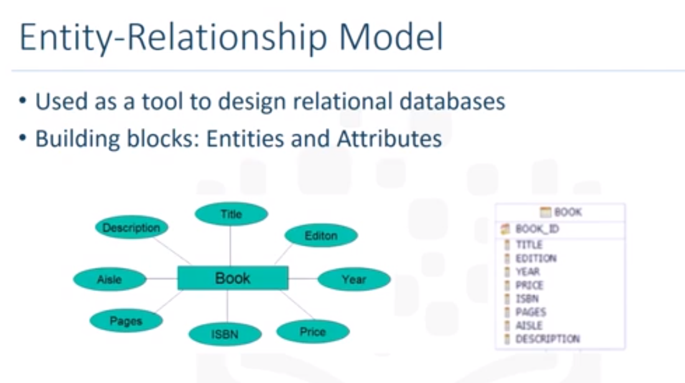
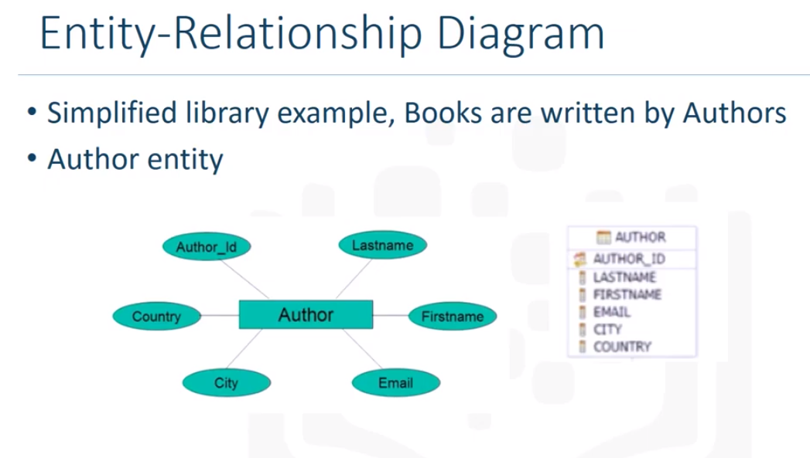
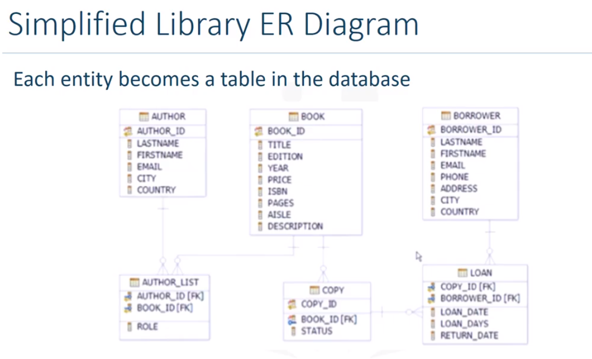

## Entity-relationship Model/Diagram
- This model proposes thinking of a DB as a collection of enitites, each with their attributes
- a tool used in DB design
- Entities are Nouns important to the business domain
- Entities have attributes
- Entities can be related to each other

- it is easy to convert an ER model into a table
- the attributes tell us most about an entity
- entities become the rows/entries
- attributes the column

Here is the ER diagram for an entity Author

#### Final ER diagram for a library

