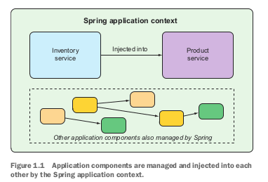

#Getting started with Spring

##What is Spring?
- Any non trivial app is composed of many components each responsible for its own piece of the overall app's functionality, coordinating with other app elements to get the job done
- when the app is run, the components somehow need to be created and introduced to each other
- at its core, Spring offers a **container**, often referred to as the **Spring application context** that creates and manages these components of the app
- these components, or **beans** are wired together inside the Spring application context (container) to make a complete application
- the act of wiring beans together is based on a pattern known as **dependency injection**


###Main Idea of Dependency Injection
- instead of having components create and maintain the lifecycle of other beans that they depend on, a dependency-injected application relies on a separate entity (the container) to create and maintain all components and inject those into the beans that need them.
- This injection is typically done through constructor arguments or property accessor

Example:




###Three ways to tell the ApplicationContext (Container) to wire beans together (Inject beans)
  ####1. XML
  - The older way to wire beans together was using one or more XML files that describe the components (beans) and their relationship to other

  Ex

  -  following XML declares two beans `InventoryService` and `ProductService`
  -  The XML also injects InventoryService  into ProductService

```xml
<bean id="inventoryService"
class="com.example.InventoryService" />
<bean id="productService"
class="com.example.ProductService" />
<constructor-arg ref="inventoryService" />
</bean>
```


  ####2. Annotation (Java-based configuration)
- The following configuration class is equivalent to the XML configuration:
```Java
@Configuration
public class ServiceConfiguration {
@Bean
public InventoryService inventoryService() {
  return new InventoryService();
  }

@Bean
public ProductService productService() {
  return new ProductService(inventoryService());
  }
}
```

- The `@Configuration` annotation tells spring that this is a configuration class that will provide beans to the Spring Application Context
- The configuration class's methods are annotated with `@Bean`
- This indicates that the objects they return should be added as beans to the application context
  - _By default, the bean id is the name of the method_


###Creating an ApplicationContext (container) that contains the beans in the class annotated with @Configuration and performing DI

- `ApplicationContext` is an interface implemented by multiple classes
- the `AnnotationConfigApplicationContext` implementation is used to create a container containing the beans in the configuration class
<br>
<br>
<br>
<br>

`AppConfig.Java`

```JAVA
package com.example.demo;

import org.springframework.context.annotation.Bean;
import org.springframework.context.annotation.Configuration;

//the configuration annotation tells Spring this class will be used to create beans for the application context
@Configuration
public class AppConfig {

    //in this class we define multiple beans
    @Bean
    public InventoryService inventoryService(){
        return new InventoryService();
    }

    @Bean
    public ProductService productService(){
        return new ProductService(inventoryService());
    }


}

```
`InventoryService.Java`

```JAVA
package com.example.demo;

public class InventoryService {

    public int getProducts(){
        return 5;
    }

}

```


`ProductService.Java`

```JAVA
package com.example.demo;

public class ProductService{

    private InventoryService inventoryService;

    //DI occurs using constructor, if we get rid of constructor, inventoryService instance variable will be null
    public ProductService(InventoryService inventoryService) {
        this.inventoryService = inventoryService;
    }

    public String greet(String name){
        //NOTE HOW WE NEVER INSTANTIATED AN InventoryService OBJECT !!!! IOC AT ITS FINEST (AND DI)
        return "hello "+name + inventoryService.getProducts();
    }

    public InventoryService getInventoryService() {
        return inventoryService;
    }

    public void setInventoryService(InventoryService inventoryService) {
        this.inventoryService = inventoryService;
    }
}


```

`Main.Java`

```JAVA
package com.example.demo;

import org.springframework.context.ApplicationContext;
import org.springframework.context.annotation.AnnotationConfigApplicationContext;

public class Main {
    public static void main(String[] args) {
        //this implementation of ApplicationContext is used to create a container which contains the beans from a user defined,annotation based, configuration class
        ApplicationContext applicationContext = new AnnotationConfigApplicationContext(AppConfig.class);

        //we get the bean as a general object, which we have to downcast for it to be useful
        ProductService productService = (ProductService)  applicationContext.getBean("productService");
        System.out.println(productService.greet("Miguel "));

        //if null pointer exception occurs, it is due to the instance variable of type InventoryService of the ProductService class being null. A nullpointer exception means  DI did not occur
        System.out.println("number of products is " +productService.getInventoryService().getProducts());

    }
}
```
```Java
Output:

hello Miguel 5
number of products is 5

```


Java-based configuration offers greater type safety and improved refactorability but _**EXPLICIT CONFIGURATION WITH EITHER JAVA OR XML IS ONLY NECESSARY IF SPRING IS UNABLE TO AUTOMATICALLY CONFIGURE THE COMPONENTS**_


####3. Automatic Configuration
- has its roots in spring techniques known as **autowiring** and **component scanning**
- with **component scanning** spring can automatically discover components from an application's classpath and create them as beans in the spring container
- With **autowiring** spring automatically injects the components with the other beans that they depend on
- `@Component` is used to indicate this class is an auto scan component

More information: https://www.mkyong.com/spring/spring-auto-scanning-components/


##Review Questions:

Source for IoC, container (ApplicationContext), and DI: https://www.baeldung.com/inversion-control-and-dependency-injection-in-spring
1. What is **Inversion Of Control** (IoC)
   - A principle by which the control of objects or portions of a program is given to a container or framework
   - In an app that does not use IoC, our custom code makes calls to libraries
   - In app that uses IoC, the framework takes control of the flow of the program and makes calls to our custom code
2. What is **Dependency Injection**?
   - one of the mechanisms that aids in achieving IoC
   - The control of creating and setting objects dependencies is given to a container, instead of the objects themselves doing this

Traditional way of creating and setting/injecting a dependency:
- Store objects have a dependency on Item objects
-In the example above, we need to instantiate an implementation of the Item interface within the Store class itself.

```JAVA
public class Store {
    private Item item;

    public Store() {
        item = new ItemImpl1();    
    }
}

```
- By using DI, we can rewrite the example without specifying the implementation of Item that we want:

```Java
public class Store {
    private Item item;
    public Store(Item item) {
        this.item = item;
    }
}
```
- Now we do not have to hard code the specific implementation of the item interface
- The specific implementation is defined in other places such as a .xml file or a class annotated with `@Configuration` which contains bean definitions

3. What is a **Spring container**?
   - An entity in charge of the whole lifecycle of beans, such as instantiating, and wiring (injecting) beans together, and destroying them.
4. What is **ApplicationContext**?
   - an interface which represents, or models, a Spring container
   - Multiple classes implement this interface, such as, `AnnotationConfigApplicationContext()`, which can create and manage beans from a class containing bean definitions. The class is annotated with `@Configuration` at the class level and `@Bean` at the method level
5. When are beans instantiated?
   - The default behavior for ApplicationContext implementations is to eagerly pre-instantiate all singleton beans when the context is started-up
   - For other scopes, beans will be instantiated whenever they are requested
