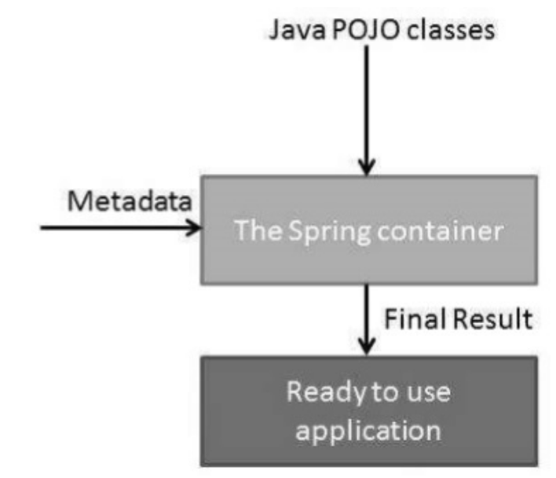
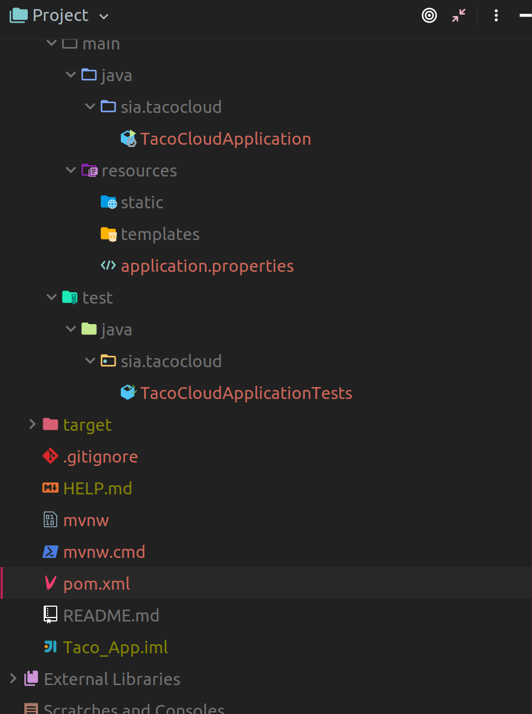
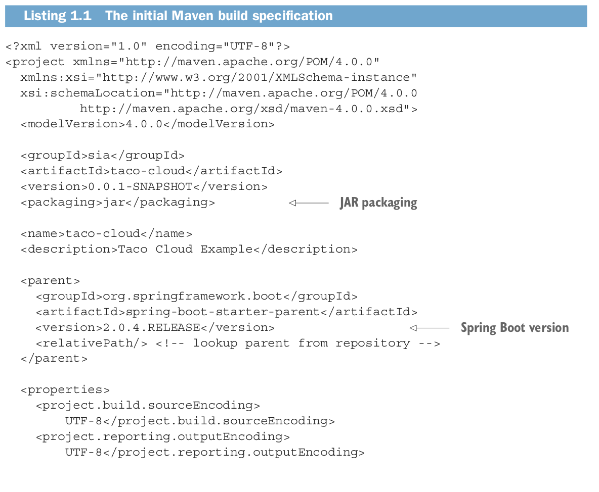
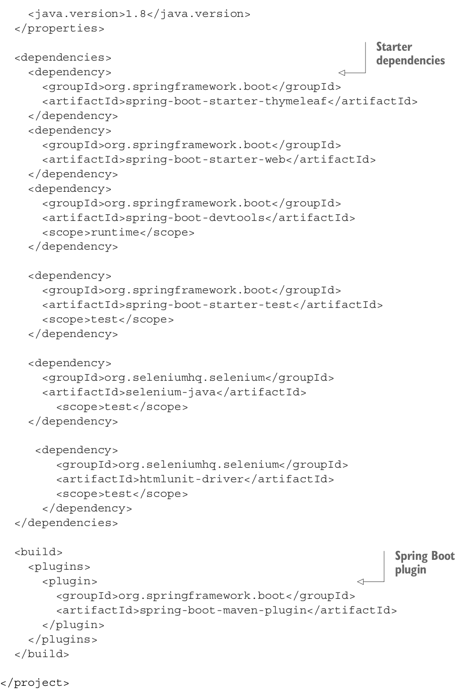
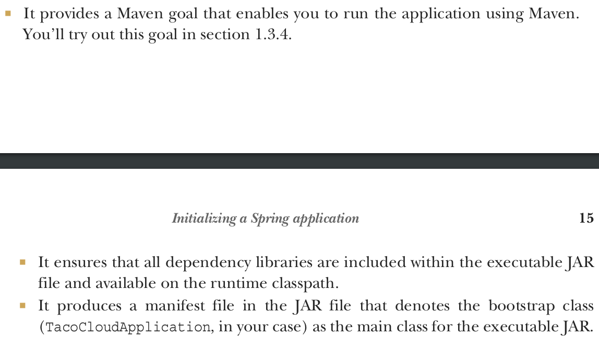
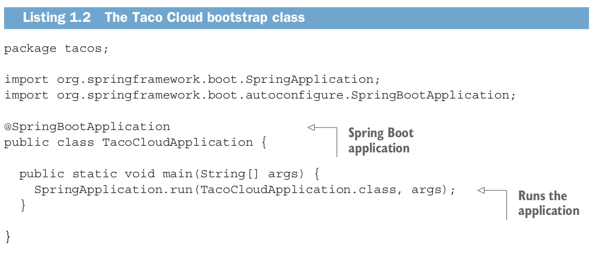
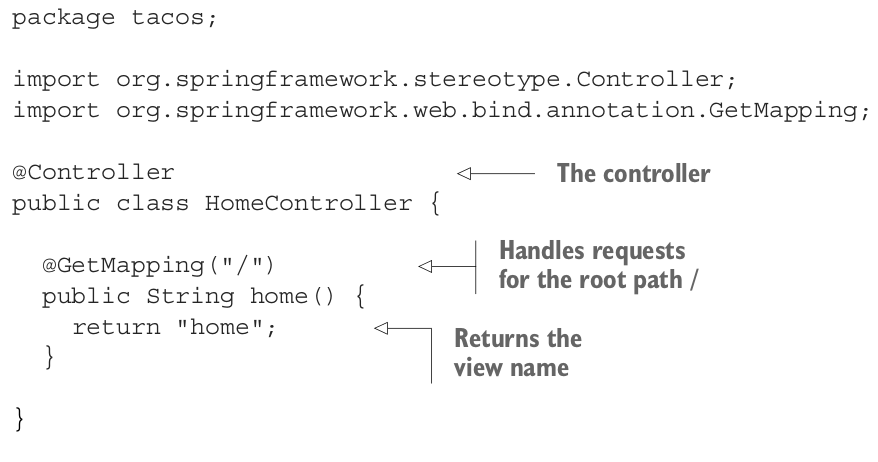
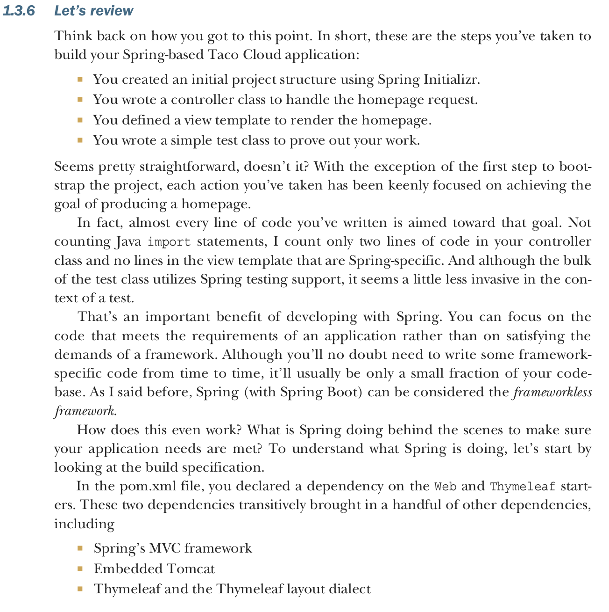
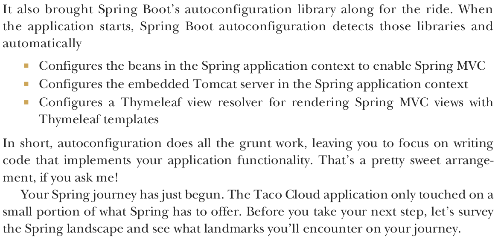
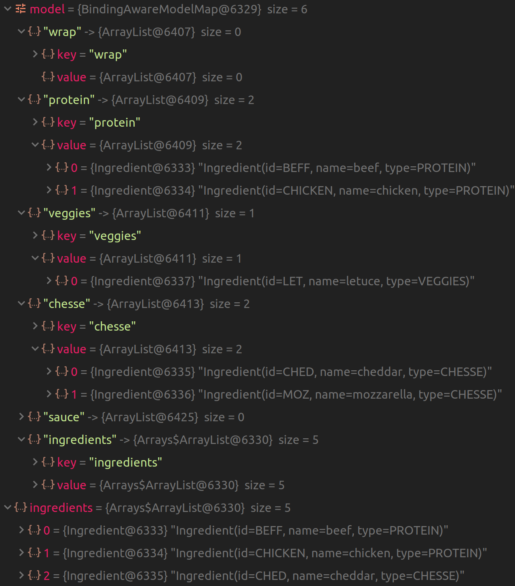

# Part 1: Foundational Topics of Building Spring Applications

# Ch 1: Getting started with Spring
- Chapter 1: overview of spring and springboot
- Chapter 2: Spring MVC, how to present model data in browser, how to process and validate input
- Chapter 3: Adding data persistence to the app
- Chapter 4: Security
- Chapter 5: Configuration properties, learning how to fine-tune autoconfigured beans, apply configuration properties to application components, and work with Spring profiles.

## 1.1 What is Spring?
- Any non trivial app is composed of many components each responsible for its own piece of the overall app's functionality, coordinating with other app elements to get the job done
- when the app is run, the components somehow need to be created and introduced to each other
- The Spring container is at the core of the Spring framework, Spring offers a **container**, often referred to as the **Spring application context** that creates and manages these components of the app
- these components, or **beans** are wired together inside the Spring application context (container) to make a complete application
- the act of wiring beans together is based on a pattern known as **dependency injection**
- The container gets its instructions on what objects to instantiate, configure, and inject by reading the configuration metadata provided.
- The config data can be represented in XML, Java annotations, or Java code.


High level view of how Spring Works



### Main Idea of Dependency Injection
- instead of having components create and maintain the lifecycle of other components that they depend on, a dependency-injected application relies on a separate entity (the container) to create and maintain all components and inject those into the beans that need them.
- This injection is typically done through constructor arguments or property accessor

Example:


### Three ways to define/register beans in the Spring Container and to tell the ApplicationContext (Container) to wire beans together (Inject beans)

  #### 1. XML
  - The older way to wire beans together was using one or more XML files that describe the components (beans) and their relationship to other beans

  Ex

  -  following XML declares two beans `InventoryService` and `ProductService`
  -  The XML also injects InventoryService  into ProductService

```xml
<bean id="inventoryService"
class="com.example.InventoryService" />
<bean id="productService"
class="com.example.ProductService" />
<constructor-arg ref="inventoryService" />
</bean>
```


  #### 2. Annotation (Java-based configuration)
- The following configuration class is equivalent to the XML configuration:

```Java
@Configuration
public class ServiceConfiguration {
@Bean
public InventoryService inventoryService() {
  return new InventoryService();
  }

@Bean
public ProductService productService() {
  return new ProductService(inventoryService());
  }
}
```

- The `@Configuration` annotation tells spring that this is a configuration class that will provide beans to the Spring Application Context
   - `@Configuration` is the equivalent of XML's `<beans> </beans>` element
- The configuration class's methods are annotated with `@Bean`
  - This indicates that the objects they return should be added as beans to the application context
    - _By default, the bean id is the name of the method_
   - `@Bean` is the equivalent of XML's `<bean> </bean>`


##### Creating an ApplicationContext (container) that contains the beans in the class annotated with @Configuration and performing DI

- `ApplicationContext` is an interface implemented by multiple classes
- the `AnnotationConfigApplicationContext` implementation is used to create a container containing the beans in the configuration class
- `FileSystemXmlApplicationContext` and `ClassPathXmlApplicationContext` load bean definitions from an XML file
<br>
<br>

`AppConfig.Java`

```JAVA
package com.example.demo;

import org.springframework.context.annotation.Bean;
import org.springframework.context.annotation.Configuration;

//the configuration annotation tells Spring this class will be used to create beans for the application context
@Configuration
public class AppConfig {

    //in this class we define multiple beans
    @Bean
    public InventoryService inventoryService(){
        return new InventoryService();
    }

    @Bean
    public ProductService productService(){
        return new ProductService(inventoryService());
    }


}

```
`InventoryService.Java`

```JAVA
package com.example.demo;

public class InventoryService {

    public int getProducts(){
        return 5;
    }

}

```


`ProductService.Java`

```JAVA
package com.example.demo;

public class ProductService{

    private InventoryService inventoryService;

    //DI occurs using constructor, if we get rid of constructor, inventoryService instance variable will be null
    public ProductService(InventoryService inventoryService) {
        this.inventoryService = inventoryService;
    }

    public String greet(String name){
        //NOTE HOW WE NEVER INSTANTIATED AN InventoryService OBJECT !!!! IOC AT ITS FINEST (AND DI)
        return "hello "+name + inventoryService.getProducts();
    }

    public InventoryService getInventoryService() {
        return inventoryService;
    }

    public void setInventoryService(InventoryService inventoryService) {
        this.inventoryService = inventoryService;
    }
}


```

`Main.Java`

```JAVA
package com.example.demo;

import org.springframework.context.ApplicationContext;
import org.springframework.context.annotation.AnnotationConfigApplicationContext;

public class Main {
    public static void main(String[] args) {
        //this implementation of ApplicationContext is used to create a container which contains the beans from a user defined,annotation based, configuration class
        ApplicationContext applicationContext = new AnnotationConfigApplicationContext(AppConfig.class);

        //we get the bean as a general object, which we have to downcast for it to be useful
        ProductService productService = (ProductService)  applicationContext.getBean("productService");
        System.out.println(productService.greet("Miguel "));

        //if null pointer exception occurs, it is due to the instance variable of type InventoryService of the ProductService class being null. A nullpointer exception means  DI did not occur
        System.out.println("number of products is " +productService.getInventoryService().getProducts());

    }
}
```
```Java
Output:

hello Miguel 5
number of products is 5

```


- Java-based configuration offers greater type safety and improved refactorability
- _**EXPLICIT CONFIGURATION WITH EITHER JAVA OR XML IS ONLY NECESSARY IF SPRING IS UNABLE TO AUTOMATICALLY CONFIGURE THE COMPONENTS**_

#####Note:

- The class annotated with `@Confguration` does not always have to be manually loaded by AnnotationConfigApplicationContext , if Spring picks the Configuration class up via component scanning, then the beans defined will be automatically loaded into the container


#### 3. Automatic Configuration
- has its roots in spring techniques known as **autowiring** and **component scanning**
- with **component scanning** spring can automatically discover components from an application's classpath and create them as beans in the spring container
- With **autowiring** spring automatically injects the components with the other beans that they depend on
- `@Component` is used to indicate this class is an auto scan component


More information: https://www.mkyong.com/spring/spring-auto-scanning-components/


## Review Questions:

Source for IoC, container (ApplicationContext), and DI: https://www.baeldung.com/inversion-control-and-dependency-injection-in-spring
1. What is **Inversion Of Control** (IoC)
   - A principle by which the control of objects or portions of a program is given to a container or framework
   - In an app that does not use IoC, our custom code makes calls to libraries
   - In app that uses IoC, the framework takes control of the flow of the program and makes calls to our custom code
2. What is **Dependency Injection**?
   - one of the mechanisms that aids in achieving IoC
   - The control of creating and setting objects dependencies is given to a container, instead of the objects themselves doing this

Traditional way of creating and setting/injecting a dependency:
- Store objects have a dependency on Item objects
- In the example above, we need to instantiate an implementation of the Item interface within the Store class itself.

```JAVA
public class Store {
    private Item item;

    public Store() {
        item = new ItemImpl1();    
    }
}

```
- By using DI, we can rewrite the example without specifying the implementation of Item that we want:

```Java
public class Store {
    private Item item;
    public Store(Item item) {
        this.item = item;
    }
}
```
- Now we do not have to hard code the specific implementation of the item interface
- The specific implementation is defined in other places such as a .xml file or a class annotated with `@Configuration` which contains bean definitions
- **This modification made the changed the relationship between the two classes from tightly to loosely coupled**
- Now we can easily unit test

3. What is a **Spring container**?
   - An entity in charge of the whole lifecycle of beans, such as instantiating, and wiring (injecting) beans together, and destroying them.
4. What is **ApplicationContext**?
   - an interface which represents, or models, a Spring container
   - Multiple classes implement this interface, such as, `AnnotationConfigApplicationContext()`, which can create and manage beans from a class containing bean definitions. The class is annotated with `@Configuration` at the class level and `@Bean` at the method level
5. When are beans instantiated?
   - The default behavior for ApplicationContext implementations is to eagerly pre-instantiate all singleton beans when the context is started-up
   - For other scopes, beans will be instantiated whenever they are requested


## 1.2 Initializing a Project using Spring Initializr
<br>


#### Examining the Spring Project Structure




- The project has the typical Maven Structure
- `mvnw` and `mvnw.cmd` are maven wrapper scripts , these can be use to build project even if maven is not installed.
- `pom.xml`: describes your Project
- `TacoCouldApplication.java`: the spring boot main class that boot straps the Project
- `application.properties`: offers a place where you can specify configuration properties
- `static`: a folder where you get any static content (images, stylesheets, js, etc)
- `Templates`: folder containing template files that will be used to render content to browser. (files containing thymeleaf)
- `TacoCouldApplicationTests.java`: a simple test class that ensures that the Spring application context loads successfully. More tests will be added as we develop the app.

#### Exploring the pom.xml
- Since we chose Maven as the build tool, a pom.xml file is generated





#### `<packaging>`

- The `<packaging` element specifies the output type of your project once it is build
- traditional web apps are packaged as WAR
- The choice of JAR is a cloud minded choice
- WAR are suitable for deploying to a traditional Java app server, not a natural fit for most cloud platforms

#### `<parent>`
- This specifies that your project has spring-boot-starter-parent as its parent
POM


#### `<dependencies>`

- You may also notice that all three dependencies have the word starter in their arti-
fact ID. Spring Boot starter dependencies are special in that they typically don’t have
any library code themselves, but instead transitively pull in other libraries

#### `<build>`




#### TacoCouldApplication.java


- `@springBootApplication` made up of 3 tags:
  - `@SpringBootConfiguration`
      - a specialized version of @configuration. Designates this class as a configuration class. You can add java based configuration if you need to.
  - `@EnableAutoConfiguration`
    - Tells Spring boot to automatically configure any components it thinks you will need
  - `@ComponentScan`
    - enables component scanning **in the current package containing the @SpringBoot main class and its sub packages** allowing you to declare other classes with @Component, @Service, @Controller, etc. To have spring automatically discover them and register them as components in the Spring application context
    - **Note: It is recommended that you locate your main application class in a root package above the component classes of the application**
- `main()`
  - the method that will be run when the JAR is executed

## 1.3: Writing a Spring Application
- let's add a homepage.
- we need two things to make make our homepage function
  - Controller class
  - A view template

#### 1.3.1 Handling web requests
- Spring MVC is a web framework within Spring
- core concept is a **_controller_**, a class that handles requests and responds with information.
- Let's write a Controller that handles requests for the root URI "/"




- `@Controller`
  - primary goal is to identify class as a component
  - This allows the class to be identified as a component by Springs automatic scanning
  - Other annotations such as @Component can be used instead, @Controller should be used because it is more restrictive
- `@GetMapping("/")` or alternatively, `@RequestMapping(value='/', method = RequestMethod.GET)`
  - defines the annotated method as a handler method capable of handling `GET` requests to the root URI
- **Note, the handler method handles the GET request by returning the name of the view, we can use different libraries/frameworks to implement the view, we will use Thymeleaf**

#### 1.3.2 Defining the view

In the interest of keeping your homepage simple, it should do nothing more than wel-
come users to the site. The next listing shows the basic Thymeleaf template that
defines the Taco Cloud homepage.


```HTML
<!DOCTYPE html>
<html xmlns="http://www.w3.org/1999/xhtml"
xmlns:th="http://www.thymeleaf.org">
<head>
<title>Taco Cloud</title>
</head>
<body>
<h1>Welcome to...</h1>

</body>
</html>
```

- the `` tag uses `th:src` attribute and an `@{..}` expression to reference the image with a context-relative path
- **static content such as images should be kept in static directory**
- lets define an images directory inside static and add our image to match the src thymeleaf attribute

#### 1.3.3 Testing the Controller
- Lets test two things

1. the view name returned by the handler method in charge of handling GET requests to "/" returns a string with a value "index"
2. the content of the response has the phrase "Welcome to..."


#### 1.3.5 SprintBoot DevTools


**Benefits:**
- https://spring.io/blog/2015/06/17/devtools-in-spring-boot-1-3
1. Automatic application restart when code changes
2. Automatic browser refresh (need to install an extension)
3. Automatic disable of template cache
     - Cached templates are great for prod but not while developing
     - Cached templates make it impossible to make changes while app is running and to see changes after refreshing browser
4. Built in H2 console
  - http://localhost:8080/h2-console

**Note:**
- If new dependencies are included, we need to restart application


**Automatic Browser refresh Extension installation and Template Cache Disable:**
- Template caching property is automatically set to false when `Dev-Tools` are inlcuded
- Before, we needed to manually modify This
- To have automatic browser refresh/live reload in IntelliJ, we need to follow the next steps in the tutorial below

https://dev.to/suin/spring-boot-developer-tools-how-to-enable-automatic-restart-in-intellij-idea-1c6i

- We also need to download a chrome extension

http://livereload.com/extensions/






# Ch 2: Developing web Applications

- In chapter one, we created an app that displays a static homepage webpage

**Goals for Ch 2:**
1. Need a page that displays ingredients for taco artists to choose from
2. Ingredient choice may change, so can not be hardcoded, it should be fetched from a DB and handed over to the page to be displayed


- Controller's job is to fetch and process data
- View's job is to render data into HTML

**We need:**
- A domain class that defines a Taco
- A controller that fetches ingredient info and passes it to the View
- a View template that integrates that will have data fetched and be displayed to the browser

Note:
- we are deferring DB functionality to focus on Spring MVC, we will refactor to add DB in chapter 3
- For now, our controller is only responsible for providing the ingredients to the View

#### 2.1.1 Establishing the domain
- an applications domain is the subject area it addresses. The ideas and concepts that influence the understanding of the app

**For this app the domain includes objects such as:**
- Tacos
- Customer
- Ingredients
- Taco orders

Let's define Taco ingredients:

`Ingredient.java`

```JAVA
import lombok.Data;
import lombok.RequiredArgsConstructor;

@Data
//* in book they added a @RequiredArgsConstructor annotation. Not needed because it is included in @Data

public class Ingredient {


    private final String id;
    private final String name;
    private final Type type;


    /**
     *! @Data adds getters and setters for all variables
     *! @Data also adds Constructor which has parameters for each final variable, which the compiler forces you to initialize either at declaration, in an initialization block, or at construction.
     *! The equivalent constructor can be seen below

     ** public Ingredient(String id, String name, Type type){
     ** this.id = id;
     **  this.name = name;
     ** this.type =type;
     **  }
     */


    public static enum Type{
        WRAP,PROTEIN,VEGGIES, CHESSE,SAUCE
    }

}
```

- We are using lombok do generate getters, setters, Required argument constructor, and a couple other things

#### 2.1.2 Creating a Controller
- A controller handles HTTP requests
- Common responses for controllers are a view name, or data in the body of a response (RESTful) a view name and data
- Right now we focus on controllers that help views produce content

Lets create a webpage that has a list of the ingredients that we can choose from
- To do this we need a controller to handle a `GET HTTP` request to the `/Design` URI


```java
package sia.tacocloud;

import lombok.extern.slf4j.Slf4j;
import org.springframework.stereotype.Controller;
import org.springframework.ui.Model;
import org.springframework.web.bind.annotation.GetMapping;
import org.springframework.web.bind.annotation.RequestMapping;
import org.springframework.web.bind.annotation.RequestMethod;

import java.util.ArrayList;
import java.util.Arrays;
import java.util.List;
import java.util.stream.Collectors;

@Slf4j
@Controller

/*
 ! when applied to the class, it designates the method handlers of this class
 ! as methods that will handle any request to "/design", we can further refine which handlers handle what request
 ! by adding more annotations to each method
 */

@RequestMapping("/design")
public class DesignTacoController {

    private ArrayList<Ingredient> ingredients = new ArrayList<>();

    @RequestMapping(method = RequestMethod.GET)
    public String showDesignForm(Model model) {

        List<Ingredient> ingredients = Arrays.asList(
                (new Ingredient("BEFF", "beef", Ingredient.Type.PROTEIN)),
                (new Ingredient("CHICKEN", "chicken", Ingredient.Type.PROTEIN)),
                (new Ingredient("CHED", "cheddar", Ingredient.Type.CHESSE)),
                (new Ingredient("MOZ", "mozzarella", Ingredient.Type.CHESSE)),
                (new Ingredient("LET", "letuce", Ingredient.Type.VEGGIES))

        );

        //* Get all types in a list
        Ingredient.Type[] types = Ingredient.Type.values();
        for (Ingredient.Type type : types) {
            //* change the type to a string, add it to model as key value pair, where key is the name of the incredient type
            //* the value is a List containing all ingredients of a specific type
            model.addAttribute(type.toString().toLowerCase(),
                    filterByType(ingredients, type));
        }


        model.addAttribute("ingredients", ingredients);

        return "design";
    }


    private List<Ingredient> filterByType(List<Ingredient> ingredients, Ingredient.Type type) {
        return ingredients.stream()
                .filter(x -> x.getType().equals(type))
                .collect(Collectors.toList());
    }

}


```

**When the method reaches `return`, `Model model` has the following data**

**Key Points**
  - `@RequestMapping("/design")` at the class level states that the whole class will hanfle requests at `/design` we further add annotations to the methods for fine grain control
- `Model model` object carries data to the View Template Engine, in charged of adding the data to the view for rendering
- Ultimately, data is Model will be copied into servlet response attributes
- The controller returns `"design"`, which is interpreted to be the name of the view to be rendered. The view resolver actually gets that view and passes it to the View Template Engine, The dispatcher Servlet passes the data to be combined with the view template.


#### 2.1.3 Designing the view
- after the controller is finisihed, it is time for the view to take action
- We will use Thymeleaf as the View Template Engine

add to `pom.xml`

```xml
<dependency>
<groupId>org.springframework.boot</groupId>
<artifactId>spring-boot-starter-thymeleaf</artifactId>
</dependency>
```


- At runtime, Spring Boot autoconfiguration will see Thymeleaf in the Classpath
- SpringBoot will automatically create beans that support Thymeleaf views for Spring MVC

##### View Libraries are decoupled from web frameworks

- View Libraries suchs as Thymeleaf are designed to be decoupled from any particular framework
- Therefore, view libraries are unable to work with data in `Model model`

##### What happens to data in Model model
- For view library to be decoupled, data in `Model model` needs to be copied to `servlet response attributes`
- Thymeleaf and other Template Engines can work with these `servlet response`

###### Thymeleaf Templates
- Templates are just HTML with some additional element attributes that guide a template in rendering request data
Ex:


##### Thymeleaf Attributes
1. `th:text`
  -  If we had a request attribute whose key is `message` and we wanted to render the content in an HTML `<p>` tag by thymeleaf, we would write:
  `<p th:text = "${message}"> placeholder message </p>`
  - is a thymeleaf attribute that performs the replacement
      - when the template is rendered, the body of the `<p>` element will be replaced with the value of the request attribute whose key is "message"
2. `th:each`
  - attribute that iterates over a collection of elements rendering the HTML once for each item
  Ex: to render the list of wrap ingredients:
3. `th:value`
  - The check box uses Thymeleaf’s `th:value`
  to set the rendered `<input>` element’s value attribute to the value found in the

```html
<h3>Designate your wrap:</h3>
<div th:each="ingredient : ${wrap}">
<input name="ingredients" type="checkbox" th:value="${ingredient.id}" />
<span th:text="${ingredient.name}">INGREDIENT</span><br/>
</div>
```

- Here, you use the `th:each` attribute on the <div> tag to repeat rendering of the `<div>`
once for each item in the collection found in the wrap request attribute.
- On each iteration, the ingredient item is bound to a Thymeleaf variable named ingredient
- Inside the `<div>` element, there’s a check box `<input>` element and a `<span>` ele-
ment to provide a label for the check box. The check box uses Thymeleaf’s `th:value`
to set the rendered `<input>` element’s value attribute to the value found in the ingredient's id property.
- The `<span>` element uses the proeprty `th:text` to replace the INGREDIENT placeholder with the value of the ingredients name property


##### Thymelead Operators
- `${}` operator tells thymeleaf to use the value of a request attribute (in this case message)
