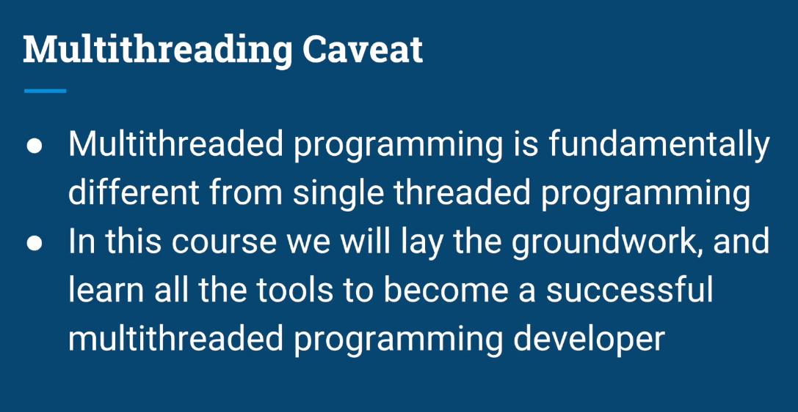

## Motivation and Operating Systems fundamentals

### Why do we need multiple threads?
1. Responsiveness
   - No feedback from an app after clicking button

Example:
- Suppose we have an online store app that services thousands of users
- App saves info of users purchases in a DB
- if One user makes a large purchase, which results in a long operation in the DB. At the same time, another user makes a purchase, the seocond user will not get any response until app is done responding to the first request. With multiple threading we can serve multiple users simultaneously by  serving each request in a difference thread.

Example: Movie Player app
- responsiveness particularly critical in apps with a UI
- app is showing images, playing audio, and if we click we should see a response.

- by multitasking quickly b/w different threads, it creates an illusion that all those tasks are happening at the same time
- **Note:** we do not even need multiple cores to achieve concurrency. we can create responsive apps by using multiple threads.

 

2. Performance

- A lot of the intuition we have from the traditional,single threaded sequential programming, will break when we introduce multiple threads.

 

### What are threads and where they live and OS fundamentals
- when we turn pc on, OS is loaded from the disk/HD into the memory

- os takes over allowing to interact with hardware and CPU

 

- apps reside in HD
- when user runs app the oS takes program from disk and creates an instance of the app in the memory

- that instance is called a **process/context of an app/context**
- each process is completely isolated from other processes that runs on the system

**Contained within process**
- process contains PID and other metadata
- the heap (contains data our app needs)
- files app opens
- code (program instructions) that will be executed
- Main thread
  - stack
  - instruction pointer

 

- for multi threaded apps each thread has its stack and instruction pointer
- all other components in process are shared

- it is easy to understand why each thread contains its own stack and pointer if we remember each thread is executing a different instruction in a different function, at any given moment

 

## Context Switch

