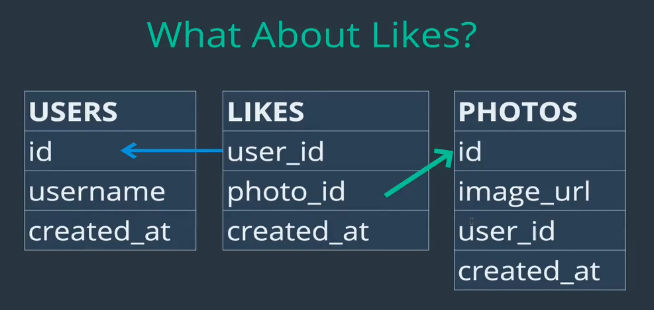
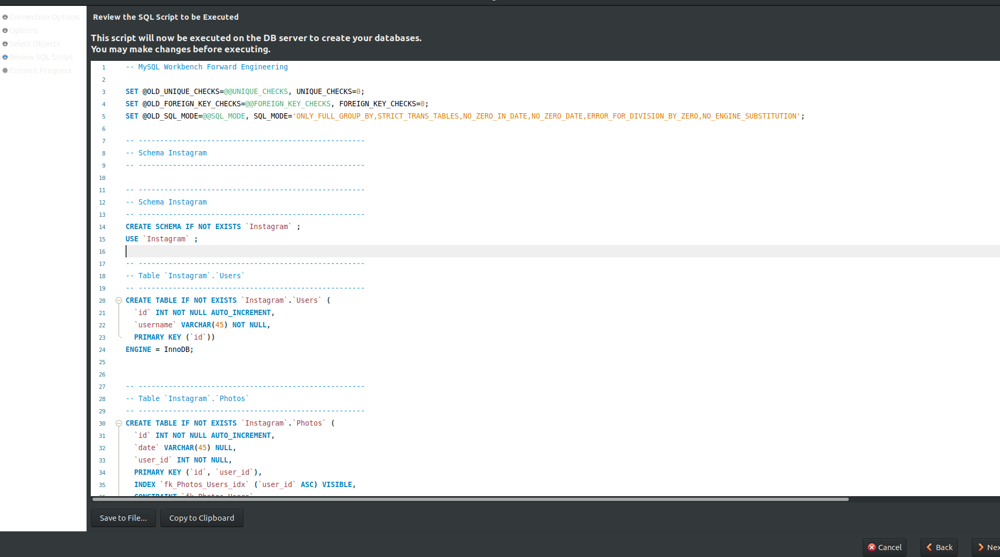

# Schema Design: Clone Instagram
-  so far we have only worked with two or three tables, modeling a single relationship like Customers and Orders
- In this section We will design a schema for something with 7-8 tables
- In the next section, we will insert data

***Table/Relation Schema:***
- specifies name of relation/table; and the name and type of each attribute/column

***Relational/DB Schema:***
- Collection of Table Schemas along with how they elate to each other

<br>

##### Lets take a look at a Instagram and Identify Entities

Entities:
- Users
- Photos
- Likes for a given photo, remember we can only like it once
- Hashtags (only for photos)
- Comments
- Followers
- Following

- we need a way to store: users, photos, likes, Hashtags on pictures, followers, following

This is not necessarily all the Tables we need, but these are the entities we need to store, we may need more or less tables


Notes:
- followers/following relationship is one way. we can follow and not be followed nack vice versa.
- we are not storing many things, like profile info, ads etc
- This is a simplified Instagram App
- we also have quirks for example, we can only like a photo once

<br>

#### Users Schema
- make sure to enforce user name unique constraint
- user_name ca be made PK but faster to have an int as PK
- **Lets store the creating of the tables in the instagram DB inside a script**
```SQL
CREATE DATABASE ig_clone;
USE ig_clone;

CREATE TABLE Users(
  id INT NOT NULL PRIMARY KEY AUTO_INCREMENT,
  username VARCHAR(122) UNIQUE NOT NULL,
  first_name VARCHAR(122),
  last_name VARCHAR(122),
  created_at TIMESTAMP DEFAULT NOW()
)
```
- every time we run the file above it will create database, use it, and create tables

#### Photos Schema
- Note relationship b/w user and Photos
- A user can upload 0 (min) to n (max) photos and a photo could have been submitted by exactly one (min and max) user
  - This is a one to many relationship b/w Users and Photos


```SQL
CREATE Photos(
  id INT NOT NULL PRIMARY KEY AUTO_INCREMENT,
  img_url VARCHAR(122) NOT NULL,
  user_id INT NOT NULL,
  created_at TIMESTAMP DEFAULT NOW(),
  FOREIGN KEY(user_id) REFERENCES Users(id)
)
```
<br>
#### Comments Schema


- A comment is related to a user, and the comment is related to a particular photo
- Comments are associated to Users and Photos
- User can comment 0 to n photos and a photo can be commented by 0 to m users
  - We see a one to many relationship b/w Users and Photos
- `NOT NULL` for the FK because we do not want a comment without a user_id or photo_id associated to it (orphan comment)
```SQL
CREATE TABLE Comments(
  id INT NOT NULL PRIMARY KEY AUTO_INCREMENT,
  content VARCHAR(122) NOT NULL,
  user_id INT NOT NULL,
  photo_id INT NOT NULL,
  created_at TIMESTAMP DEFAULT NOW(),
  FOREIGN KEY(user_id) REFERENCES Users(id),
  FOREIGN KEY(photo_id) REFERENCES Photos(id)
)
```
<br>
#### Likes Schema


- again, FKs are not null because we do not want orphan likes
- We do not have and id because we are not referencing to likes anywhere from other tables in our DB Schema for our app, if we were, we would want an ID
- **We ensure there is one like per user per photo (a unique combination of the two)** by last line

```SQL

CREATE TABLE Likes(
  user_id INT NOT NULL,
  photo_id INT NOT NULL,
  created_at TIMESTAMP DEFAULT NOW(),
  FOREIGN KEY(user_id) REFERENCES Users(id),
  FOREIGN KEY(photo_id) REFERENCES Photos(id),
  PRIMARY KEY (user_id, photo_id)
  )
```
- this is the error if we insert a non unique combo of user_id and photo_id


#### Follower/Follow Schema
- We need to capture the follower:followee relationship
- easiest way is with a single table that references the Users.id Primary Key
- we also do not have duplicates, we can not follow one person twice so the combo of follower and followee has to be unique
- no id because we are not going to reference this table by another


```SQL
CREATE TABLE follows (
    follower_id INTEGER NOT NULL,
    followee_id INTEGER NOT NULL,
    created_at TIMESTAMP DEFAULT NOW(),
    FOREIGN KEY(follower_id) REFERENCES users(id),
    FOREIGN KEY(followee_id) REFERENCES users(id),
    PRIMARY KEY(follower_id, followee_id)
);
```
<br>

#### Hashtag Schema


Downsides:
- limited number of tags can be stored
- can not store additional info
- have to be careful with searching


- we are storing tag names over and over (duplicates)
<br>

## Solution 3: Classic Many to Many relationship With Junction Table

 

 Positive:
 - we can store additional data in junction table, like, time and location when a specific photo was tagged with a specific tag (add these ass attributes to junction table)
 - In Tags table we can store when the tag was first created

Downside (comes down to more work/complex queries):
- When adding a new tag, we have to create tag and associate it to photo using junction table
- If tag is deleted (maybe a controversial tag) then we have to make sure that records in junction table referencing the tag are also deleted (`DELETE ON CASCADE`)

<br>

```SQL
CREATE TABLE Hashtags(
id INT PRIMARY KEY NOT NULL AUTO_INCREMENT,
tag_name VARCHAR(200) NOT NULL UNIQUE,
created_at TIMESTAMP DEFAULT NOW()
)

CREATE TABLE Hashtags_Photos(
photo_id INT NOT NULL,
hashtag_id INT NOT NULL,
FOREIGN KEY (photo_id) REFERENCES Photos(id) ON DELETE CASCADE,
FOREIGN KEY (hashtag_id) REFERENCES Hashtags(id) ON DELETE CASCADE,
PRIMARY KEY(photo_id, hashtag_id)
)
```
<br>
### Aside: Using Forward Engineering Feature of MySQL Workbench
- Forward engineering feature allows us to create a DB with tables and relationships between tables from an ER diagram

Lets create a User and photos table
- we can change the name in Table tab
- Add columns in columns tab
  - Lets add id column, set as PK, set as Not Null, and set as Auto Increment


- after drawing our ER diagram, we can forward engineer it to create the DB, by going to Databases in top tab, and forward engineering


- Code is generated shown below



- click next to run script, we can also save to file, or copy to clipboard


- lets check to see if DB was created... it is !!!

```SQL
mysql> show databases;
+--------------------+
| Database           |
+--------------------+
| Instagram          |
| bakery             |
| information_schema |
| mysql              |
| performance_schema |
| sys                |
| tv_review_app      |
+--------------------+
7 rows in set (0.00 sec)


mysql> desc Photos;
+---------+-------------+------+-----+---------+----------------+
| Field   | Type        | Null | Key | Default | Extra          |
+---------+-------------+------+-----+---------+----------------+
| id      | int(11)     | NO   | PRI | NULL    | auto_increment |
| date    | varchar(45) | YES  |     | NULL    |                |
| user_id | int(11)     | NO   | PRI | NULL    |                |
+---------+-------------+------+-----+---------+----------------+
3 rows in set (0.00 sec)

mysql> desc Users;
+----------+-------------+------+-----+---------+----------------+
| Field    | Type        | Null | Key | Default | Extra          |
+----------+-------------+------+-----+---------+----------------+
| id       | int(11)     | NO   | PRI | NULL    | auto_increment |
| username | varchar(45) | NO   |     | NULL    |                |
+----------+-------------+------+-----+---------+----------------+
2 rows in set (0.00 sec)


```

<br>
