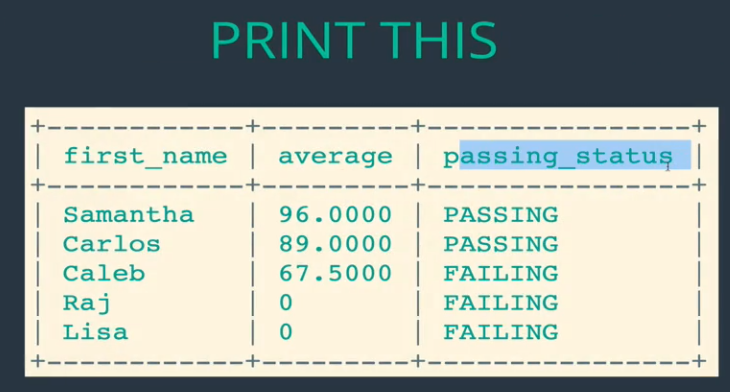
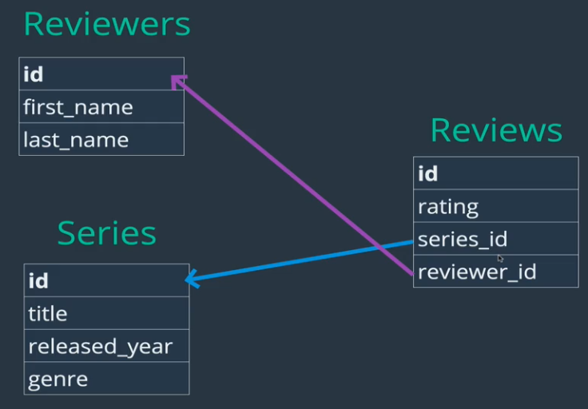
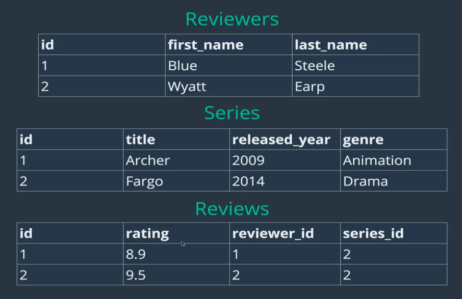
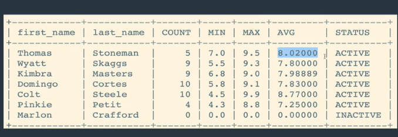

## Section 12 and 13: Related Tables (Data)
- So far the course has been on data in a table at a time
- No data has been related so far
- In the real world, we have Users, Likes, Followers, Comments, and many more tables


Now we will talk about how data is related and how to implement those relations using multiple tables


#### Real World Data
- is messy
- if we have a simple blog site there are a lot to store
  - Users
  - Blogs
  - Comments
- We will see how to work with interrelated data


**Lets talk about books! What if we had a library website?**
- we would need to have the following tables


- in a typical app like a book store, we would need a bunch of tables
- Orders may need to be split into various tables


# Types of relationships
- how do we represent complex data using Relational DBs and SQL
- How are Entities (Nouns) related?


#### 1:1 Relationship
Ex:
- One customer has one row in the customer_details tables abd one customer_details is associated with one Customer (row) in the Customers table
- a customer_details table and a customer table
- instead of having a customer table with a bunch of columns, the data was broken up in two tables
- Customer table contained data used often


#### 1:n relationship

Ex:
- The relationship between Books and reviews
- A book can have many reviews, a single review record, belongs to one book
- books have many reviews but reviews belong to one book


#### n:n relationship

Ex:
- two entities, Books and Authors
- Books can have many authors
- Authors can have many books


## 1:n Basics, The most Common Relationship
- lets start with an example, Customers and Orders (two tables)


- This is the easy part
- Now we have to figure out how to store the data

<br>

**A possible way: one giant table(Awful idea)**

- the big table does capture everything But....
1. A lot of repeated Data for first, last name, and email because they have placed multiple orders
2. The last two haven't placed orders, if they have never placed, then there is no need to have any order info if they have not placed any orders
   - There are many times actions are done that do not require some information stored in table
   - Here, David logs in, there is no need to go through a table with a bunch of null values if all we need is log in info

<br>


**Solution: break data up**
- we have two tables now
- Orders have a field that references the Customer table
- whatever the customer_id is of a given order corresponds to the Customer that placed the order


Note:
- Orders.customer_id references Customer.customer_id
  - it tells us that the rows that have custromer_id =1 matches boy George, etc
- we have users that havent ordered but we do not waste resources storing nulls
- we are not repeating names and usernames

**This is a classic way of structuring a 1:n relationship**

### Primary Key
- a column that has unique values for each row
- Used for Unique Identification of entries/rows


### Foreign Key
- references in a given table to the primary key of another table
- We can specify which columns in a table are a foreign key
  - We do this to enforce that whatever customer_id value we insert into the  (when for example, adding an order entry) table has to have an existing corresponding value in Customer.customer_id table. (essentially enforces an order was submitted by an existing User/customer)


- Lets explicitly set a foreign key in one table (Orders) and reference the primary key in the other table (Customers)


```SQL
CREATE TABLE customers(
    id INT AUTO_INCREMENT PRIMARY KEY,
    first_name VARCHAR(100),
    last_name VARCHAR(100),
    email VARCHAR(100)
);
CREATE TABLE orders(
    id INT AUTO_INCREMENT PRIMARY KEY,
    order_date DATE,
    amount DECIMAL(8,2),
    customer_id INT,
    FOREIGN KEY(customer_id) REFERENCES customers(id)
);


INSERT INTO customers (first_name, last_name, email)
VALUES ('Boy', 'George', 'george@gmail.com'),
       ('George', 'Michael', 'gm@gmail.com'),
       ('David', 'Bowie', 'david@gmail.com'),
       ('Blue', 'Steele', 'blue@gmail.com'),
       ('Bette', 'Davis', 'bette@aol.com');

INSERT INTO orders (order_date, amount, customer_id)
VALUES ('2016/02/10', 99.99, 1),
       ('2017/11/11', 35.50, 1),
       ('2014/12/12', 800.67, 2),
       ('2015/01/03', 12.50, 2),
       ('1999/04/11', 450.25, 5);

       mysql> select * from customers;
       +----+------------+-----------+------------------+
       | id | first_name | last_name | email            |
       +----+------------+-----------+------------------+
       |  1 | Boy        | George    | george@gmail.com |
       |  2 | George     | Michael   | gm@gmail.com     |
       |  3 | David      | Bowie     | david@gmail.com  |
       |  4 | Blue       | Steele    | blue@gmail.com   |
       |  5 | Bette      | Davis     | bette@aol.com    |
       +----+------------+-----------+------------------+
       5 rows in set (0.00 sec)

Note how the id field was auto incremented


-- This INSERT fails because of our fk constraint.  No user with id: 98
INSERT INTO orders (order_date, amount, customer_id)
VALUES ('2016/06/06', 33.67, 98);

```


### Cross Join
- lets review, Orders has a fk referencing the pk in Customer's table


## Joins
- The whole point is that it takes data from two tables and joins them in a meaningful way


#### Cross Join
- useless
- cartesian product
- like diagram above but takes everything


#### Inner Join


- A and B represent a table, Customers and Orders.
- We select all record from A and B here the join condition is met


```SQL
mysql> select *  from customers;
+----+------------+-----------+------------------+
| id | first_name | last_name | email            |
+----+------------+-----------+------------------+
|  1 | Boy        | George    | george@gmail.com |
|  2 | George     | Michael   | gm@gmail.com     |
|  3 | David      | Bowie     | david@gmail.com  |
|  4 | Blue       | Steele    | blue@gmail.com   |
|  5 | Bette      | Davis     | bette@aol.com    |
+----+------------+-----------+------------------+
5 rows in set (0.00 sec)


mysql> select *  from orders;
+----+------------+--------+-------------+
| id | order_date | amount | customer_id |
+----+------------+--------+-------------+
|  1 | 2016-02-10 |  99.99 |           1 |
|  2 | 2017-11-11 |  35.50 |           1 |
|  3 | 2014-12-12 | 800.67 |           2 |
|  4 | 2015-01-03 |  12.50 |           2 |
|  5 | 1999-04-11 | 450.25 |           5 |
+----+------------+--------+-------------+
5 rows in set (0.00 sec)


```

```SQL
-- IMPLICIT INNER JOIN

SELECT * FROM customers, orders
WHERE customers.id = orders.customer_id;
-- IMPLICIT INNER JOIN

SELECT first_name, last_name, order_date, amount
FROM customers, orders
    WHERE customers.id = orders.customer_id;


    -- EXPLICIT INNER JOINS
    -- can also write INNER JOIN

SELECT * FROM customers
JOIN orders
    ON customers.id = orders.customer_id;

SELECT first_name, last_name, order_date, amount
FROM customers
JOIN orders
    ON customers.id = orders.customer_id;

SELECT *
FROM orders
JOIN customers
    ON customers.id = orders.customer_id;

-- ARBITRARY JOIN - meaningless, but still possible

SELECT * FROM customers
JOIN orders ON customers.id = orders.id;
```


Result of correctly joining:
```SQL
mysql> select first_name, last_name, order_date, amount
    -> FROM customers
    -> JOIN orders
    -> ON customers.id = orders.customer_id;
+------------+-----------+------------+--------+
| first_name | last_name | order_date | amount |
+------------+-----------+------------+--------+
| Boy        | George    | 2016-02-10 |  99.99 |
| Boy        | George    | 2017-11-11 |  35.50 |
| George     | Michael   | 2014-12-12 | 800.67 |
| George     | Michael   | 2015-01-03 |  12.50 |
| Bette      | Davis     | 1999-04-11 | 450.25 |
+------------+-----------+------------+--------+
5 rows in set (0.00 sec)

```
- Note:
  - We need to know the relationship between the two tables (FK and PK) so we can JOIN on the keys (join condition)
  - Take customers and orders tables and join them where customers.id = orders.customer_id
  - We could join off a meaningless condition but this will give us erroneous data


#### Left Join

- Takes everything from left table


- Left join means taking everything from the left table and from the right only the entries that match the join condition


Process:
1) boy georger, is there a matching order? yes
2) put those together
3) what about for george michael? is there a matching order? yes
4) put those together
5) what about for david and blue? no
5) place the customers and fill the missing info of customers with null

- If it was an Inner Join, David and Blue would not show up
```SQL

mysql> select first_name, last_name, order_date, amount FROM customers LEFT JOIN orders ON customers.id = orders.customer_id;
+------------+-----------+------------+--------+
| first_name | last_name | order_date | amount |
+------------+-----------+------------+--------+
| Boy        | George    | 2016-02-10 |  99.99 |
| Boy        | George    | 2017-11-11 |  35.50 |
| George     | Michael   | 2014-12-12 | 800.67 |
| George     | Michael   | 2015-01-03 |  12.50 |
| David      | Bowie     | NULL       |   NULL |
| Blue       | Steele    | NULL       |   NULL |
| Bette      | Davis     | 1999-04-11 | 450.25 |
+------------+-----------+------------+--------+
7 rows in set (0.00 sec)

```

Lets Group By customer_id

```SQL
mysql> select first_name,
              last_name,
              IFNULL(SUM(amount),0)
              FROM customers
              LEFT JOIN orders
              ON customers.id = orders.customer_id
              group by customers.id;
+------------+-----------+-----------------------+
| first_name | last_name | IFNULL(SUM(amount),0) |
+------------+-----------+-----------------------+
| Boy        | George    |                135.49 |
| George     | Michael   |                813.17 |
| David      | Bowie     |                  0.00 |
| Blue       | Steele    |                  0.00 |
| Bette      | Davis     |                450.25 |
+------------+-----------+-----------------------+
5 rows in set (0.00 sec)

```

##### Why would we want this left join?
- maybe i want to see for every user, how much they have spent to send a thank you for being a loyal customer to high spenders and coupon for low or no spenders
- This involves seeing all customers, not just customers that have submitted orders


Code:
```SQL
-- Getting Fancier (Inner Joins Still)

SELECT first_name, last_name, order_date, amount
FROM customers
JOIN orders
    ON customers.id = orders.customer_id
ORDER BY order_date;
SELECT
    first_name,
    last_name,
    SUM(amount) AS total_spent
FROM customers
JOIN orders
    ON customers.id = orders.customer_id
GROUP BY orders.customer_id
ORDER BY total_spent DESC;
-- LEFT JOINS

SELECT * FROM customers
LEFT JOIN orders
    ON customers.id = orders.customer_id;
SELECT first_name, last_name, order_date, amount
FROM customers
LEFT JOIN orders
    ON customers.id = orders.customer_id;
SELECT
    first_name,
    last_name,
    IFNULL(SUM(amount), 0) AS total_spent
FROM customers
LEFT JOIN orders
    ON customers.id = orders.customer_id
GROUP BY customers.id
ORDER BY total_spent;
```
<br>
#### Right Joins

- In our case we do not have any orders that do not have a customer that is not already present therefore we won't see a difference
- In our case, it would not make sense for a customers right join orders to ever give us any result that is different from the results of an inner join because it does not make sense for an order to have been submitted by a customer that is not recorded unless we accidentally add a record to orders table or delete a customer from customers table
- On ther other hand, we do have customers who have not order so a `customers LEFT JOIN orders` would give us all customers even if they have not ordered (even if customer id in customers table is not present in the orders table)


- Same as left join except it takes everything from which ever table we are joining as written in `tableA right join TableB syntax`


##### Revisiting Customer and Orders tables
- What happens if we try to delete a customer, lets say Boy George


```SQL
mysql> select * from orders;
+----+------------+--------+-------------+
| id | order_date | amount | customer_id |
+----+------------+--------+-------------+
|  1 | 2016-02-10 |  99.99 |           1 |
|  2 | 2017-11-11 |  35.50 |           1 |
|  3 | 2014-12-12 | 800.67 |           2 |
|  4 | 2015-01-03 |  12.50 |           2 |
|  5 | 1999-04-11 | 450.25 |           5 |
+----+------------+--------+-------------+
5 rows in set (0.00 sec)

mysql> select * from customers                                                      -> ;
+----+------------+-----------+------------------+
| id | first_name | last_name | email            |
+----+------------+-----------+------------------+
|  1 | Boy        | George    | george@gmail.com |
|  2 | George     | Michael   | gm@gmail.com     |
|  3 | David      | Bowie     | david@gmail.com  |
|  4 | Blue       | Steele    | blue@gmail.com   |
|  5 | Bette      | Davis     | bette@aol.com    |
+----+------------+-----------+------------------+
5 rows in set (0.00 sec)

mysql> DELETE FROM customers where first_name='Boy';
ERROR 1451 (23000): Cannot delete or update a parent row: a foreign key constraint fails (`bakery`.`orders`, CONSTRAINT `orders_ibfk_1` FOREIGN KEY (`customer_id`) REFERENCES `customers` (`id`))
mysql>

```

- Error occurs because we can not delete a customer if it is referenced by a foreign key in another table
- this is done by not letting us delete data willy nilly if it is referenced

How can we delete a customer and all its associated orders? or, if we wanted to delete a book, how can we delete its associated reviews?
- delete orders that refer to the customer we want to delete, then delete the customer
- we could also get rid of the foreign key constraint (Bad idea!)
- **We also will not be able to delete customers table because orders depends on it**

<br>
```SQL

Lets say that  an app with customers and orders did not use a foreign-primary key constraint, so when customers left the app the associated orders stayed (this could not have happened with a pk-fk constraint since you can not delete customers if orders refer them). This scenario is recreated by tables below. App had up to 109 customers like we see.

Lets see the orders that do not have matching customers

mysql> CREATE TABLE orders(
    ->     id INT AUTO_INCREMENT PRIMARY KEY,
    ->     order_date DATE,
    ->     amount DECIMAL(8,2),
    ->     customer_id INT
    -> );
Query OK, 0 rows affected (0.09 sec)

mysql> INSERT INTO customers (first_name, last_name, email)
    -> VALUES ('Boy', 'George', 'george@gmail.com'),
    ->        ('George', 'Michael', 'gm@gmail.com'),
    ->        ('David', 'Bowie', 'david@gmail.com'),
    ->        ('Blue', 'Steele', 'blue@gmail.com'),
    ->        ('Bette', 'Davis', 'bette@aol.com');
Query OK, 5 rows affected (0.01 sec)
Records: 5  Duplicates: 0  Warnings: 0

mysql>        
mysql> INSERT INTO orders (order_date, amount, customer_id)
    -> VALUES ('2016/02/10', 99.99, 1),
    ->        ('2017/11/11', 35.50, 1),
    ->        ('2014/12/12', 800.67, 2),
    ->        ('2015/01/03', 12.50, 2),
    ->        ('1999/04/11', 450.25, 5);
Query OK, 5 rows affected (0.01 sec)
Records: 5  Duplicates: 0  Warnings: 0

mysql> desc orders;
+-------------+--------------+------+-----+---------+----------------+
| Field       | Type         | Null | Key | Default | Extra          |
+-------------+--------------+------+-----+---------+----------------+
| id          | int(11)      | NO   | PRI | NULL    | auto_increment |
| order_date  | date         | YES  |     | NULL    |                |
| amount      | decimal(8,2) | YES  |     | NULL    |                |
| customer_id | int(11)      | YES  |     | NULL    |                |
+-------------+--------------+------+-----+---------+----------------+
4 rows in set (0.00 sec)

mysql> desc customers;
+------------+--------------+------+-----+---------+----------------+
| Field      | Type         | Null | Key | Default | Extra          |
+------------+--------------+------+-----+---------+----------------+
| id         | int(11)      | NO   | PRI | NULL    | auto_increment |
| first_name | varchar(100) | YES  |     | NULL    |                |
| last_name  | varchar(100) | YES  |     | NULL    |                |
| email      | varchar(100) | YES  |     | NULL    |                |
+------------+--------------+------+-----+---------+----------------+
4 rows in set (0.00 sec)

mysql> INSERT INTO orders (order_date, amount, customer_id) VALUES
    -> ('2017/11/05', 23.45, 45),
    -> (CURDATE(), 777.77, 109);
Query OK, 2 rows affected (0.01 sec)
Records: 2  Duplicates: 0  Warnings: 0

mysql>


Lets view the left over orders that do not have an associated customer


mysql> select first_name, last_name, amount, order_date from customers right join orders on customers.id=orders.customer_id;
+------------+-----------+--------+------------+
| first_name | last_name | amount | order_date |
+------------+-----------+--------+------------+
| Boy        | George    |  99.99 | 2016-02-10 |
| Boy        | George    |  35.50 | 2017-11-11 |
| George     | Michael   | 800.67 | 2014-12-12 |
| George     | Michael   |  12.50 | 2015-01-03 |
| Bette      | Davis     | 450.25 | 1999-04-11 |
| NULL       | NULL      |  23.45 | 2017-11-05 |
| NULL       | NULL      | 777.77 | 2019-12-26 |
+------------+-----------+--------+------------+
7 rows in set (0.00 sec)


```
<br>

### ON DELETE CASCADE
- when we delete a parent (so a customer in customers) we also want the order associated with the customer to be deleted from orders table most of the time
- **We can only do this if we define a pk-fk relationship when creating a table**
- Without this, MySQL would not let us delete a customer that has an order associated with it

```SQL
-- WORKING WITH ON DELETE CASCADE

CREATE TABLE customers(
    id INT AUTO_INCREMENT PRIMARY KEY,
    first_name VARCHAR(100),
    last_name VARCHAR(100),
    email VARCHAR(100)
);

CREATE TABLE orders(
    id INT AUTO_INCREMENT PRIMARY KEY,
    order_date DATE,
    amount DECIMAL(8,2),
    customer_id INT,
    FOREIGN KEY(customer_id)
        REFERENCES customers(id)
        ON DELETE CASCADE
);


INSERT INTO customers (first_name, last_name, email)
VALUES ('Boy', 'George', 'george@gmail.com'),
       ('George', 'Michael', 'gm@gmail.com'),
       ('David', 'Bowie', 'david@gmail.com'),
       ('Blue', 'Steele', 'blue@gmail.com'),
       ('Bette', 'Davis', 'bette@aol.com');

INSERT INTO orders (order_date, amount, customer_id)
VALUES ('2016/02/10', 99.99, 1),
       ('2017/11/11', 35.50, 1),
       ('2014/12/12', 800.67, 2),
       ('2015/01/03', 12.50, 2),
       ('1999/04/11', 450.25, 5);
```


```SQL
--Visualizing tables

mysql> select * from orders;
+----+------------+--------+-------------+
| id | order_date | amount | customer_id |
+----+------------+--------+-------------+
|  1 | 2016-02-10 |  99.99 |           1 |
|  2 | 2017-11-11 |  35.50 |           1 |
|  3 | 2014-12-12 | 800.67 |           2 |
|  4 | 2015-01-03 |  12.50 |           2 |
|  5 | 1999-04-11 | 450.25 |           5 |
+----+------------+--------+-------------+
5 rows in set (0.00 sec)

mysql> select * from customers;
+----+------------+-----------+------------------+
| id | first_name | last_name | email            |
+----+------------+-----------+------------------+
|  1 | Boy        | George    | george@gmail.com |
|  2 | George     | Michael   | gm@gmail.com     |
|  3 | David      | Bowie     | david@gmail.com  |
|  4 | Blue       | Steele    | blue@gmail.com   |
|  5 | Bette      | Davis     | bette@aol.com    |
+----+------------+-----------+------------------+
5 rows in set (0.00 sec)

--Looking at what i want to delete

mysql> select * from customers where id=2;
+----+------------+-----------+--------------+
| id | first_name | last_name | email        |
+----+------------+-----------+--------------+
|  2 | George     | Michael   | gm@gmail.com |
+----+------------+-----------+--------------+
1 row in set (0.00 sec)

--Deleting

mysql> delete from customers where id=2;
Query OK, 1 row affected (0.01 sec)

--Note how deleting a customer cascades to deleting the entries that have a foreign key that reference the deleted customer. We essentially delete the corresponding others that the customer has placed

mysql> select * from orders;
+----+------------+--------+-------------+
| id | order_date | amount | customer_id |
+----+------------+--------+-------------+
|  1 | 2016-02-10 |  99.99 |           1 |
|  2 | 2017-11-11 |  35.50 |           1 |
|  5 | 1999-04-11 | 450.25 |           5 |
+----+------------+--------+-------------+
3 rows in set (0.00 sec)

mysql>

```

### Right and Left Join Questions
1) is there a difference between a right and left join if we switch table A and B that we are joining?

A: No, you get the same data/content. Only the order of the columns changes

<br>

### Our first Join Exercises


- We see it is a one to many relationship students (1) : papers (n) and each paper (1) , in this case, is tied to a single student at minimum and most

<br>

First lets create the table following the schema defined above
<br>

**Task 1 : Now lets find out the students who submitted papers and their scores**


- it helps to first visualize the tables we have and now their relationships
  - We can do this by using the `select * from table` statement to see data and `desc table` to see pk and fk

Answer:
```SQL

mysql> SELECT first_name, title, grade
    ->        from
    ->    students  join papers
    ->    on students.id = papers.student_id;
+------------+---------------------------------------+-------+
| first_name | title                                 | grade |
+------------+---------------------------------------+-------+
| Caleb      | My First Book Report                  |    60 |
| Caleb      | My Second Book Report                 |    75 |
| Samantha   | Russian Lit Through The Ages          |    94 |
| Samantha   | De Montaigne and The Art of The Essay |    98 |
| Carlos     | Borges and Magical Realism            |    89 |
+------------+---------------------------------------+-------+
5 rows in set (0.00 sec)


```
- A `students RIGHT JOIN papers` would give the same result since every paper has to have a corresponding student_id
- In other words, there aren't any papers that aren't associated with a student

**Task 2 : Now lets see every single student and related scored, even if they did not submit a paper**

Answer:
```SQL

mysql> SELECT first_name, title, grade
    ->        from
    ->    students  left join papers
    ->    on students.id = papers.student_id;
    +------------+---------------------------------------+-------+
    | first_name | title                                 | grade |
    +------------+---------------------------------------+-------+
    | Caleb      | My First Book Report                  |    60 |
    | Caleb      | My Second Book Report                 |    75 |
    | Samantha   | Russian Lit Through The Ages          |    94 |
    | Samantha   | De Montaigne and The Art of The Essay |    98 |
    | Raj        | NULL                                  |  NULL |
    | Carlos     | Borges and Magical Realism            |    89 |
    | Lisa       | NULL                                  |  NULL |
    +------------+---------------------------------------+-------+

```

**Task 3 : perform task 2 but sub nulls for 0's**

```SQL

SELECT first_name,IFNULL(title,"MISSING") AS title, IFNULL(grade,0) AS grade
       from
	   students left join papers
	   on students.id = papers.student_id;

     +------------+---------------------------------------+-------+
     | first_name | title                                 | grade |
     +------------+---------------------------------------+-------+
     | Caleb      | My First Book Report                  |    60 |
     | Caleb      | My Second Book Report                 |    75 |
     | Samantha   | Russian Lit Through The Ages          |    94 |
     | Samantha   | De Montaigne and The Art of The Essay |    98 |
     | Raj        | MISSING                               |     0 |
     | Carlos     | Borges and Magical Realism            |    89 |
     | Lisa       | MISSING                               |     0 |


```

**Task 4 : print table with average grade for every student, if average is null, print 0**
- we know it is not an inner join since we have all students shown
- we know that we need to group by because we want averages for every student and a student may have multiple papers associated with them
- we group by ID since it is a unique identifier of a student
- We do not need to be explicit when saying `students.id and papers.student_id` since papers does not have an id column but it does not hurt

```SQL

mysql> select first_name, IFNULL(AVG(grade),0) AS average  
from
students left join papers
on students.id = papers.student_id
GROUP BY students.id;
+------------+---------+
| first_name | average |
+------------+---------+
| Caleb      | 67.5000 |
| Samantha   | 96.0000 |
| Raj        |  0.0000 |
| Carlos     | 89.0000 |
| Lisa       |  0.0000 |
+------------+---------+
5 rows in set (0.00 sec)

mysql>

```


**Task 5 :**




```SQL

mysql> select first_name, IFNULL(AVG(grade),0) AS average, IF(AVG(grade) >75,"PASSING", "FAILING") AS passing_status
from
students left join papers
on students.id = papers.student_id
GROUP BY students.id;

+------------+---------+----------------+
| first_name | average | passing_status |
+------------+---------+----------------+
| Caleb      | 67.5000 | FAILING        |
| Samantha   | 96.0000 | PASSING        |
| Raj        |  0.0000 | FAILING        |
| Carlos     | 89.0000 | PASSING        |
| Lisa       |  0.0000 | FAILING        |
+------------+---------+----------------+

mysql>

```
<br>

## n:n Basics, Many to many relationships

Examples:


- books can have multiple authors, and each of those authors can have many books
- One student has multiple classes, and each class has multiple students

<br>

**Imagine we are building a tv show reviewing application.**

key idea of app:
- someone can sign up and be a reviewer to rate tv shows
- Many reviewers can sign up
- a reviewer can review many tv shows and a tv show can have many reviewers

<br>
#### Union/linking/ association table
- so, our two entities are
  - Reviewers
  - Series

But, for many to many relationships they are connected by a third table


- Series and reviewers exist on their own
- But the two are associated through a Reviews table


The reviews table will have information about the series id, the reviewer's id, and data such as rating, etc



- Reviews is a **union table**
- Reviews table has an id (PK), a series_id (FK pointing to series table), and a reviewer_id (FK pointing to the Reviewers table)
- Reviews on its own will be a ugly table to look at (just numbers)
- Looking at it on its own will be confusing, we have to use Joins for things to make sense

Example:


- Fargo has been rated twice, once by blue and once by wyatt


So far we have discussed the schema, now lets create the actual tables

```SQL

mysql> CREATE TABLE reviewers(
    -> id INT AUTO_INCREMENT NOT NULL PRIMARY KEY,
    -> first_name VARCHAR(100),
    -> last_name VARCHAR(100));
Query OK, 0 rows affected (0.03 sec)


mysql> CREATE table series(
     id INT AUTO_INCREMENT PRIMARY KEY NOT NULL,
     title VARCHAR(100),
     released_year YEAR(4),
     genre VARCHAR(100))
     ;
Query OK, 0 rows affected (0.04 sec)


CREATE TABLE reviews (
    id INT AUTO_INCREMENT PRIMARY KEY,
    rating DECIMAL(2,1),
    series_id INT,
    reviewer_id INT,
    FOREIGN KEY(series_id) REFERENCES series(id),
    FOREIGN KEY(reviewer_id) REFERENCES reviewers(id)
);

```

After Insert the given Data, we have the following
- We insert the data in the join table after inserting the data for the other two because it depends (references) the first two tables


Lets see the tables:


```SQL
mysql> select * from series;
+----+-----------------------+---------------+-----------+
| id | title                 | released_year | genre     |
+----+-----------------------+---------------+-----------+
|  1 | Archer                |          2009 | Animation |
|  2 | Arrested Development  |          2003 | Comedy    |
|  3 | Bob's Burgers         |          2011 | Animation |
|  4 | Bojack Horseman       |          2014 | Animation |
|  5 | Breaking Bad          |          2008 | Drama     |
|  6 | Curb Your Enthusiasm  |          2000 | Comedy    |
|  7 | Fargo                 |          2014 | Drama     |
|  8 | Freaks and Geeks      |          1999 | Comedy    |
|  9 | General Hospital      |          1963 | Drama     |
| 10 | Halt and Catch Fire   |          2014 | Drama     |
| 11 | Malcolm In The Middle |          2000 | Comedy    |
| 12 | Pushing Daisies       |          2007 | Comedy    |
| 13 | Seinfeld              |          1989 | Comedy    |
| 14 | Stranger Things       |          2016 | Drama     |
+----+-----------------------+---------------+-----------+
14 rows in set (0.00 sec)


mysql> select * from reviewers;
+----+------------+-----------+
| id | first_name | last_name |
+----+------------+-----------+
|  1 | Thomas     | Stoneman  |
|  2 | Wyatt      | Skaggs    |
|  3 | Kimbra     | Masters   |
|  4 | Domingo    | Cortes    |
|  5 | Colt       | Steele    |
|  6 | Pinkie     | Petit     |
|  7 | Marlon     | Crafford  |
+----+------------+-----------+
7 rows in set (0.00 sec)


mysql> select * from reviews;
+----+--------+-----------+-------------+
| id | rating | series_id | reviewer_id |
+----+--------+-----------+-------------+
|  1 |    8.0 |         1 |           1 |
|  2 |    7.5 |         1 |           2 |
|  3 |    8.5 |         1 |           3 |
|  4 |    7.7 |         1 |           4 |
|  5 |    8.9 |         1 |           5 |
|  6 |    8.1 |         2 |           1 |
|  7 |    6.0 |         2 |           4 |
|  8 |    8.0 |         2 |           3 |
|  9 |    8.4 |         2 |           6 |
| 10 |    9.9 |         2 |           5 |
| 11 |    7.0 |         3 |           1 |
| 12 |    7.5 |         3 |           6 |
| 13 |    8.0 |         3 |           4 |
| 14 |    7.1 |         3 |           3 |
| 15 |    8.0 |         3 |           5 |
| 16 |    7.5 |         4 |           1 |
| 17 |    7.8 |         4 |           3 |
| 18 |    8.3 |         4 |           4 |
| 19 |    7.6 |         4 |           2 |
| 20 |    8.5 |         4 |           5 |
| 21 |    9.5 |         5 |           1 |
| 22 |    9.0 |         5 |           3 |
| 23 |    9.1 |         5 |           4 |
| 24 |    9.3 |         5 |           2 |
| 25 |    9.9 |         5 |           5 |
| 26 |    6.5 |         6 |           2 |
| 27 |    7.8 |         6 |           3 |
| 28 |    8.8 |         6 |           4 |
| 29 |    8.4 |         6 |           2 |
| 30 |    9.1 |         6 |           5 |
| 31 |    9.1 |         7 |           2 |
| 32 |    9.7 |         7 |           5 |
| 33 |    8.5 |         8 |           4 |
| 34 |    7.8 |         8 |           2 |
| 35 |    8.8 |         8 |           6 |
| 36 |    9.3 |         8 |           5 |
| 37 |    5.5 |         9 |           2 |
| 38 |    6.8 |         9 |           3 |
| 39 |    5.8 |         9 |           4 |
| 40 |    4.3 |         9 |           6 |
| 41 |    4.5 |         9 |           5 |
| 42 |    9.9 |        10 |           5 |
| 43 |    8.0 |        13 |           3 |
| 44 |    7.2 |        13 |           4 |
| 45 |    8.5 |        14 |           2 |
| 46 |    8.9 |        14 |           3 |
| 47 |    8.9 |        14 |           4 |
+----+--------+-----------+-------------+
47 rows in set (0.00 sec)
```

<br>

##### Task 1: Get the ratings given by all reviewers for each series along with the name of the series
- For this task, the columns we want are found in two tables so we only have to join these two tables
- We only want to see the movies that have been rated and want to only see ratings associated with movies therefore we want an inner join


```SQL
mysql> select title, rating
 from  
 series inner join reviews  
 on  series.id = reviews.series_id  
 ORDER BY title ASC;
+----------------------+--------+
| title                | rating |
+----------------------+--------+
| Archer               |    7.5 |
| Archer               |    8.0 |
| Archer               |    8.9 |
| Archer               |    8.5 |
| Archer               |    7.7 |
| Arrested Development |    8.1 |
| Arrested Development |    6.0 |
| Arrested Development |    8.0 |
| Arrested Development |    8.4 |
| Arrested Development |    9.9 |
| Bob's Burgers        |    8.0 |
| Bob's Burgers        |    8.0 |
| Bob's Burgers        |    7.1 |
| Bob's Burgers        |    7.5 |
| Bob's Burgers        |    7.0 |
| Bojack Horseman      |    7.5 |
| Bojack Horseman      |    7.8 |
| Bojack Horseman      |    8.3 |
| Bojack Horseman      |    7.6 |
| Bojack Horseman      |    8.5 |
| Breaking Bad         |    9.9 |
| Breaking Bad         |    9.3 |
| Breaking Bad         |    9.0 |
| Breaking Bad         |    9.5 |
| Breaking Bad         |    9.1 |
| Curb Your Enthusiasm |    6.5 |
| Curb Your Enthusiasm |    7.8 |
| Curb Your Enthusiasm |    8.8 |
| Curb Your Enthusiasm |    8.4 |
| Curb Your Enthusiasm |    9.1 |
| Fargo                |    9.1 |
| Fargo                |    9.7 |
| Freaks and Geeks     |    8.8 |
| Freaks and Geeks     |    9.3 |
| Freaks and Geeks     |    7.8 |
| Freaks and Geeks     |    8.5 |
| General Hospital     |    5.5 |
| General Hospital     |    6.8 |
| General Hospital     |    5.8 |
| General Hospital     |    4.3 |
| General Hospital     |    4.5 |
| Halt and Catch Fire  |    9.9 |
| Seinfeld             |    8.0 |
| Seinfeld             |    7.2 |
| Stranger Things      |    8.5 |
| Stranger Things      |    8.9 |
| Stranger Things      |    8.9 |
+----------------------+--------+
47 rows in set (0.00 sec)

```
<br>


##### Task 2: Get the ratings given by all reviewers for each series along with the name of the series and also include the reviewers name and last name

- For this task, we need to do two double joins because the information is spread among the three tables


```SQL

mysql> select title, rating, first_name, last_name  
from  
series inner join reviews  
on  series.id = reviews.series_id
inner join reviewers on reviewers.id = reviews.reviewer_id
ORDER BY title ASC;
+----------------------+--------+------------+-----------+
| title                | rating | first_name | last_name |
+----------------------+--------+------------+-----------+
| Archer               |    7.5 | Wyatt      | Skaggs    |
| Archer               |    8.0 | Thomas     | Stoneman  |
| Archer               |    8.9 | Colt       | Steele    |
| Archer               |    8.5 | Kimbra     | Masters   |
| Archer               |    7.7 | Domingo    | Cortes    |
| Arrested Development |    8.1 | Thomas     | Stoneman  |
| Arrested Development |    6.0 | Domingo    | Cortes    |
| Arrested Development |    8.0 | Kimbra     | Masters   |
| Arrested Development |    8.4 | Pinkie     | Petit     |
| Arrested Development |    9.9 | Colt       | Steele    |
| Bob's Burgers        |    8.0 | Domingo    | Cortes    |
| Bob's Burgers        |    8.0 | Colt       | Steele    |
| Bob's Burgers        |    7.1 | Kimbra     | Masters   |
| Bob's Burgers        |    7.5 | Pinkie     | Petit     |
| Bob's Burgers        |    7.0 | Thomas     | Stoneman  |
| Bojack Horseman      |    7.5 | Thomas     | Stoneman  |
| Bojack Horseman      |    7.8 | Kimbra     | Masters   |
| Bojack Horseman      |    8.3 | Domingo    | Cortes    |
| Bojack Horseman      |    7.6 | Wyatt      | Skaggs    |
| Bojack Horseman      |    8.5 | Colt       | Steele    |
| Breaking Bad         |    9.9 | Colt       | Steele    |
| Breaking Bad         |    9.3 | Wyatt      | Skaggs    |
| Breaking Bad         |    9.0 | Kimbra     | Masters   |
| Breaking Bad         |    9.5 | Thomas     | Stoneman  |
| Breaking Bad         |    9.1 | Domingo    | Cortes    |
| Curb Your Enthusiasm |    6.5 | Wyatt      | Skaggs    |
| Curb Your Enthusiasm |    7.8 | Kimbra     | Masters   |
| Curb Your Enthusiasm |    8.8 | Domingo    | Cortes    |
| Curb Your Enthusiasm |    8.4 | Wyatt      | Skaggs    |
| Curb Your Enthusiasm |    9.1 | Colt       | Steele    |
| Fargo                |    9.1 | Wyatt      | Skaggs    |
| Fargo                |    9.7 | Colt       | Steele    |
| Freaks and Geeks     |    8.8 | Pinkie     | Petit     |
| Freaks and Geeks     |    9.3 | Colt       | Steele    |
| Freaks and Geeks     |    7.8 | Wyatt      | Skaggs    |
| Freaks and Geeks     |    8.5 | Domingo    | Cortes    |
| General Hospital     |    5.5 | Wyatt      | Skaggs    |
| General Hospital     |    6.8 | Kimbra     | Masters   |
| General Hospital     |    5.8 | Domingo    | Cortes    |
| General Hospital     |    4.3 | Pinkie     | Petit     |
| General Hospital     |    4.5 | Colt       | Steele    |
| Halt and Catch Fire  |    9.9 | Colt       | Steele    |
| Seinfeld             |    8.0 | Kimbra     | Masters   |
| Seinfeld             |    7.2 | Domingo    | Cortes    |
| Stranger Things      |    8.5 | Wyatt      | Skaggs    |
| Stranger Things      |    8.9 | Kimbra     | Masters   |
| Stranger Things      |    8.9 | Domingo    | Cortes    |
+----------------------+--------+------------+-----------+
47 rows in set (0.00 sec)

```

<br>

##### Task 3: Get the title of the movies and the average rating (average the ratings of all reviewers for each series)
- we group by series.id or reviews.series_id because they are unique, if we risk grouping by name we run a risk that different series may posses the same name

```SQL
mysql> select title, AVG(rating) AS avg_rating  
from  
series join reviews on reviews.series_id = series.id  
GROUP BY series.id
ORDER BY avg_rating ASC;
+----------------------+------------+
| title                | avg_rating |
+----------------------+------------+
| General Hospital     |    5.38000 |
| Bob's Burgers        |    7.52000 |
| Seinfeld             |    7.60000 |
| Bojack Horseman      |    7.94000 |
| Arrested Development |    8.08000 |
| Archer               |    8.12000 |
| Curb Your Enthusiasm |    8.12000 |
| Freaks and Geeks     |    8.60000 |
| Stranger Things      |    8.76667 |
| Breaking Bad         |    9.36000 |
| Fargo                |    9.40000 |
| Halt and Catch Fire  |    9.90000 |
+----------------------+------------+
12 rows in set (0.00 sec)
```
<br>

##### Task 4: Get the reviewers name and last name and each rating they gave
```SQL

mysql> select first_name, last_name, rating
    -> from
    -> reviewers join reviews
    -> on reviewers.id = reviews.reviewer_id;
+------------+-----------+--------+
| first_name | last_name | rating |
+------------+-----------+--------+
| Thomas     | Stoneman  |    8.0 |
| Thomas     | Stoneman  |    8.1 |
| Thomas     | Stoneman  |    7.0 |
| Thomas     | Stoneman  |    7.5 |
| Thomas     | Stoneman  |    9.5 |
| Wyatt      | Skaggs    |    7.5 |
| Wyatt      | Skaggs    |    7.6 |
| Wyatt      | Skaggs    |    9.3 |
| Wyatt      | Skaggs    |    6.5 |
| Wyatt      | Skaggs    |    8.4 |
| Wyatt      | Skaggs    |    9.1 |
| Wyatt      | Skaggs    |    7.8 |
| Wyatt      | Skaggs    |    5.5 |
| Wyatt      | Skaggs    |    8.5 |
| Kimbra     | Masters   |    8.5 |
| Kimbra     | Masters   |    8.0 |
| Kimbra     | Masters   |    7.1 |
| Kimbra     | Masters   |    7.8 |
| Kimbra     | Masters   |    9.0 |
| Kimbra     | Masters   |    7.8 |
| Kimbra     | Masters   |    6.8 |
| Kimbra     | Masters   |    8.0 |
| Kimbra     | Masters   |    8.9 |
| Domingo    | Cortes    |    7.7 |
| Domingo    | Cortes    |    6.0 |
| Domingo    | Cortes    |    8.0 |
| Domingo    | Cortes    |    8.3 |
| Domingo    | Cortes    |    9.1 |
| Domingo    | Cortes    |    8.8 |
| Domingo    | Cortes    |    8.5 |
| Domingo    | Cortes    |    5.8 |
| Domingo    | Cortes    |    7.2 |
| Domingo    | Cortes    |    8.9 |
| Colt       | Steele    |    8.9 |
| Colt       | Steele    |    9.9 |
| Colt       | Steele    |    8.0 |
| Colt       | Steele    |    8.5 |
| Colt       | Steele    |    9.9 |
| Colt       | Steele    |    9.1 |
| Colt       | Steele    |    9.7 |
| Colt       | Steele    |    9.3 |
| Colt       | Steele    |    4.5 |
| Colt       | Steele    |    9.9 |
| Pinkie     | Petit     |    8.4 |
| Pinkie     | Petit     |    7.5 |
| Pinkie     | Petit     |    8.8 |
| Pinkie     | Petit     |    4.3 |
+------------+-----------+--------+

```


<br>

##### Task 5: Identify unreviewed series
- **Left join is needed because I need to list all series because I care about the ones without reviews**
- where `ISNULL(rating)` will be used to filter, I tried `where rating = NULL` but it did not work
- where `rating IS NULL` also works

```SQL

select title AS unreviewed_series
from  series left join reviews
on series.id = reviews.series_id
where ISNULL(rating);

```
<br>
##### Task 6: get average ratings for the various genres the series belong to

```SQL

mysql> select genre, ROUND(AVG(rating),2) AS avg_rating
from  series join reviews
on series.id = reviews.series_id
group by genre;
+-----------+------------+
| genre     | avg_rating |
+-----------+------------+
| Animation |    7.86000 |
| Comedy    |    8.16250 |
| Drama     |    8.04375 |
+-----------+------------+
3 rows in set (0.00 sec)

```

<br>

##### Task 7: Analytics table

IF(released_year > 2000, 'ACTIVE', 'INACTIVE') AS STATUS





Incorrect:
```SQL
mysql> select
  first_name,
  last_name,
  IFNULL(AVG(reviews.rating),0) AS AVG,
  IFNULL(COUNT(reviews.rating),0) AS COUNT,
  IFNULL(MIN(reviews.rating),0) AS MIN,
  IFNULL(MAX(reviews.rating),0) AS MAX,
  IF(COUNT(reviews.rating)=0,'INACTIVE','ACTIVE') AS STATUS
    from
    reviewers left join reviews on reviewers.id = reviews.reviewer_id
         left join series on series.id = reviews.series_id
    group by
    reviews.reviewer_id;
ERROR 1055 (42000): Expression #1 of SELECT list is not in GROUP BY clause and contains nonaggregated column 'tv_review_app.reviewers.first_name' which is not functionally dependent on columns in GROUP BY clause; this is incompatible with sql_mode=only_full_group_by
mysql>


```

Correct (grouping by reviewers.id instead)

```SQL
--Case statement more useful if we need more logic, maybe if we have power user, active, and inactive

select
  first_name,
  last_name,
  IFNULL(AVG(reviews.rating),0) AS AVG,
  IFNULL(COUNT(reviews.rating),0) AS COUNT,
  IFNULL(MIN(reviews.rating),0) AS MIN,
  IFNULL(MAX(reviews.rating),0) AS MAX,
  IF(COUNT(reviews.rating)=0,'INACTIVE','ACTIVE') AS STATUS
from
  reviewers left join reviews on reviewers.id = reviews.reviewer_id
  left join series on series.id = reviews.series_id
  group by reviewers.id;


  +------------+-----------+---------+-------+------+------+----------+
| first_name | last_name | AVG     | COUNT | MIN  | MAX  | STATUS   |
+------------+-----------+---------+-------+------+------+----------+
| Thomas     | Stoneman  | 8.02000 |     5 |  7.0 |  9.5 | ACTIVE   |
| Wyatt      | Skaggs    | 7.80000 |     9 |  5.5 |  9.3 | ACTIVE   |
| Kimbra     | Masters   | 7.98889 |     9 |  6.8 |  9.0 | ACTIVE   |
| Domingo    | Cortes    | 7.83000 |    10 |  5.8 |  9.1 | ACTIVE   |
| Colt       | Steele    | 8.77000 |    10 |  4.5 |  9.9 | ACTIVE   |
| Pinkie     | Petit     | 7.25000 |     4 |  4.3 |  8.8 | ACTIVE   |
| Marlon     | Crafford  |    NULL |     0 | NULL | NULL | INACTIVE |
+------------+-----------+---------+-------+------+------+----------+
7 rows in set (0.00 sec)


```
