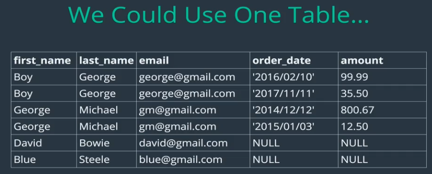
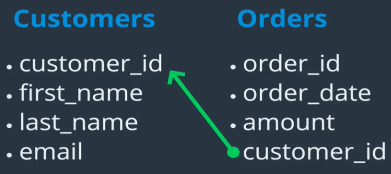
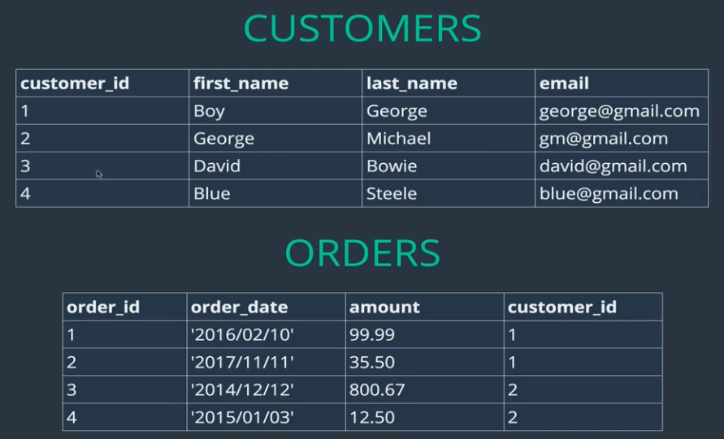
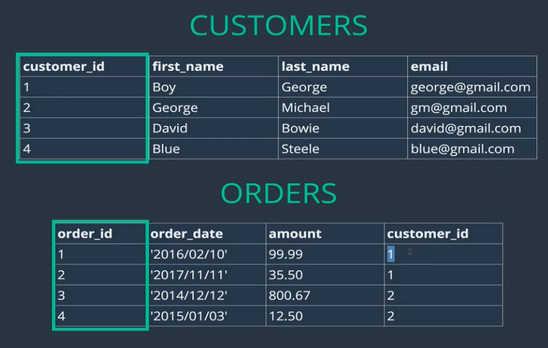
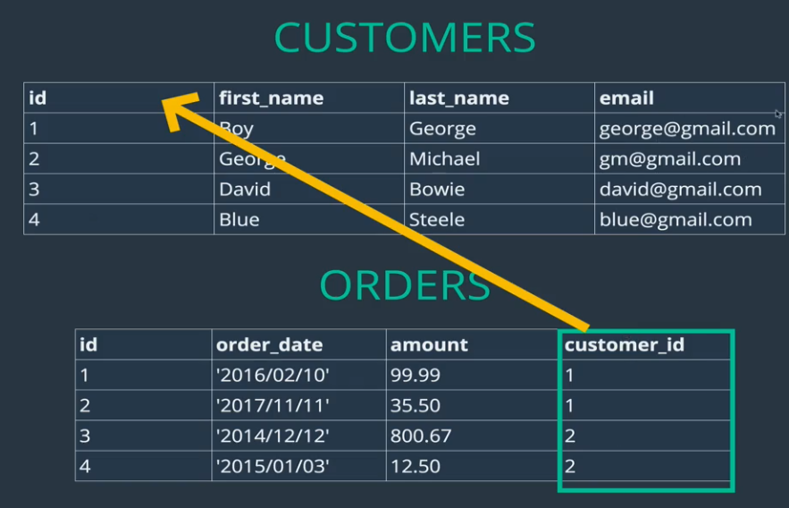
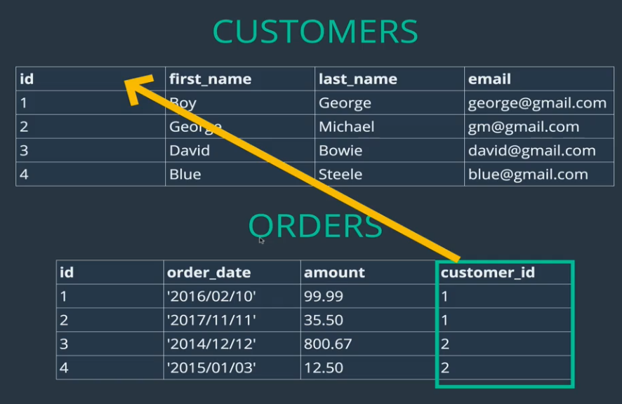
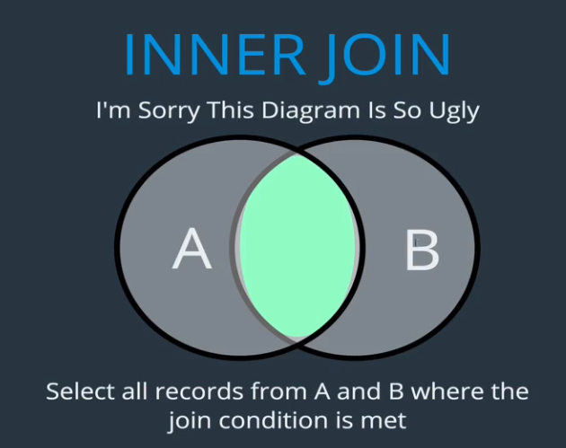
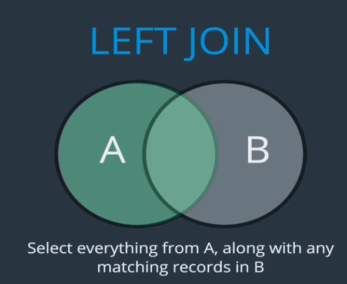
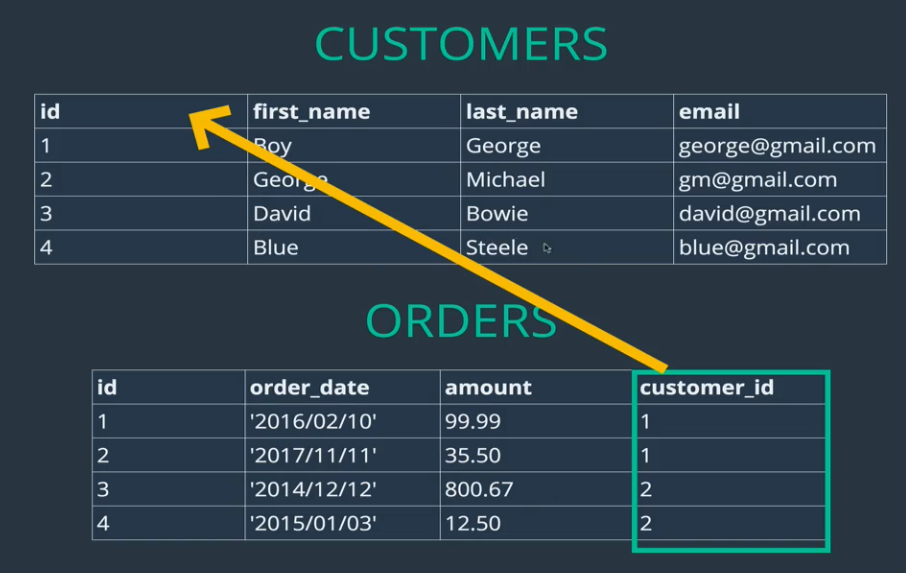
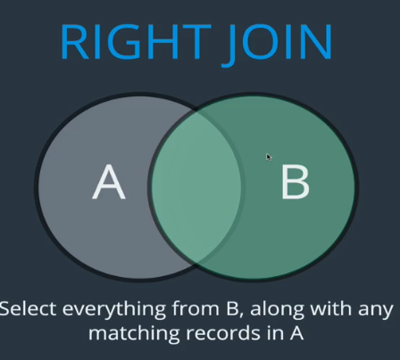

## Section 12: Related Tables (Data)
- So far the course has been on data in a table at a time
- No data has been related so far
- In the real world, we have Users, Likes, Followers, Comments, and many more tables


Now we will talk about how data is related and how to implement those relations using multiple tables


#### Real World Data
- is messy
- if we have a simple blog site there are a lot to store
  - Users
  - Blogs
  - Comments
- We will see how to work with interrelated data


**Lets talk about books! What if we had a library website?**
- we would need to have the following tables


- in a typical app like a book store, we would need a bunch of tables
- Orders may need to be split into various tables


# Types of relationships
- how do we represent complex data using Relational DBs and SQL
- How are Entities (Nouns) related?


#### 1:1 Relationship
Ex:
- One customer has one row in the customer_details tables abd one customer_details is associated with one Customer (row) in the Customers table
- a customer_details table and a customer table
- instead of having a customer table with a bunch of columns, the data was broken up in two tables
- Customer table contained data used often


#### 1:n relationship

Ex:
- The relationship between Books and reviews
- A book can have many reviews, a single review record, belongs to one book
- books have many reviews but reviews belong to one book


#### n:n relationship

Ex:
- two entities, Books and Authors
- Books can have many authors
- Authors can have many books


## 1:n Basics, The most Common Relationships
- lets start with an example, Customers and Orders (two tables)


- This is the easy part
- Now we have to figure out how to store the data

<br>

**A possible way: one giant table(Awful idea)**

- the big table does capture everything But....
1. A lot of repeated Data for first, last name, and email because they have placed multiple orders
2. The last two haven't placed orders, if they have never placed, then there is no need to have any order info if they have not placed any orders
   - There are many times actions are done that do not require some information stored in table
   - Here, David logs in, there is no need to go through a table with a bunch of null values if all we need is log in info

<br>


**Solution: break data up**
- we have two tables now
- Orders have a field that references the Customer table
- whatever the customer_id is of a given corresponds to a Customer that placed the order





Note:
- Orders.customer_id references Customer.customer_id
  - it tells us that the rows that have custromer_id =1 matches boy George, etc
- we have users that havent ordered but we do not waste resources storing nulls
- we are not repeating names and usernames

**This is a classic way of structuring a 1:n relationship**

### Primary Key
- a column that has unique values for each row
- Used for Unique Identification of entries/rows





### Foreign Key
- references in a given table to the primary key of another table
- We can specify which columns in a table are a foreign key
  - We do this to enforce that whatever customer_id value we insert into the  (when for example, adding an order entry) table has to have an existing corresponding value in Customer.customer_id table. (essentially enforces an order was submitted by an existing User/customer)



- Lets explicitly set a foreign key in one table (Orders) and reference the primary key in the other table (Customers)


```SQL
CREATE TABLE customers(
    id INT AUTO_INCREMENT PRIMARY KEY,
    first_name VARCHAR(100),
    last_name VARCHAR(100),
    email VARCHAR(100)
);
CREATE TABLE orders(
    id INT AUTO_INCREMENT PRIMARY KEY,
    order_date DATE,
    amount DECIMAL(8,2),
    customer_id INT,
    FOREIGN KEY(customer_id) REFERENCES customers(id)
);


INSERT INTO customers (first_name, last_name, email)
VALUES ('Boy', 'George', 'george@gmail.com'),
       ('George', 'Michael', 'gm@gmail.com'),
       ('David', 'Bowie', 'david@gmail.com'),
       ('Blue', 'Steele', 'blue@gmail.com'),
       ('Bette', 'Davis', 'bette@aol.com');

INSERT INTO orders (order_date, amount, customer_id)
VALUES ('2016/02/10', 99.99, 1),
       ('2017/11/11', 35.50, 1),
       ('2014/12/12', 800.67, 2),
       ('2015/01/03', 12.50, 2),
       ('1999/04/11', 450.25, 5);

       mysql> select * from customers;
       +----+------------+-----------+------------------+
       | id | first_name | last_name | email            |
       +----+------------+-----------+------------------+
       |  1 | Boy        | George    | george@gmail.com |
       |  2 | George     | Michael   | gm@gmail.com     |
       |  3 | David      | Bowie     | david@gmail.com  |
       |  4 | Blue       | Steele    | blue@gmail.com   |
       |  5 | Bette      | Davis     | bette@aol.com    |
       +----+------------+-----------+------------------+
       5 rows in set (0.00 sec)

Note how the id field was auto incremented


-- This INSERT fails because of our fk constraint.  No user with id: 98
INSERT INTO orders (order_date, amount, customer_id)
VALUES ('2016/06/06', 33.67, 98);

```


### Cross Join
- lets review, Orders has a fk referencing the pk in Customer's table




## Joins
- The whole point is that it takes data from two tables and joins them in a meaningful way


#### Cross Join
- useless
- cartesian product
- like diagram above but takes everything


#### Inner Join


- A and B represent a table, Customers and Orders.
- We select all record from A and B here the join condition is met


```SQL
mysql> select *  from customers;
+----+------------+-----------+------------------+
| id | first_name | last_name | email            |
+----+------------+-----------+------------------+
|  1 | Boy        | George    | george@gmail.com |
|  2 | George     | Michael   | gm@gmail.com     |
|  3 | David      | Bowie     | david@gmail.com  |
|  4 | Blue       | Steele    | blue@gmail.com   |
|  5 | Bette      | Davis     | bette@aol.com    |
+----+------------+-----------+------------------+
5 rows in set (0.00 sec)


mysql> select *  from orders;
+----+------------+--------+-------------+
| id | order_date | amount | customer_id |
+----+------------+--------+-------------+
|  1 | 2016-02-10 |  99.99 |           1 |
|  2 | 2017-11-11 |  35.50 |           1 |
|  3 | 2014-12-12 | 800.67 |           2 |
|  4 | 2015-01-03 |  12.50 |           2 |
|  5 | 1999-04-11 | 450.25 |           5 |
+----+------------+--------+-------------+
5 rows in set (0.00 sec)


```

```SQL
-- IMPLICIT INNER JOIN

SELECT * FROM customers, orders
WHERE customers.id = orders.customer_id;
-- IMPLICIT INNER JOIN

SELECT first_name, last_name, order_date, amount
FROM customers, orders
    WHERE customers.id = orders.customer_id;


    -- EXPLICIT INNER JOINS
    -- can also write INNER JOIN

SELECT * FROM customers
JOIN orders
    ON customers.id = orders.customer_id;

SELECT first_name, last_name, order_date, amount
FROM customers
JOIN orders
    ON customers.id = orders.customer_id;

SELECT *
FROM orders
JOIN customers
    ON customers.id = orders.customer_id;

-- ARBITRARY JOIN - meaningless, but still possible

SELECT * FROM customers
JOIN orders ON customers.id = orders.id;
```


Result of correctly joining:
```SQL
mysql> select first_name, last_name, order_date, amount
    -> FROM customers
    -> JOIN orders
    -> ON customers.id = orders.customer_id;
+------------+-----------+------------+--------+
| first_name | last_name | order_date | amount |
+------------+-----------+------------+--------+
| Boy        | George    | 2016-02-10 |  99.99 |
| Boy        | George    | 2017-11-11 |  35.50 |
| George     | Michael   | 2014-12-12 | 800.67 |
| George     | Michael   | 2015-01-03 |  12.50 |
| Bette      | Davis     | 1999-04-11 | 450.25 |
+------------+-----------+------------+--------+
5 rows in set (0.00 sec)

```
- Note:
  - We need to know the relationship between the two tables (FK and PK) so we can JOIN on the keys (join condition)
  - Take customers and orders tables and join them where customers.id = orders.customer_id
  - We could join off a meaningless condition but this will give us erroneous data


#### Left Join

- Takes everything from left table



- Left join means taking everything from the left table and from the right only the entries that match the join condition


Process:
1) boy georger, is there a matching order? yes
2) put those together
3) what about for george michael? is there a matching order? yes
4) put those together
5) what about for david and blue? no
5) place the customers and fill the missing info of customers with null

- If it was an Inner Join, David and Blue would not show up
```SQL

mysql> select first_name, last_name, order_date, amount FROM customers LEFT JOIN orders ON customers.id = orders.customer_id;
+------------+-----------+------------+--------+
| first_name | last_name | order_date | amount |
+------------+-----------+------------+--------+
| Boy        | George    | 2016-02-10 |  99.99 |
| Boy        | George    | 2017-11-11 |  35.50 |
| George     | Michael   | 2014-12-12 | 800.67 |
| George     | Michael   | 2015-01-03 |  12.50 |
| David      | Bowie     | NULL       |   NULL |
| Blue       | Steele    | NULL       |   NULL |
| Bette      | Davis     | 1999-04-11 | 450.25 |
+------------+-----------+------------+--------+
7 rows in set (0.00 sec)

```

Lets Group By customer_id

```SQL
mysql> select first_name,
              last_name,
              IFNULL(SUM(amount),0)
              FROM customers
              LEFT JOIN orders
              ON customers.id = orders.customer_id
              group by customers.id;
+------------+-----------+-----------------------+
| first_name | last_name | IFNULL(SUM(amount),0) |
+------------+-----------+-----------------------+
| Boy        | George    |                135.49 |
| George     | Michael   |                813.17 |
| David      | Bowie     |                  0.00 |
| Blue       | Steele    |                  0.00 |
| Bette      | Davis     |                450.25 |
+------------+-----------+-----------------------+
5 rows in set (0.00 sec)

```

##### Why would we want this left join?
- maybe i want to see for every user, how much they have spent to send a thank you for being a loyal customer to high spenders and coupon for low or no spenders
- This involves seeing all customers, not just customers that have submitted orders


Code:
```SQL
-- Getting Fancier (Inner Joins Still)

SELECT first_name, last_name, order_date, amount
FROM customers
JOIN orders
    ON customers.id = orders.customer_id
ORDER BY order_date;
SELECT
    first_name,
    last_name,
    SUM(amount) AS total_spent
FROM customers
JOIN orders
    ON customers.id = orders.customer_id
GROUP BY orders.customer_id
ORDER BY total_spent DESC;
-- LEFT JOINS

SELECT * FROM customers
LEFT JOIN orders
    ON customers.id = orders.customer_id;
SELECT first_name, last_name, order_date, amount
FROM customers
LEFT JOIN orders
    ON customers.id = orders.customer_id;
SELECT
    first_name,
    last_name,
    IFNULL(SUM(amount), 0) AS total_spent
FROM customers
LEFT JOIN orders
    ON customers.id = orders.customer_id
GROUP BY customers.id
ORDER BY total_spent;
```
<br>
#### Right Joins

- In our case we do not have any orders that do not have a customer that is not already present therefore we won't see a difference
- In our case, it would not make sense for a customers right join orders to ever give us any result that is different from the results of an inner join because it does not make sense for an order to have been submitted by a customer that is not recorded unless we accidentally add a record to orders table or delete a customer from customers table
- On ther other hand, we do have customers who have not order so a `customers LEFT JOIN orders` would give us all customers even if they have not ordered (even if customer id in customers table is not present in the orders table)



- Same as left join except it takes everything from which ever table we are joining as written in `tableA right join TableB syntax`


##### Revisiting Customer and Orders tables
- What happens if we try to delete a customer, lets say Boy George


```SQL
mysql> select * from orders;
+----+------------+--------+-------------+
| id | order_date | amount | customer_id |
+----+------------+--------+-------------+
|  1 | 2016-02-10 |  99.99 |           1 |
|  2 | 2017-11-11 |  35.50 |           1 |
|  3 | 2014-12-12 | 800.67 |           2 |
|  4 | 2015-01-03 |  12.50 |           2 |
|  5 | 1999-04-11 | 450.25 |           5 |
+----+------------+--------+-------------+
5 rows in set (0.00 sec)

mysql> select * from customers                                                      -> ;
+----+------------+-----------+------------------+
| id | first_name | last_name | email            |
+----+------------+-----------+------------------+
|  1 | Boy        | George    | george@gmail.com |
|  2 | George     | Michael   | gm@gmail.com     |
|  3 | David      | Bowie     | david@gmail.com  |
|  4 | Blue       | Steele    | blue@gmail.com   |
|  5 | Bette      | Davis     | bette@aol.com    |
+----+------------+-----------+------------------+
5 rows in set (0.00 sec)

mysql> DELETE FROM customers where first_name='Boy';
ERROR 1451 (23000): Cannot delete or update a parent row: a foreign key constraint fails (`bakery`.`orders`, CONSTRAINT `orders_ibfk_1` FOREIGN KEY (`customer_id`) REFERENCES `customers` (`id`))
mysql>

```

- Error occurs because we can not delete a customer if it is referenced by a foreign key in another
- this is done by not letting us delete data willy nilly if it is referenced

How can we delete a customer and all its associated orders? or, if we wanted to delete a book, how can we delete its associated reviews?
- delete orders that refer to the customer we want to delete, then delete the customer
- we could also get rid of the foreign key constraint (Bad idea!)
