## What is a Database
- A collection of data
- A method for accessing and manipulating the data
- A structured set of data with an interface


## What is a Schema
- a blueprint or outline of how the DB should be constructed

An example of a "database" is a phone book.
- With a phone book we can look up people


## Database vs DBMS


- A DBMS =/= Database
- A DBMS is the program (software) that allows us to interface with our Databases


- People often refer to a Database as the DBMS and DB together
- All the names above are DBMS not Databases

## MySQL vs SQL
- SQL is the language we use to talk to out DB
- We could do the following things with SQL
  - find all users
  - find all users who are 18 years old
  - add new user named Miguel


<br>


#### Different Relational DBs


<br>


<br>


- There is a standard to SQL
- SQL may vary slightly

<br>


Features that may be different:
- speed
- security


#### Section 3: Creating Databases and Tables
- Currently we have a mySQL Database server which comes with the installation of MySQL
- We ran the server by `sudo service mysql start`


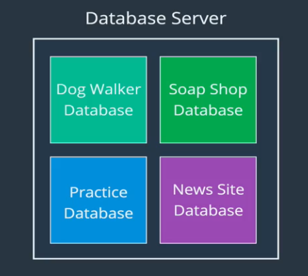
- Inside the DB server we can have multiple Databases


**Lets zoom in inside two of our DBs**

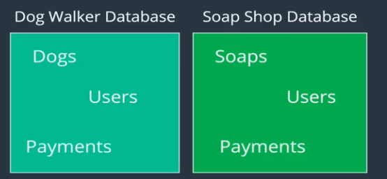

- DB Dog Walker and Soap Shop DB both store users and payments
- these must be kept separate

<br>

#### Showing databases

- The following command allows us to see all DBs inside the DB server


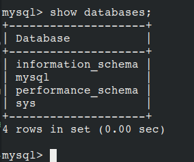

<br>

#### Creating databases


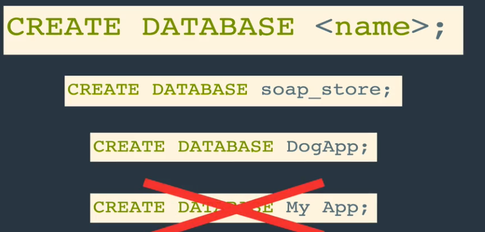

Ex:

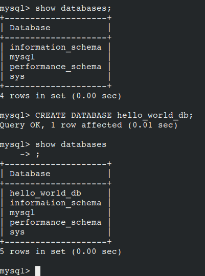


#### Dropping Databases
`DROP DATABASES <name>`
- DROP is the SQL word for delete
- used to delete DBs and Tables .. maybe others

Ex:


##### Let's actually Use DBs


- This command tells MySQL which DB we want to work with
- Needed because DB server has multiple DBs


- This command is used to tell you which DB you are currently using, if any

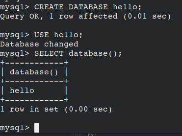


##Intro to Tables (in Relational DBs)
- a DB contains a collection of tables
- Table:
  - a collection of structured related data

**Anatomy:**
Columns : headers
Rows: Each entry/record

<br>

**Example of a Table:**
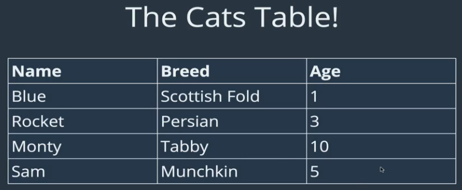

<br>


- usually not just One
- usually we will have, an a Pet sitting app
- we would have to keep track of owners, payments, dogs, etc


### Data Types
- when creating a new Table, we have to specify the Data Type of each column


Reason:
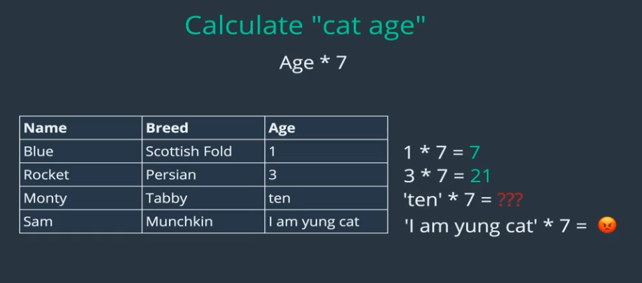


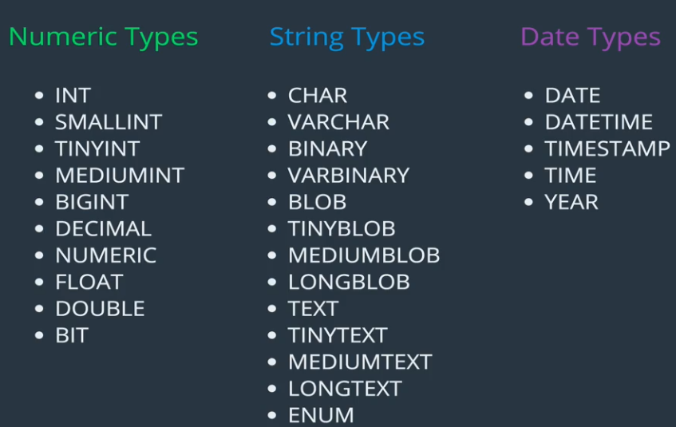

**lets focus on two Types**

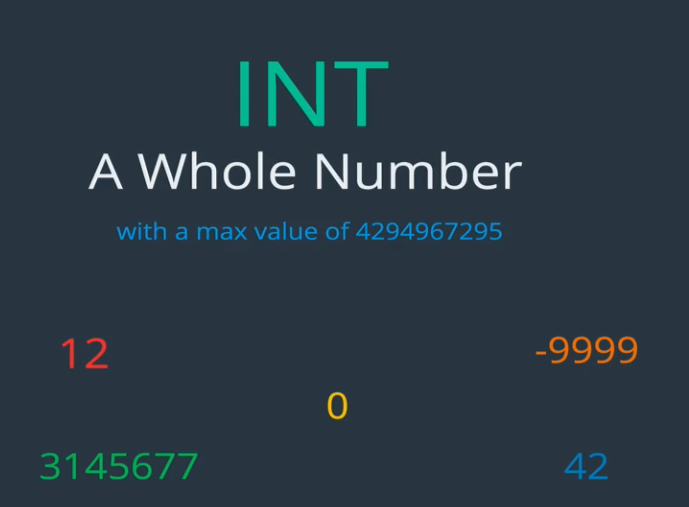


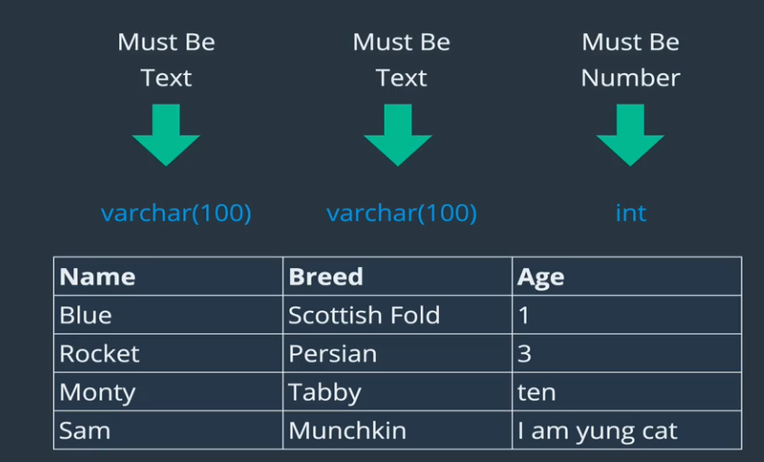
- varchar(number)
- number represents the maximum number of characters allowed

<br>

### Creating Tables

- table names should be pluralized
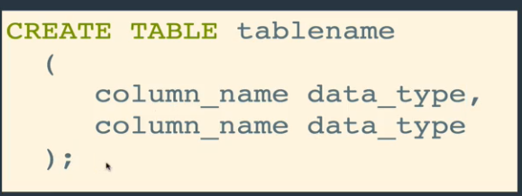

```SQL
CREATE TABLE tablename
  (
    column_name data_type,
    column_name data_type
  );
CREATE TABLE cats
  (
    name VARCHAR(100),
    age INT
  );
```

**How do we know it worked?**

`SHOW TABLES`

`SHOW COLUMNS FROM cats`

`DESC cats`

Ex:

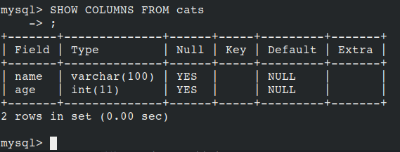


### Deleting tables
`DROP TABLE cats`

<br>

###Lets Practice


<br>

### Inserting Tables
- Adding Data to your Tables

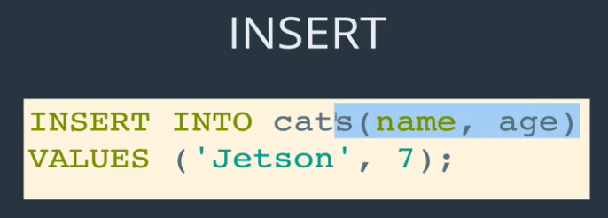

- Order Matters if name appears first then the value for name needs to be first


Ex:
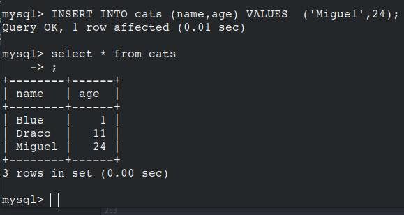


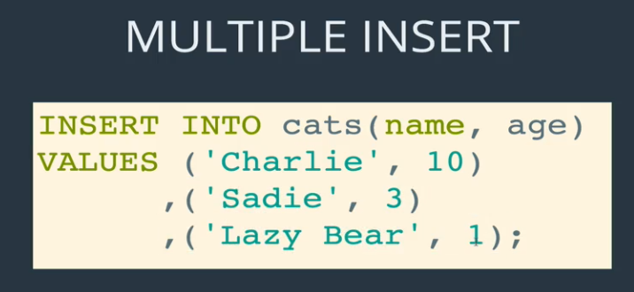


Example:
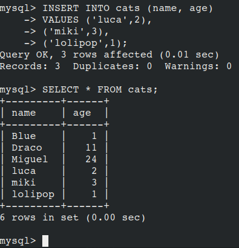


```SQL
INSERT INTO table_name
            (column_name, column_name)
VALUES      (value, value),
            (value, value),
            (value, value);
```


Example of Multiple Inserts:
```SQL
mysql> INSERT INTO people (first_name, last_name, age)
    -> VALUES ('Linda', 'Belcher', 45),
    -> ('Phillip','Frond', 38),
    -> ('Calvin','Fischoeder',70);

```


#### Warnings
- Sometimes mySQL would show  Warnings
- If we define a column to be of type `VARCHAT(10)` and we insert a string of characters > 10, we will get a warning
- `SHOW WARNINGS` is used to display warnings
- In this case the string will get truncated to 10 characters
- Note: Warnings will be wiped after another command is run
- If we try to insert a string where a cell expects an INT then the value will be set to 0 and a warning logged
  - we can change this default


#### NULL and NOT_NULL

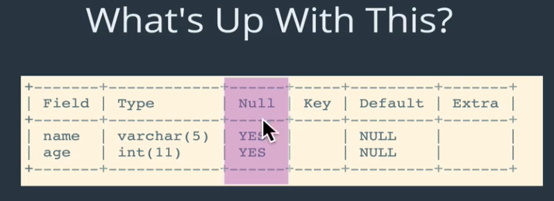

- NULL means   "there is no specified value"

###### What if we want to define that a coulmn should not accept nulls

```sql

CREATE TABLE cats2(
  name VARCHAR(100) NOT NULL,
  age INT NOT NULL)
)
```
- In MySQL, each column type has an "implicit default" value.
- Below we can see that Null is not allowed for either field, and that the default value is set to Null
```SQL
mysql> show columns from cats2;
+-------+-------------+------+-----+---------+-------+
| Field | Type        | Null | Key | Default | Extra |
+-------+-------------+------+-----+---------+-------+
| name  | varchar(10) | NO   |     | NULL    |       |
| age   | int(11)     | NO   |     | NULL    |       |
+-------+-------------+------+-----+---------+-------+

```


Now lets try to insert a row (cat entry) with a missing column

```SQL
mysql> INSERT INTO cats2(name) VALUES ('texas');
ERROR 1364 (HY000): Field 'age' doesn't have a default value
mysql> INSERT INTO cats2(age) VALUES (7);
ERROR 1364 (HY000): Field 'name' doesn't have a default value
mysql>
```

- Note no entry was inserted
- I believe this happens only if strict mode is on
`For data entry into a NOT NULL column that has no explicit DEFAULT clause, if an INSERT or REPLACE statement includes no value for the column [and if] strict SQL mode is enabled, an error occurs ..`
- If strict mode is not on, i believe a warning will be logged


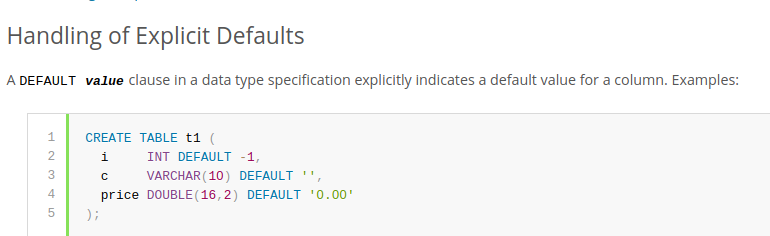

<br>

#### Setting Default Values
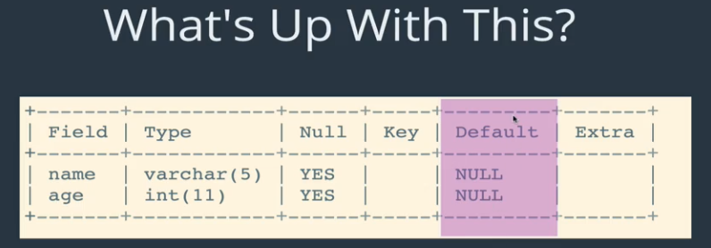
- It is useful to specify a fall back if a record is missing a field value
- That is where Default comes in


Ex:

```SQL

CREATE TABLE cats3(
    -> name VARCHAR(20) DEFAULT 'no name provided',
    -> age INT DEFAULT 99);

```

```SQL
+-------+-------------+------+-----+------------------+-------+
| Field | Type        | Null | Key | Default          | Extra |
+-------+-------------+------+-----+------------------+-------+
| name  | varchar(20) | YES  |     | no name provided |       |
| age   | int(11)     | YES  |     | 99               |       |
+-------+-------------+------+-----+------------------+-------+

```

Lets try to insert a record with missing name

```SQL
INSERT INTO cats3(age) VALUES(10);
```

Result:

```SQL
mysql> INSERT INTO cat3(age) VALUES(10);
Query OK, 1 row affected (0.01 sec)

mysql> SELECT * FROM cat3;
+------------------+------+
| name             | age  |
+------------------+------+
| no name provided |   10 |
+------------------+------+
1 row in set (0.00 sec)

mysql>

```


<br>


- no, if we leave a field of an entry empty, it will be defaulted to the default value but if we do not explicitly include not null, there is nothing stopping SQL from inserting NULL with the following statement

```SQL
INSERT into table(name, age) VALUES('miguel',NULL);
```
On the other hand, if we try to explicitly insert null above, we get an error saying a field value can not be null


Summary:
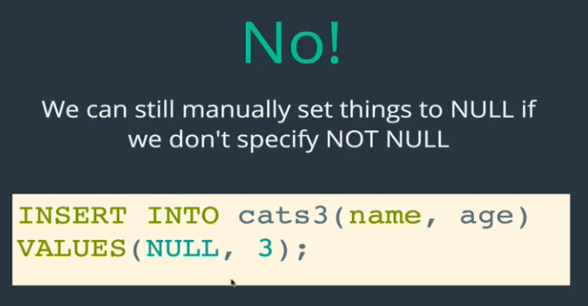

<br>

### Primer On Primary Keys

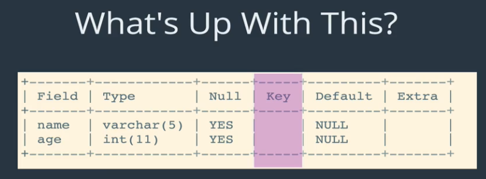

- Right now we can enter a bunch of cats with the same name and age
- This is a problem because we want our data to be uniquely identifiable
- Each row needs to be unique
- Each row represents a unique entity
- A fundamental part of DBs is to have entries be identifiable
- If we sign up for facebook, there is a reason why usernames are unique, there can not be two users with user name colt


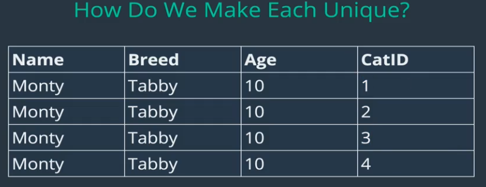


- We generally assign a field/column of a Table as a primary key, usually named `tablename_id`

##### How do we assign a column as a primary key in SQL when we Create a Table?

```SQL
CREATE TABLE unique_cats (cat_id INT NOT NULL,
   name VARCHAR(100),
    age INT,
     PRIMARY KEY (cat_id));
```


```SQL

mysql> INSERT INTO unique_cats(cat_id,name,age) VALUES(1,"fred",23);
ERROR 1146 (42S02): Table 'bakery.unqiue_cats' doesn't exist
mysql> INSERT INTO unique_cats(cat_id,name,age) VALUES(1,"fred",23);
Query OK, 1 row affected (0.00 sec)

mysql> SELECT * from unique_cats;
+--------+------+------+
| cat_id | name | age  |
+--------+------+------+
|      1 | fred |   23 |
+--------+------+------+
1 row in set (0.00 sec)

mysql> INSERT INTO unique_cats(cat_id,name,age) VALUES(1,"MIG",232);
ERROR 1062 (23000): Duplicate entry '1' for key "PRIMARY"
mysql>
```

Note:
- we can not insert an entry with a duplicate value for whatever column was defined as a primary key
<br>

#### AUTO_INCREMENT
- we can specify that the primary key is should be auto incremented
- This allows us to not have to specify the primary key when inserting elements


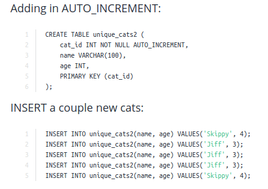

```SQL
mysql> select * from unique_cats2;                                   
+--------+--------+------+
| cat_id | name   | age  |
+--------+--------+------+
|      1 | Skippy |    4 |
|      2 | Jiff   |    3 |
|      3 | Jiff   |    3 |
|      4 | Jiff   |    3 |
|      5 | Skippy |    4 |
+--------+--------+------+
 We can see that the primary key was auto incremented
```

`EXERCISE: Create an employees table with given fields`


```SQL

CREATE TABLE Employees(
  id INT NOT NULL AUTO_INCREMENT,
  last_name VARCHAR(20) NOT NULL,
  first_name VARCHAR(20) NOT NULL,
  middle_name VARCHAR(20),
  age INT NOT NULL,
  current_status VARCHAR(20) NOT NULL DEFAULT 'employed',
  PRIMARY KEY(id)


  mysql> DESC Employees;
+----------------+-------------+------+-----+----------+----------------+
| Field          | Type        | Null | Key | Default  | Extra          |
+----------------+-------------+------+-----+----------+----------------+
| id             | int(11)     | NO   | PRI | NULL     | auto_increment |
| last_name      | varchar(20) | NO   |     | NULL     |                |
| first_name     | varchar(20) | NO   |     | NULL     |                |
| middle_name    | varchar(20) | YES  |     | NULL     |                |
| age            | int(11)     | NO   |     | NULL     |                |
| current_status | varchar(20) | NO   |     | employed |                |
+----------------+-------------+------+-----+----------+----------------+

);

```
- we can also add PRIMARY KEY to line that specified id like this `... id INT NOT NULL AUTO_INCREMENT PRIMARY KEY`


**Lets try to insert a record**
```SQL
mysql> INSERT INTO Employees(last_name, first_name,middle_name,age) VALUES ('miguel', 'petrarca', 'eduardo', 24);
Query OK, 1 row affected (0.01 sec)

```

```SQL
mysql> select * from Employees;
+----+-----------+------------+-------------+-----+----------------+
| id | last_name | first_name | middle_name | age | current_status |
+----+-----------+------------+-------------+-----+----------------+
|  1 | miguel    | petrarca   | eduardo     |  24 | employed       |
+----+-----------+------------+-------------+-----+----------------+
1 row in set (0.00 sec)

```

###Section 5 CRUD Commands
- CRUD
  - Create
  - Read
  - Update
  - Delete
- The command commands we perform on data

1) Create
- we do this with `INSERT INTO`
- This operation is review


Lets focus on Read, Update, and Delete


Lets start with a Clean slate by dropping the cats tables and creating a new one


```SQL
Let's drop the existing cats table:

DROP TABLE cats;

Recreate a new cats table:

CREATE TABLE cats
  (
     cat_id INT NOT NULL AUTO_INCREMENT,
     name   VARCHAR(100),
     breed  VARCHAR(100),
     age    INT,
     PRIMARY KEY (cat_id)
  );
DESC cats;

And finally insert some new cats:

INSERT INTO cats(name, breed, age)
VALUES ('Ringo', 'Tabby', 4),
       ('Cindy', 'Maine Coon', 10),
       ('Dumbledore', 'Maine Coon', 11),
       ('Egg', 'Persian', 4),
       ('Misty', 'Tabby', 13),
       ('George Michael', 'Ragdoll', 9),
       ('Jackson', 'Sphynx', 7);
```
<br>

## Select (Read in CRUD)
- `SELECT * FROM cats` to select all columns
- `SELECT column_name1, column_name2, .... FROM cats`

<br>

#### Filtering / searching for specific data using `WHERE
- not just used with `SELECT`
- also user for `UPDATE`, `DELETE`, etc

```SQL
mysql> select * from cats where name="Egg";
+--------+------+---------+------+
| cat_id | name | breed   | age  |
+--------+------+---------+------+
|      4 | Egg  | Persian |    4 |
+--------+------+---------+------+
1 row in set (0.00 sec)

```

- we could do `"EGG"` instead, this is not case sensitive by default

#### Aliases
- we can give aliases to column names, tables, whatelse?
`SELECT cat_id AS id from cats`

<br>

## Update

- update existing data

Ex:
`UPDATE cats SET breed='Shorthair' WHERE breed ="Tabby"`
`UPDATE cats SET age = 14 WHERE name = 'Misty'`


- Core idea, use select first and double check expected data is returned before updating or deleting
- There are times where we would want to update all data in the table, in that case we do not use `WHERE`, but most of the time we want to update something specific


## Delete

`DELETE FROM cats WHERE name = "Egg"`
- Make sure that you have selected the correct entry before deleting

```SQL
mysql> select * from cats;
+--------+----------------+----------------+------+
| cat_id | name           | breed          | age  |
+--------+----------------+----------------+------+
|      1 | Ringo          | british soldie |    4 |
|      2 | Cindy          | Maine Coon     |   12 |
|      3 | Dumbledore     | Maine Coon     |   12 |
|      4 | Egg            | Persian        |    4 |
|      5 | Misty          | hi             |   14 |
|      6 | George Michael | Ragdoll        |    9 |
|      7 | jack           | Sphynx         |    7 |
+--------+----------------+----------------+------+
7 rows in set (0.00 sec)

mysql> delete from cats where name='egg';
Query OK, 1 row affected (0.01 sec)

mysql> select * from cats;
+--------+----------------+----------------+------+
| cat_id | name           | breed          | age  |
+--------+----------------+----------------+------+
|      1 | Ringo          | british soldie |    4 |
|      2 | Cindy          | Maine Coon     |   12 |
|      3 | Dumbledore     | Maine Coon     |   12 |
|      5 | Misty          | hi             |   14 |
|      6 | George Michael | Ragdoll        |    9 |
|      7 | jack           | Sphynx         |    7 |
+--------+----------------+----------------+------+
6 rows in set (0.00 sec)

Note that ids stay the same. They do not shift.

```


`DELETE from cats` deletes all cats (all the entries)
