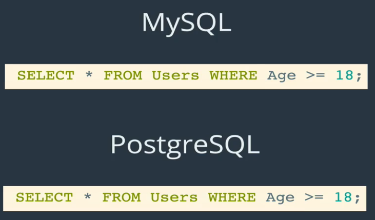
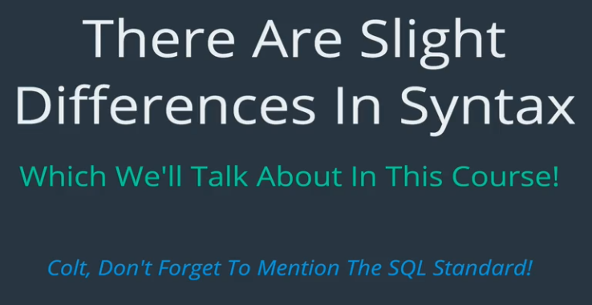
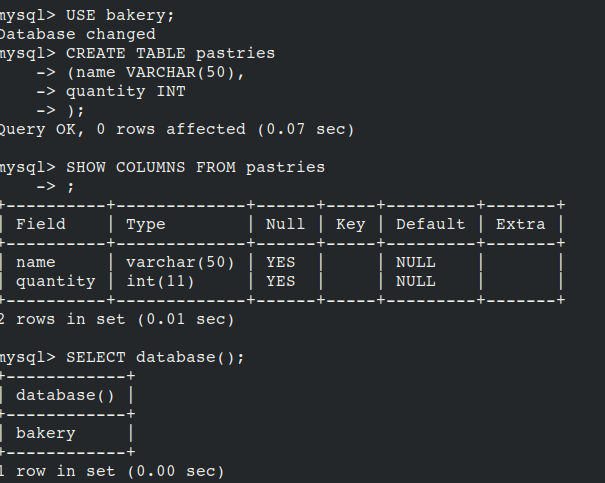

# What is a Database
- A collection of data
- A method for accessing and manipulating the data
- A structured set of data with an interface


An example of a "database" is a phone book.
- With a phone book we can look up people


## Database vs DBMS


- A DBMS =/= Database
- A DBMS is the program (software) that allows us to interface with our Databases


- People often refer to a Database as the DBMS and DB together
- All the names above are DBMS not Databases

## MySQL vs SQL
- SQL is the language we use to talk to out DB
- We could do the following things with SQL
  - find all users
  - find all users who are 18 years old
  - add new user named Miguel


<br>


#### Different Relational DBs


<br>


<br>


- There is a standard to SQL
- SQL may vary slightly

<br>


Features that may be different:
- speed
- security


#### Section 3: Creating Databases and Tables
- Currently we have a mySQL Database server which comes with the installation of MySQL
- We ran the server by `sudo service mysql start`


- Inside the DB server we can have multiple Databases


**Lets zoom in inside two of our DBs**


- DB Dog Walker and Soap Shop DB both store users and payments
- these must be kept separate

<br>

#### Showing databases

- The following command allows us to see all DBs inside the DB server


<br>

#### Creating databases


Ex:


#### Dropping Databases
`DROP DATABASES <name>`
- DROP is the SQL word for delete
- used to delete DBs and Tables .. maybe others

Ex:


##### Let's actually Use DBs


- This command tells MySQL which DB we want to work with
- Needed because DB server has multiple DBs


- This command is used to tell you which DB you are currently using, if any


##Intro to Tables (in Relational DBs)
- a DB contains a collection of tables
- Table:
  - a collection of structured related data

**Anatomy:**
Columns : headers
Rows: Each entry/record

<br>

**Example of a Table:**


<br>


- usually not just One
- usually we will have, an a Pet sitting app
- we would have to keep track of owners, payments, dogs, etc


### Data Types
- when creating a new Table, we have to specify the Data Type of each column


Reason:


**lets focus on two Types**


- varchar(number)
- number represents the maximum number of characters allowed

<br>

### Creating Tables

- table names should be pluralized


```SQL
CREATE TABLE tablename
  (
    column_name data_type,
    column_name data_type
  );
CREATE TABLE cats
  (
    name VARCHAR(100),
    age INT
  );
```

**How do we know it worked?**

`SHOW TABLES`

`SHOW COLUMNS FROM cats`

`DESC cats`

Ex:


### Deleting tables
`DROP TABLE cats`

<br>

###Lets Practice



