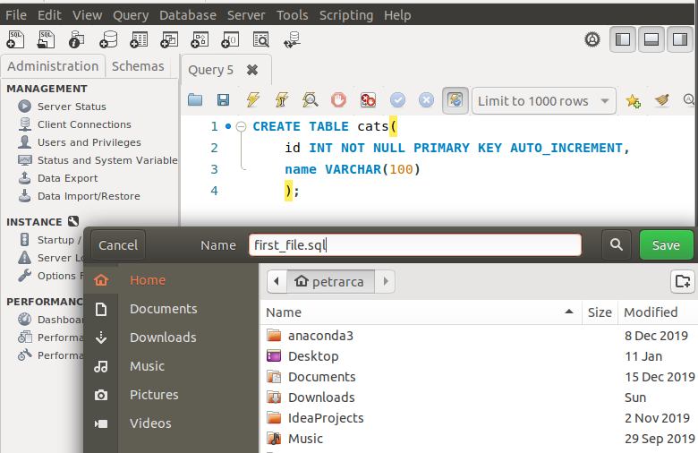
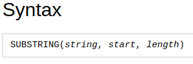
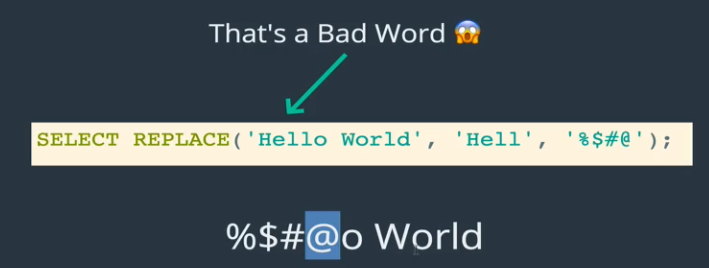
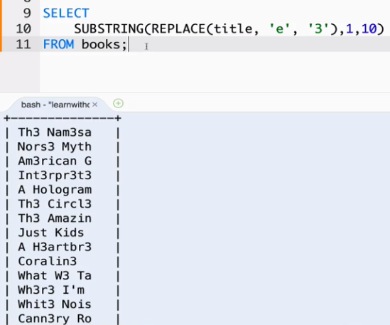

##### Intro
- so far we have only read data with select
- now we will look at further processing of the data that we can do after querying data (concatenating, reversing, getting substring of a string)

## Running SQL Files
- we can run code from a file
- by the end, we will work with .sql files and run them when we are ready
- CLI is great to try things out
- .sql files are better for long/many commands and to share
- We can create new file in GUI


- make sure to give file .sql extension
<br>

#### To actually execute File


- **It matters where we initialize MySQL CLI**
- **we need to initialize it in the directory where file is in order to use source command**
- we can also execute .sql file from GUI
- We can also specify path relative to where we initialized MySQL CLI
  - Ex: lets say we initialized MySQL CLI in directory X and the .sql file we want to run is in a directory called Desktop within X

```SQL
mysql>
source Desktop/first_file.sql;
Query OK, 0 rows affected (0.05 sec)
```
<br>

#### Concat


```SQL
mysql> select CONCAT(author_fname,' ', author_lname) AS fullname from books;
+----------------------+
| fullname             |
+----------------------+
| Jhumpa Lahiri        |
| Neil Gaiman          |
| Neil Gaiman          |
| Jhumpa Lahiri        |
| Dave Eggers          |
| Dave Eggers          |
| Michael Chabon       |
| Patti Smith          |
| Dave Eggers          |
| Neil Gaiman          |
| Raymond Carver       |
| Raymond Carver       |
| Don DeLillo          |
| John Steinbeck       |
| David Foster Wallace |
| David Foster Wallace |
+----------------------+
16 rows in set (0.00 sec)

```


- concat multiple fields with the same separator

```SQL
CONCAT_WS('-', title, author_fname, author_lname)

```
<br>

#### Substring
- allows us to select individual portion if a string





- "print characters from 1 to 4"
- strings in MySQL start at 1


#### Replace
- replace parts of strings
- replaces every instance of hell with %$#@o



```SQL
mysql> select REPLACE(title,'e','3') from books;
+-----------------------------------------------------+
| REPLACE(title,'e','3')                              |
+-----------------------------------------------------+
| Th3 Nam3sak3                                        |
| Nors3 Mythology                                     |
| Am3rican Gods                                       |
| Int3rpr3t3r of Maladi3s                             |
| A Hologram for th3 King: A Nov3l                    |
| Th3 Circl3                                          |
| Th3 Amazing Adv3ntur3s of Kavali3r & Clay           |
| Just Kids                                           |
| A H3artbr3aking Work of Stagg3ring G3nius           |
| Coralin3                                            |
| What W3 Talk About Wh3n W3 Talk About Lov3: Stori3s |
| Wh3r3 I'm Calling From: S3l3ct3d Stori3s            |
| Whit3 Nois3                                         |
| Cann3ry Row                                         |
| Oblivion: Stori3s                                   |
| Consid3r th3 Lobst3r                                |
+-----------------------------------------------------+
16 rows in set (0.00 sec)

```

- we can do replace inside substring



<br>

#### Reverse
- reverses string


<br>

#### Char Length
- tells you how many characters in a given string


```SQL
mysql> select author_fname, CHAR_LENGTH(author_fname) AS length from books;
+--------------+--------+
| author_fname | length |
+--------------+--------+
| Jhumpa       |      6 |
| Neil         |      4 |
| Neil         |      4 |
| Jhumpa       |      6 |
| Dave         |      4 |
| Dave         |      4 |
| Michael      |      7 |
| Patti        |      5 |
| Dave         |      4 |
| Neil         |      4 |
| Raymond      |      7 |
| Raymond      |      7 |
| Don          |      3 |
| John         |      4 |
| David        |      5 |
| David        |      5 |
+--------------+--------+

```


#### UPPER and LOWER
- changes case of string

<br>

#### Last Challenge

```SQL
select
  concat(substring(title, 1, 10), '...') as short_title,
  concat(author_lname, ',', author_fname) as author,
  concat(stock_quantity, ' in stock') as quantity
from
  books;


  +---------------+----------------------+--------------+
| short_title   | author               | quantity     |
+---------------+----------------------+--------------+
| The Namesa... | Lahiri,Jhumpa        | 32 in stock  |
| Norse Myth... | Gaiman,Neil          | 43 in stock  |
| American G... | Gaiman,Neil          | 12 in stock  |
| Interprete... | Lahiri,Jhumpa        | 97 in stock  |
| A Hologram... | Eggers,Dave          | 154 in stock |
| The Circle... | Eggers,Dave          | 26 in stock  |
| The Amazin... | Chabon,Michael       | 68 in stock  |
| Just Kids...  | Smith,Patti          | 55 in stock  |
| A Heartbre... | Eggers,Dave          | 104 in stock |
| Coraline...   | Gaiman,Neil          | 100 in stock |
| What We Ta... | Carver,Raymond       | 23 in stock  |
| Where I'm ... | Carver,Raymond       | 12 in stock  |
| White Nois... | DeLillo,Don          | 49 in stock  |
| Cannery Ro... | Steinbeck,John       | 95 in stock  |
| Oblivion: ... | Foster Wallace,David | 172 in stock |
| Consider t... | Foster Wallace,David | 92 in stock  |
+---------------+----------------------+--------------+

```
