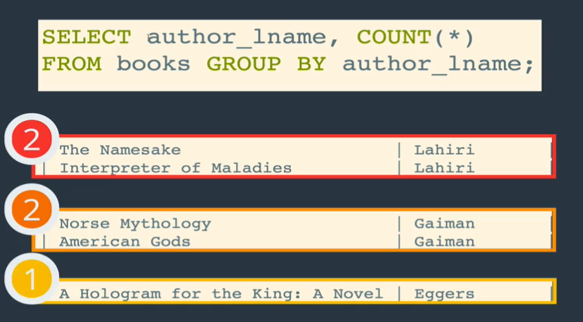
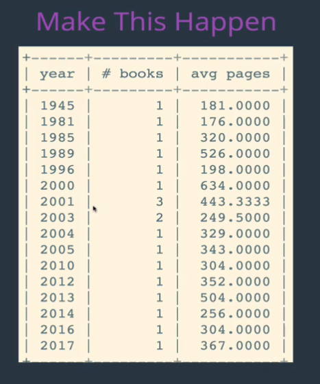

## Intro to Aggregate Functions

### What are they?
- Functions that take a collection of values as input and return a single value
- They work on aggregated data
  - Ex: find the average page length for each others


### Is Group By required when we use Aggregate functions?
- no


### COUNT


**Example Table**
```sql
mysql> select * from books;
+---------+-----------------------------------------------------+--------------+----------------+---------------+----------------+-------+
| book_id | title                                               | author_fname | author_lname   | released_year | stock_quantity | pages |
+---------+-----------------------------------------------------+--------------+----------------+---------------+----------------+-------+
|       1 | The Namesake                                        | Jhumpa       | Lahiri         |          2003 |             32 |   291 |
|       2 | Norse Mythology                                     | Neil         | Gaiman         |          2016 |             43 |   304 |
|       3 | American Gods                                       | Neil         | Gaiman         |          2001 |             12 |   465 |
|       4 | Interpreter of Maladies                             | Jhumpa       | Lahiri         |          1996 |             97 |   198 |
|       5 | A Hologram for the King: A Novel                    | Dave         | Eggers         |          2012 |            154 |   352 |
|       6 | The Circle                                          | Dave         | Eggers         |          2013 |             26 |   504 |
|       7 | The Amazing Adventures of Kavalier & Clay           | Michael      | Chabon         |          2000 |             68 |   634 |
|       8 | Just Kids                                           | Patti        | Smith          |          2010 |             55 |   304 |
|       9 | A Heartbreaking Work of Staggering Genius           | Dave         | Eggers         |          2001 |            104 |   437 |
|      10 | Coraline                                            | Neil         | Gaiman         |          2003 |            100 |   208 |
|      11 | What We Talk About When We Talk About Love: Stories | Raymond      | Carver         |          1981 |             23 |   176 |
|      12 | Where I'm Calling From: Selected Stories            | Raymond      | Carver         |          1989 |             12 |   526 |
|      13 | White Noise                                         | Don          | DeLillo        |          1985 |             49 |   320 |
|      14 | Cannery Row                                         | John         | Steinbeck      |          1945 |             95 |   181 |
|      15 | Oblivion: Stories                                   | David        | Foster Wallace |          2004 |            172 |   329 |
|      16 | Consider the Lobster                                | David        | Foster Wallace |          2005 |             92 |   343 |
|      17 | 10% Happier                                         | Dan          | Harris         |          2014 |             29 |   256 |
|      18 | fake_book                                           | Freida       | Harris         |          2001 |            287 |   428 |
|      19 | Lincoln In The Bardo                                | George       | Saunders       |          2017 |           1000 |   367 |
|      20 | hi                                                  | NULL         | NULL           |          NULL |           NULL |   232 |
+---------+-----------------------------------------------------+--------------+----------------+---------------+----------------+-------+

```

#### Count(*)

```sql
mysql> select count(*) from books;
+----------+
| count(*) |
+----------+
|       20 |
+----------+
1 row in set (0.00 sec)

```

#### Count(title)
```sql
mysql> select count(*) from books;
+----------+
| count(*) |
+----------+
|       20 |
+----------+
1 row in set (0.00 sec)

```

#### Count(stock_quantity)

```sql
mysql> select count(stock_quantity) from books;
+-----------------------+
| count(stock_quantity) |
+-----------------------+
|                    19 |
+-----------------------+
1 row in set (0.00 sec)

```

#### Count(Distinct author_fname)
- how many unqiue first names in library
```sql
mysql> select count(distinct author_fname) from books;
+------------------------------+
| count(distinct author_fname) |
+------------------------------+
|                           12 |
+------------------------------+
1 row in set (0.00 sec)

```

#### How many Distinct Authors?
- how many distinct authors?
- we can use distinct on two columns

```sql
mysql> select count(distinct author_fname, author_lname) from books;
+--------------------------------------------+
| count(distinct author_fname, author_lname) |
+--------------------------------------------+
|                                         12 |
+--------------------------------------------+
1 row in set (0.00 sec)

```

#### How many titles contain "The"?

```sql
mysql> select count(*) as number_of_books_with_the from books where title like "%the%";
+--------------------------+
| number_of_books_with_the |
+--------------------------+
|                        6 |
+--------------------------+
1 row in set (0.00 sec)

```
### Group By
- we use it along side some other functions
- Group by summarizes or aggregates identical data into single rows
- We can say for example "take all movies in our DB, group them by genre and tell me how many each genre has "


#### How does it work?

**Our Table: (a smaller version):**


- Lets say, we want to aggregate the last name of all authors together (this would not actually be what we want in real life because different authors can share the same last name)

```sql
mysql> select author_lname from books group by author_lname;
+----------------+
| author_lname   |
+----------------+
| Lahiri         |
| Gaiman         |
| Eggers         |

12 rows in set (0.00 sec)

```
- we can see that we have formed groups and gotten back only unqiue last
- we can think of the authors that share last name being combined into a single mega


<br>

 **Note: here colt can select title column because he does not have** `sql_mode = only_full_group_by`


<br>


**What happens if I try to select title also?**
```sql
mysql> select title, author_lname from books group by author_lname;
ERROR 1055 (42000): Expression #1 of SELECT list is not in GROUP BY clause and contains nonaggregated column
 'book_shop.books.title' which is not functionally
 dependent on columns in GROUP BY clause;
 this is incompatible with sql_mode=only_full_group_by
```
- This is good, because if we think about it, it makes no sense to select title after grouping by author last name, because some last names will have multiple titles, and MySQL would pick and display one of the titles like seen in colt's query

<br>

#### Functional Dependency
- This brings us to the term **functional dependency**
- the only things that can appear in `select` when `group by` is used are
  1. **aggregate functions performed on a column**
  2. functionally dependent columns
- Title is not functionally dependent because author_lname does not uniquely determine title, meaning a single author last name can point to multiple titles



- `Group by` can be thought as doing the above, grouping the various column values into distinct groups and forming mega rows. (for the column in the group by clause)
- having `sql_mode = only_full_group_by` will not allow the above, because Lahiri and Gaiman are pointing to more than one title
- For example, we will also be unable to select book_id, because the author_lname may be pointing to several, different, books
- Count(*) can be used here to count the number of rows in the Mega Rows
  - So we could use Count(*) to answer, how many titles for each author l_name (remember, different authors can share the same last name, so this finds for example, how many books were written by authors whose last name is Lahiri, Gaiman, etc )
Example:

```sql
select count(*) as number_of_books, author_lname
from books
group by author_lname;
+-----------------+----------------+
| number_of_books | author_lname   |
+-----------------+----------------+
|               2 | Lahiri         |
|               3 | Gaiman         |
|               3 | Eggers         |
|               1 | Chabon         |
|               1 | Smith          |
|               2 | Carver         |
|               1 | DeLillo        |
|               1 | Steinbeck      |
|               2 | Foster Wallace |
|               2 | Harris         |
|               1 | Saunders       |
|               1 | NULL           |
+-----------------+----------------+
12 rows in set (0.00 sec)

```

<br>

#### Group By two Columns
- lets say we want to group by authors first name and last name (better, now we will get unique author groupings with our data set, still it would be better to have a unique id for each author in case we have authors that have the same first and last name)


```sql

select avg(pages) as average_pages,count(*) as books_written, author_fname, author_lname  
from books group by author_fname, author_lname;
+---------------+---------------+--------------+----------------+
| average_pages | books_written | author_fname | author_lname   |
+---------------+---------------+--------------+----------------+
|      244.5000 |             2 | Jhumpa       | Lahiri         |
|      325.6667 |             3 | Neil         | Gaiman         |
|      431.0000 |             3 | Dave         | Eggers         |
|      634.0000 |             1 | Michael      | Chabon         |
|      304.0000 |             1 | Patti        | Smith          |
|      351.0000 |             2 | Raymond      | Carver         |
|      320.0000 |             1 | Don          | DeLillo        |
|      181.0000 |             1 | John         | Steinbeck      |
|      336.0000 |             2 | David        | Foster Wallace |
|      256.0000 |             1 | Dan          | Harris         |
|      428.0000 |             1 | Freida       | Harris         |
|      367.0000 |             1 | George       | Saunders       |
|      232.0000 |             1 | NULL         | NULL           |
+---------------+---------------+--------------+----------------+
13 rows in set (0.00 sec)

```
- we see Dan Harris and Freida Harris are now treated separately
- we can have author_fname and author_lname in select clause because when we group by author first and last name, that combination uniquely identifies the columns in the select statement.
- the combination still does not uniquely identity a title, because each author can write many titles, therefore title can not appear in select unless its inside an aggregate function (same with pages for the same reason as title)
<br>

#### Min and  Without Group By
- we can use them on their own or combines with Min/Max

**Ex: Find the minimum released year for any**

```sql
mysql> select Min(released_year) from books;
+--------------------+
| Min(released_year) |
+--------------------+
|               1945 |
+--------------------+
1 row in set (0.00 sec)

```

**Ex: Find longest book**

```sql
mysql> select max(books.pages) from books;
+------------------+
| max(books.pages) |
+------------------+
|              634 |
+------------------+


<br>
#### Subquery with Min/Max
- we can run one query inside another
- Subquery executes
- Subqueries are a bit slow

**Ex: find title of longest book (using a subquery)**
```sql
select title from
where pages= (select max(pages) from books);
+-------------------------------------------+
| title                                     |
+-------------------------------------------+
| The Amazing Adventures of Kavalier & Clay |
+-------------------------------------------+
1 row in set (0.00 sec)

- Note: select max(books.pages),title from books returns

select max(books.pages), title from books;
ERROR 1140 (42000): In aggregated query without GROUP BY, expression #2 of SELECT list contains nonaggregated column 'book_shop.books.title'; this is incompatible with sql_mode=
```
- **SQL WILL NOT FIND MAX (PAGES) AND THEN THE CORRESPONDING TITLE FOR THAT BOOK!!!** :(

- **Note: faster way is by using `Order by pages limit 1`**

<br>


#### Min and Max with group by

<br>

**Example: find the year each author published their first book**
- we want to first group by because we want the min released year for each author


```SQL
select author_fname, author_lname, min(released_year) as "year of first publication" from books group by author_fname, author_lname;
+--------------+----------------+---------------------------+
| author_fname | author_lname   | year of first publication |
+--------------+----------------+---------------------------+
| Jhumpa       | Lahiri         |                      1996 |
| Neil         | Gaiman         |                      2001 |
| Dave         | Eggers         |                      2001 |
| Michael      | Chabon         |                      2000 |
| Patti        | Smith          |                      2010 |
| Raymond      | Carver         |                      1981 |
| Don          | DeLillo        |                      1985 |
| John         | Steinbeck      |                      1945 |
| David        | Foster Wallace |                      2004 |
| Dan          | Harris         |                      2014 |
| Freida       | Harris         |                      2001 |
| George       | Saunders       |                      2017 |
| NULL         | NULL           |                      NULL |
+--------------+----------------+---------------------------+
13 rows in set (0.00 sec)
```

<br>

**Example: find the longest page count for each author**

```sql
select concat(author_fname," ",author_lname) as Author, max(pages) as "most pages of longest book written"
from books
group by author_fname,author_lname;
+----------------------+------------------------------------+
| Author               | most pages of longest book written |
+----------------------+------------------------------------+
| Jhumpa Lahiri        |                                291 |
| Neil Gaiman          |                                465 |
| Dave Eggers          |                                504 |
| Michael Chabon       |                                634 |
| Patti Smith          |                                304 |
| Raymond Carver       |                                526 |
| Don DeLillo          |                                320 |
| John Steinbeck       |                                181 |
| David Foster Wallace |                                343 |
| Dan Harris           |                                256 |
| Freida Harris        |                                428 |
| George Saunders      |                                367 |
+----------------------+------------------------------------+
12 rows in set (0.00 sec)

```
- we can group by many different columns

<br>

#### SUM Without Group By

**Example: sum all pages in entire database**

```sql
mysql> select sum(pages) from books;
+------------+
| sum(pages) |
+------------+
|       6623 |
+------------+
```

<br>

#### SUM With Group By

**Example: sum all pages each author has written**

```sql

mysql> select concat(author_fname," ",author_lname) as author, sum(pages) as "total pages written" from books group by author_fname,author_lname;
+----------------------+---------------------+
| author               | total pages written |
+----------------------+---------------------+
| Jhumpa Lahiri        |                 489 |
| Neil Gaiman          |                 977 |
| Dave Eggers          |                1293 |
| Michael Chabon       |                 634 |
| Patti Smith          |                 304 |
| Raymond Carver       |                 702 |
| Don DeLillo          |                 320 |
| John Steinbeck       |                 181 |
| David Foster Wallace |                 672 |
| Dan Harris           |                 256 |
| Freida Harris        |                 428 |
| George Saunders      |                 367 |
+----------------------+---------------------+
12 rows in set (0.00 sec)

```
<br>

#### Average without group by

**Example: calculate the average release year between all books**

```sql
mysql> select avg(released_year) as avd_released_year from books;
+-------------------+
| avd_released_year |
+-------------------+
|         1999.7895 |
+-------------------+
1 row in set (0.00 sec)

```
<br>

#### Average with group by


**Example: calculate the average stock quantity for books released in the same year**

```sql
select released_year, avg(stock_quantity) as avg_stock_quantity
from books
group by released_year
order by avg_stock_quantity desc;
+---------------+--------------------+
| released_year | avg_stock_quantity |
+---------------+--------------------+
|          2017 |          1000.0000 |
|          2004 |           172.0000 |
|          2012 |           154.0000 |
|          2001 |           134.3333 |
|          1996 |            97.0000 |
|          1945 |            95.0000 |
|          2005 |            92.0000 |
|          2000 |            68.0000 |
|          2003 |            66.0000 |
|          2010 |            55.0000 |
|          1985 |            49.0000 |
|          2016 |            43.0000 |
|          2014 |            29.0000 |
|          2013 |            26.0000 |
|          1981 |            23.0000 |
|          1989 |            12.0000 |
+---------------+--------------------+
16 rows in set (0.00 sec)

```

#### Aggregate Functions Challenge
<br>

**Example: Print number of books in the DB**

```sql
mysql> select count(book_id) as "number of books in DB" from books;
+-----------------------+
| number of books in DB |
+-----------------------+
|                    19 |
+-----------------------+
1 row in set (0.00 sec)

```

**Example: How many books were released each year**

```sql
mysql> select released_year, count(*) as "number of books released" from books group by released_year;
+---------------+--------------------------+
| released_year | number of books released |
+---------------+--------------------------+
|          2003 |                        2 |
|          2016 |                        1 |
|          2001 |                        3 |
|          1996 |                        1 |
|          2012 |                        1 |
|          2013 |                        1 |
|          2000 |                        1 |
|          2010 |                        1 |
|          1981 |                        1 |
|          1989 |                        1 |
|          1985 |                        1 |
|          1945 |                        1 |
|          2004 |                        1 |
|          2005 |                        1 |
|          2014 |                        1 |
|          2017 |                        1 |
+---------------+--------------------------+
16 rows in set (0.00 sec)


```
<br>

**Example: Print total number of books in stock**
```sql

mysql> select sum(stock_quantity) as "total books in stock" from books;
+----------------------+
| total books in stock |
+----------------------+
|                 2450 |
+----------------------+
1 row in set (0.00 sec)

```

**Example: Find the average released year for each author**

```sql
select concat(author_fname," ", author_lname) as author, avg(released_year) as "avg released year"
from books
group by author_fname, author_lname;
+----------------------+-------------------+
| author               | avg released year |
+----------------------+-------------------+
| Jhumpa Lahiri        |         1999.5000 |
| Neil Gaiman          |         2006.6667 |
| Dave Eggers          |         2008.6667 |
| Michael Chabon       |         2000.0000 |
| Patti Smith          |         2010.0000 |
| Raymond Carver       |         1985.0000 |
| Don DeLillo          |         1985.0000 |
| John Steinbeck       |         1945.0000 |
| David Foster Wallace |         2004.5000 |
| Dan Harris           |         2014.0000 |
| Freida Harris        |         2001.0000 |
| George Saunders      |         2017.0000 |
+----------------------+-------------------+
12 rows in set (0.00 sec)
```

**Example: Find the full name of the author who wrote the longest book**

Without Subquery (using order by and limit)
```sql
select max(pages) as longest_book_written, concat(author_fname, " ", author_lname) as author
from books
group by author_fname,author_lname
order by longest_book_written desc limit 1;
+----------------------+----------------+
| longest_book_written | author         |
+----------------------+----------------+
|                  634 | Michael Chabon |
+----------------------+----------------+
1 row in set (0.00 sec)

```
With subquery

```sql
select author_fname,author_lname, pages
from books
where pages = (select max(pages) from books);
+--------------+--------------+-------+
| author_fname | author_lname | pages |
+--------------+--------------+-------+
| Michael      | Chabon       |   634 |
+--------------+--------------+-------+
1 row in set (0.00 sec)

```

**Example: Make this happen**


- select and seeing all data in group, we see that we have repeating released_years
- here we only have one, so we are grouping by released year
```sql

select released_year as year, count(book_id) as "# books", avg(pages) as "avg pages"
from books
group by released_year
order by year asc;
+------+---------+-----------+
| year | # books | avg pages |
+------+---------+-----------+
| 1945 |       1 |  181.0000 |
| 1981 |       1 |  176.0000 |
| 1985 |       1 |  320.0000 |
| 1989 |       1 |  526.0000 |
| 1996 |       1 |  198.0000 |
| 2000 |       1 |  634.0000 |
| 2001 |       3 |  443.3333 |
| 2003 |       2 |  249.5000 |
| 2004 |       1 |  329.0000 |
| 2005 |       1 |  343.0000 |
| 2010 |       1 |  304.0000 |
| 2012 |       1 |  352.0000 |
| 2013 |       1 |  504.0000 |
| 2014 |       1 |  256.0000 |
| 2016 |       1 |  304.0000 |
| 2017 |       1 |  367.0000 |
+------+---------+-----------+
16 rows in set (0.00 sec)


```
