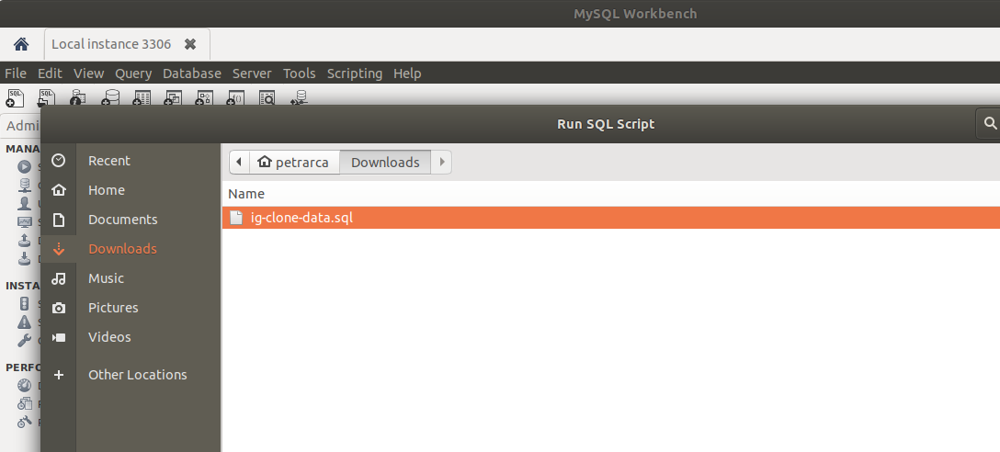
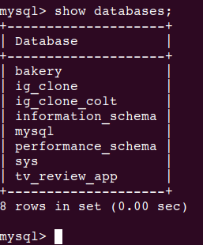
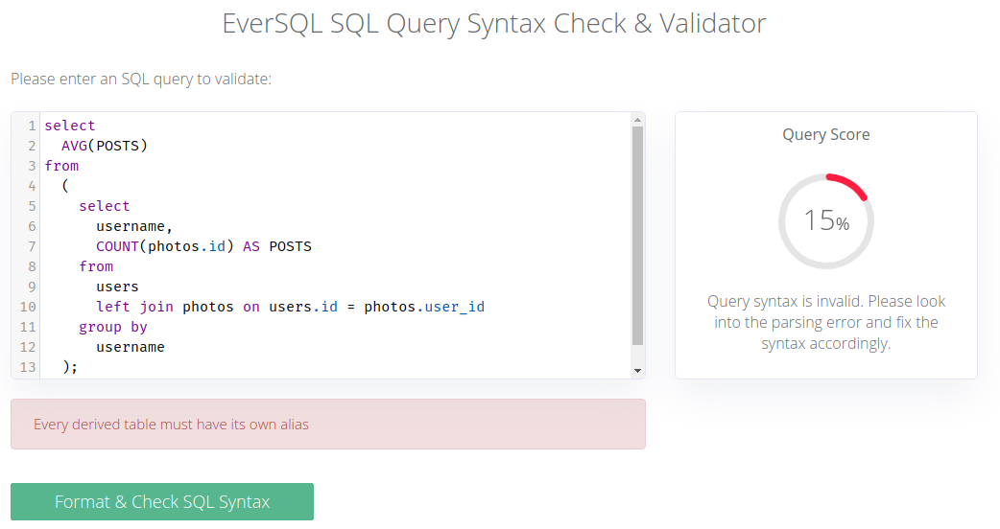
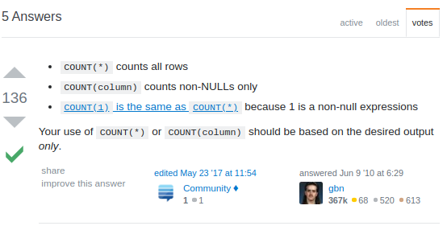
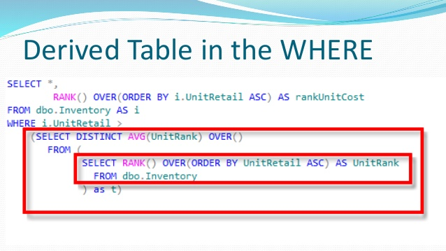

## Working With Instagram Data
- In this section, we will pose questions in english, like in the real world and we will have to translate into queries
- Every video will pose a question at the beginning and then solution
  - Ex: Lets find out which hashtags tend to be the most successful to aid in an ad campaign

<br>

#### First let's Insert our Data
Note: Download the `.sql` file that will create the schema with the same name that colt used that we we can just use the Insert statements he wrote to create data


***Colt's File***
- Schema is the same, my solution had `ON DELETE CASCADE` which I believe it is better
- First three statements are important, what they do is self explanatory
```SQL
DROP DATABASE IF EXISTS ig_clone_colt;
CREATE DATABASE ig_clone_colt;
USE ig_clone_colt;

CREATE TABLE users (
    id INTEGER AUTO_INCREMENT PRIMARY KEY,
    username VARCHAR(255) UNIQUE NOT NULL,
    created_at TIMESTAMP DEFAULT NOW()
);

CREATE TABLE photos (
    id INTEGER AUTO_INCREMENT PRIMARY KEY,
    image_url VARCHAR(255) NOT NULL,
    user_id INTEGER NOT NULL,
    created_at TIMESTAMP DEFAULT NOW(),
    FOREIGN KEY(user_id) REFERENCES users(id)
);

CREATE TABLE comments (
    id INTEGER AUTO_INCREMENT PRIMARY KEY,
    comment_text VARCHAR(255) NOT NULL,
    photo_id INTEGER NOT NULL,
    user_id INTEGER NOT NULL,
    created_at TIMESTAMP DEFAULT NOW(),
    FOREIGN KEY(photo_id) REFERENCES photos(id),
    FOREIGN KEY(user_id) REFERENCES users(id)
);

CREATE TABLE likes (
    user_id INTEGER NOT NULL,
    photo_id INTEGER NOT NULL,
    created_at TIMESTAMP DEFAULT NOW(),
    FOREIGN KEY(user_id) REFERENCES users(id),
    FOREIGN KEY(photo_id) REFERENCES photos(id),
    PRIMARY KEY(user_id, photo_id)
);

CREATE TABLE follows (
    follower_id INTEGER NOT NULL,
    followee_id INTEGER NOT NULL,
    created_at TIMESTAMP DEFAULT NOW(),
    FOREIGN KEY(follower_id) REFERENCES users(id),
    FOREIGN KEY(followee_id) REFERENCES users(id),
    PRIMARY KEY(follower_id, followee_id)
);

CREATE TABLE tags (
  id INTEGER AUTO_INCREMENT PRIMARY KEY,
  tag_name VARCHAR(255) UNIQUE,
  created_at TIMESTAMP DEFAULT NOW()
);

CREATE TABLE photo_tags (
    photo_id INTEGER NOT NULL,
    tag_id INTEGER NOT NULL,
    FOREIGN KEY(photo_id) REFERENCES photos(id),
    FOREIGN KEY(tag_id) REFERENCES tags(id),
    PRIMARY KEY(photo_id, tag_id)
);

--- This is where insert statements begin to generate data
INSERT INTO ......
```
<br>

- You can run SQL Script by going to file --> Run SQL Script in workbench



- Lets see if our DB was created from the script


- we see ig_clone_colt was successfully created

<br>


## Challenges
- Lets start asking some questions (Usually when working with data, we have a motivation and we need to find something out, we think in terms of questions and we translate to SQL language)

<br>

#### First Challenge
'

```SQL
mysql>

SELECT id, username, created_at
FROM users
ORDER BY created_at ASC
LIMIT 5 ;

+----+------------------+---------------------+
| id | username         | created_at          |
+----+------------------+---------------------+
| 80 | Darby_Herzog     | 2016-05-06 00:14:21 |
| 67 | Emilio_Bernier52 | 2016-05-06 13:04:30 |
| 63 | Elenor88         | 2016-05-08 01:30:41 |
| 95 | Nicole71         | 2016-05-09 17:30:22 |
| 38 | Jordyn.Jacobson2 | 2016-05-14 07:56:26 |
+----+------------------+---------------------+
5 rows in set (0.00 sec)


```
<br>


#### Second Challenge


- The COUNT function is used when you need to know how many records exist in a table or within a group.  COUNT(*) will count every record in the grouping; whereas COUNT(expression) counts every record where expression’s result isn’t null.  You can also use Distinct with COUNT to find the number of unique values within a group.


```SQL

mysql>

 SELECT DAYNAME(created_at) AS Day, COUNT(*) AS Registrations
 FROM users
 group by DAY;
+-----------+---------------+
| Day       | Registrations |
+-----------+---------------+
| Thursday  |            16 |
| Sunday    |            16 |
| Tuesday   |            14 |
| Saturday  |            12 |
| Wednesday |            13 |
| Monday    |            14 |
| Friday    |            15 |
+-----------+---------------+
7 rows in set (0.00 sec)

```
<br>

#### Third Challenge


- we want a left users left join photos to see all users even if they have not submitted any photos
- Make sure to use `IS NULL` in where clause and not an `=` sign

```SQL

mysql>

SELECT username, photos.user_id
FROM users
LEFT JOIN photos
ON users.id = photos.user_id WHERE
user_id IS NULL;
+---------------------+---------+
| username            | user_id |
+---------------------+---------+
| Aniya_Hackett       |    NULL |
| Bartholome.Bernhard |    NULL |
| Bethany20           |    NULL |
| Darby_Herzog        |    NULL |
| David.Osinski47     |    NULL |
| Duane60             |    NULL |
| Esmeralda.Mraz57    |    NULL |
| Esther.Zulauf61     |    NULL |
| Franco_Keebler64    |    NULL |
| Hulda.Macejkovic    |    NULL |
| Jaclyn81            |    NULL |
| Janelle.Nikolaus81  |    NULL |
| Jessyca_West        |    NULL |
| Julien_Schmidt      |    NULL |
| Kasandra_Homenick   |    NULL |
| Leslie67            |    NULL |
| Linnea59            |    NULL |
| Maxwell.Halvorson   |    NULL |
| Mckenna17           |    NULL |
| Mike.Auer39         |    NULL |
| Morgan.Kassulke     |    NULL |
| Nia_Haag            |    NULL |
| Ollie_Ledner37      |    NULL |
| Pearl7              |    NULL |
| Rocio33             |    NULL |
| Tierra.Trantow      |    NULL |
+---------------------+---------+
26 rows in set (0.00 sec)

```
<br>

#### Fourth Challenge


- Group by performs better on

```SQL

select photo_id, username, COUNT(*) AS Total_Likes
from
users join photos on users.id = photos.user_id
  inner join likes on photos.id = likes.photo_id
  group by photos.id
  order by Total_Likes DESC
  LIMIT 1;

```
<br>

#### Fifth Challenge


```SQL

--we use COUNT(photos.id) instead of COUNT(*) because we dont want to tally up Nulls (count NULL as a submission)
--we do a left join because we want to include users who have not uploaded a photo in the average
--rs is an alias to the result set because derived tables need an alias

select
  AVG(rs.POSTS)
from
  (
    select
      COUNT(photos.id) AS POSTS
    from
      users left join photos on users.id = photos.user_id
    group by
      username
  ) rs;
```
<br>

Note:
- first I did an inner join which found the avg numbers of posts per users THAT HAD AT LEAST ONE POST
- This is not what the question asked for, we wanted to include the users without posts in the average
- **An alias is required for derived tables, hence why we gave the result set the alias rs (see below)**
- we use COUNT(photos.id) instead of COUNT(*) because we dont want to tally up Nulls (count NULL as a submission)
- we do a left join because we want to include users who have not uploaded a photo in the average
- rs is an alias to the result set because derived tables need an alias



<br>

#####  `COUNT(*) vs COUNT(photos.id)`
- lets see with a `users left join photos` which user has not uploaded a photo

```SQL
mysql>  

select username, photos.id  AS POSTS     
from     
users left join photos on users.id = photos.user_id
order by photos.id asc
limit 40;
+---------------------+-------+
| username            | POSTS |
+---------------------+-------+
| Aniya_Hackett       |  NULL |
| Mckenna17           |  NULL |
| Bethany20           |  NULL |
| Bartholome.Bernhard |  NULL |
| Duane60             |  NULL |
| Esmeralda.Mraz57    |  NULL |
| Esther.Zulauf61     |  NULL |
| Tierra.Trantow      |  NULL |
| David.Osinski47     |  NULL |
| Franco_Keebler64    |  NULL |
| Hulda.Macejkovic    |  NULL |
| Jaclyn81            |  NULL |
| Janelle.Nikolaus81  |  NULL |
| Jessyca_West        |  NULL |
| Darby_Herzog        |  NULL |
| Kasandra_Homenick   |  NULL |
| Julien_Schmidt      |  NULL |
| Nia_Haag            |  NULL |
| Morgan.Kassulke     |  NULL |
| Mike.Auer39         |  NULL |
| Linnea59            |  NULL |
| Maxwell.Halvorson   |  NULL |
| Ollie_Ledner37      |  NULL |
| Pearl7              |  NULL |
| Rocio33             |  NULL |
| Leslie67            |  NULL |
| Kenton_Kirlin       |     1 |
| Kenton_Kirlin       |     2 |
| Kenton_Kirlin       |     3 |
| Kenton_Kirlin       |     4 |
| Kenton_Kirlin       |     5 |
| Andre_Purdy85       |     6 |
| Andre_Purdy85       |     7 |
| Andre_Purdy85       |     8 |
| Andre_Purdy85       |     9 |
| Harley_Lind18       |    10 |
| Harley_Lind18       |    11 |
| Harley_Lind18       |    12 |
| Harley_Lind18       |    13 |
| Arely_Bogan63       |    14 |
+---------------------+-------+
40 rows in set (0.00 sec)

```

#### Lets use `COUNT(*)`
```SQL

mysql>  

select username, count(*)  AS POSTS     
from users left join photos on users.id = photos.user_id
group by username
order by POSTS asc;
+-----------------------+-------+
| username              | POSTS |
+-----------------------+-------+
| Leslie67              |     1 |
| Franco_Keebler64      |     1 |
| Granville_Kutch       |     1 |
| Hulda.Macejkovic      |     1 |
| Imani_Nicolas17       |     1 |
| Jaclyn81              |     1 |
| Janelle.Nikolaus81    |     1 |
| Jaylan.Lakin          |     1 |
| Jayson65              |     1 |
| Jessyca_West          |     1 |
| Julien_Schmidt        |     1 |
| Karley_Bosco          |     1 |
| Kasandra_Homenick     |     1 |
| Katarina.Dibbert      |     1 |
| Kelsi26               |     1 |
| Kenneth64             |     1 |
| Aiyana_Hoeger         |     1 |
| Linnea59              |     1 |
| Maxwell.Halvorson     |     1 |
| Mckenna17             |     1 |
| Meggie_Doyle          |     1 |
| Mike.Auer39           |     1 |
| Morgan.Kassulke       |     1 |
| Nia_Haag              |     1 |
| Odessa2               |     1 |
| Ollie_Ledner37        |     1 |
| Pearl7                |     1 |
| Peter.Stehr0          |     1 |
| Rafael.Hickle2        |     1 |
| Rocio33               |     1 |
| Tierra.Trantow        |     1 |
| Yazmin_Mills95        |     1 |
| David.Osinski47       |     1 |
| Aniya_Hackett         |     1 |
| Bartholome.Bernhard   |     1 |
| Bethany20             |     1 |
| Damon35               |     1 |
| Darby_Herzog          |     1 |
| Darwin29              |     1 |
| Delpha.Kihn           |     1 |
| Duane60               |     1 |
| Erick5                |     1 |
| Esmeralda.Mraz57      |     1 |
| Esther.Zulauf61       |     1 |
| Jordyn.Jacobson2      |     2 |
| Sam52                 |     2 |
| Lennie_Hartmann40     |     2 |
| Ressie_Stanton46      |     2 |
| Alysa22               |     2 |
| Kaley9                |     2 |
| Hailee26              |     2 |
| Tomas.Beatty93        |     2 |
| Javonte83             |     2 |
| Milford_Gleichner42   |     2 |
| Willie_Leuschke       |     2 |
| Nicole71              |     2 |
| Aracely.Johnston98    |     2 |
| Emilio_Bernier52      |     3 |
| Frederik_Rice         |     3 |

```
Note:
- even users that did not upload photos were given a tally as if the NULL value they had was a submission
- This will throw our average off

#####Lets use `COUNT(photos.id)`

```SQL

mysql>
select username, count(photos.id)  AS POSTS     
from users left join photos on users.id = photos.user_id
group by username
order by POSTS asc;
+-----------------------+-------+
| username              | POSTS |
+-----------------------+-------+
| Linnea59              |     0 |
| Hulda.Macejkovic      |     0 |
| Jaclyn81              |     0 |
| Janelle.Nikolaus81    |     0 |
| Franco_Keebler64      |     0 |
| Esther.Zulauf61       |     0 |
| Esmeralda.Mraz57      |     0 |
| Jessyca_West          |     0 |
| Julien_Schmidt        |     0 |
| Duane60               |     0 |
| Kasandra_Homenick     |     0 |
| David.Osinski47       |     0 |
| Leslie67              |     0 |
| Darby_Herzog          |     0 |
| Maxwell.Halvorson     |     0 |
| Mckenna17             |     0 |
| Mike.Auer39           |     0 |
| Morgan.Kassulke       |     0 |
| Bethany20             |     0 |
| Bartholome.Bernhard   |     0 |
| Tierra.Trantow        |     0 |
| Rocio33               |     0 |
| Nia_Haag              |     0 |
| Ollie_Ledner37        |     0 |
| Pearl7                |     0 |
| Aniya_Hackett         |     0 |
| Yazmin_Mills95        |     1 |
| Meggie_Doyle          |     1 |
| Imani_Nicolas17       |     1 |
| Rafael.Hickle2        |     1 |
| Jaylan.Lakin          |     1 |
| Jayson65              |     1 |
| Peter.Stehr0          |     1 |
| Karley_Bosco          |     1 |
| Odessa2               |     1 |
| Katarina.Dibbert      |     1 |
| Kelsi26               |     1 |
| Kenneth64             |     1 |
| Aiyana_Hoeger         |     1 |
| Damon35               |     1 |
| Granville_Kutch       |     1 |
| Darwin29              |     1 |
| Delpha.Kihn           |     1 |
| Erick5                |     1 |
| Hailee26              |     2 |
| Milford_Gleichner42   |     2 |
| Nicole71              |     2 |
| Lennie_Hartmann40     |     2 |
| Aracely.Johnston98    |     2 |
| Kaley9                |     2 |
| Alysa22               |     2 |
| Ressie_Stanton46      |     2 |
| Jordyn.Jacobson2      |     2 |
| Sam52                 |     2 |
| Willie_Leuschke       |     2 |
| Javonte83             |     2 |
| Tomas.Beatty93        |     2 |
| Maya.Farrell          |     3 |
| Alek_Watsica          |     3 |
| Gerard79              |     3 |
| Norbert_Carroll35     |     3 |
| Arely_Bogan63         |     3 |
| Keenan.Schamberger60  |     3 |
| Frederik_Rice         |     3 |
| Presley_McClure       |     3 |
| Emilio_Bernier52      |     3 |
| Tabitha_Schamberger11 |     4 |
| Annalise.McKenzie16   |     4 |
| Andre_Purdy85         |     4 |
| Seth46                |     4 |
| Billy52               |     4 |
| Harley_Lind18         |     4 |
| Rick29                |     4 |
| Malinda_Streich       |     4 |
| Dario77               |     4 |
| Gus93                 |     4 |
| Irwin.Larson          |     4 |
| Dereck65              |     4 |
| Elenor88              |     4 |
| Justina.Gaylord27     |     5 |
| Zack_Kemmer93         |     5 |
| Yvette.Gottlieb91     |     5 |
| Adelle96              |     5 |
| Harrison.Beatty50     |     5 |
| Travon.Waters         |     5 |
| Janet.Armstrong       |     5 |
| Florence99            |     5 |
| Alexandro35           |     5 |
| Josianne.Friesen      |     5 |
| Colten.Harris76       |     5 |
| Kathryn80             |     5 |
| Kenton_Kirlin         |     5 |
| Mariano_Koch3         |     5 |
| Donald.Fritsch        |     6 |
| Jaime53               |     8 |
| Aurelie71             |     8 |
| Delfina_VonRueden68   |     9 |
| Cesar93               |    10 |
| Clint27               |    11 |
| Eveline95             |    12 |
+-----------------------+-------+
100 rows in set (0.00 sec)

```
Note:
- users that had Null for photo id after the left join have 0 photos uploaded, which is correct



<br>


#### Sixth Challenge


```SQL

mysql>

select tag_id, tags.tag_name,  count(tag_id) AS TOTAL_USE
from photo_tags join tags on photo_tags.tag_id = tags.id
group by tag_id
order by TOTAL_USE desc
limit 5;
+--------+----------+-----------+
| tag_id | tag_name | TOTAL_USE |
+--------+----------+-----------+
|     21 | smile    |        59 |
|     20 | beach    |        42 |
|     17 | party    |        39 |
|     13 | fun      |        38 |
|     18 | concert  |        24 |
+--------+----------+-----------+
5 rows in set (0.00 sec)

```
<br>

#### Seventh Challenge


- Having allows us to filter after grouping by is done
- where allows us to filter before
- **We do not need a double join with photos table**
- The reason we do not need to join photos is because once we inner join users with likes on user id , we get a result set where a user that liked various photos shows up on multiple rows. So then we can group by username, or id, since they both unique, and count(username), or count(id) or count (photo_id), it does not matter because we are counting the number of records after grouping regardless of which column. Since we are grouping after joining users and likes on user id, the umber of records for each user is the number of photos they liked
- Note: Having clause is used to filter the resulting table further
  - `having` is used to place conditions on groups
  - `where` is used to place conditions on columns
- Note how we are using the photos table in a sub query


```SQL
select
  username,
  COUNT(username) AS Total_Likes
from
  users
  join likes on users.id = likes.user_id
group by
  username
having
  Total_Likes = (
    select
      count(*)
    from
      photos
  );
```

Another Solution:

```SQL

select
  username,
  IF(
    COUNT(users.id) = (
      SELECT
        Count(*)
      from
        photos
    ),
    "Bot",
    "Human"
  ) AS STATUS
from
  users
  join likes on users.id = likes.user_id
group by
  username
having
  STATUS = "BOT"


  +--------------------+--------+
| username           | STATUS |
+--------------------+--------+
| Aniya_Hackett      | Bot    |
| Jaclyn81           | Bot    |
| Rocio33            | Bot    |
| Maxwell.Halvorson  | Bot    |
| Ollie_Ledner37     | Bot    |
| Mckenna17          | Bot    |
| Duane60            | Bot    |
| Julien_Schmidt     | Bot    |
| Mike.Auer39        | Bot    |
| Nia_Haag           | Bot    |
| Leslie67           | Bot    |
| Janelle.Nikolaus81 | Bot    |
| Bethany20          | Bot    |
+--------------------+--------+
13 rows in set (0.02 sec)

```
<br>

#### Sub Queries and Derived Tables

source: https://www.geeksforgeeks.org/sql-sub-queries/

- A query within another query
- Can be used in `WHERE`, `HAVING`, `SELECT`, `FROM`, `DELETE`, `UPDATE`, along with expression operators
- Subquery generally executes first

<br>

##### Derived Tables
- are the resulting table generated after a sub query, which generally implies an outer query will manipulate this derived table
- must have an alias
- A “derived table” is essentially a statement-local temporary table created by means of a subquery in the FROM clause of a SQL SELECT statement. It exists only in memory and behaves like a standard view or table.


