##### Intro
- we will focus on refining search results
- last section we focused on select
- we will talk about tools that will allow us to get more specific when selecting things
- first lets insert some more data into our books table


### Distinct

- something we use in conjunction with select

**Use:**
- allows us to return only distinct record, will not return any duplicates


- this will return only one last name
- without it we may get duplicate last names since authors can have multiple books

**Without `DISTINCT`**
```SQL
mysql> select author_lname from books;
+----------------+
| author_lname   |
+----------------+
| Lahiri         |
| Gaiman         |
| Gaiman         |
| Lahiri         |
| Eggers         |
| Eggers         |
| Chabon         |
| Smith          |
| Eggers         |
| Gaiman         |
| Carver         |
| Carver         |
| DeLillo        |
| Steinbeck      |
| Foster Wallace |
| Foster Wallace |
| Harris         |
| Harris         |
| Saunders       |
+----------------+
19 rows in set (0.00 sec)
```

**With `DISTINCT`**

```SQL
mysql> select distinct author_lname from books;
+----------------+
| author_lname   |
+----------------+
| Lahiri         |
| Gaiman         |
| Eggers         |
| Chabon         |
| Smith          |
| Carver         |
| DeLillo        |
| Steinbeck      |
| Foster Wallace |
| Harris         |
| Saunders       |
+----------------+
11 rows in set (0.00 sec)

```
- Note: there are no repeats
- When would we need this ? maybe when we want to know the last name in our library

***In our table we have two different last names with Harris, we did not capture ths above***


1) **we can use concat**

```SQL

mysql> select distinct concat(author_lname,' ',author_fname) from books;
+---------------------------------------+
| concat(author_lname,' ',author_fname) |
+---------------------------------------+
| Lahiri Jhumpa                         |
| Gaiman Neil                           |
| Eggers Dave                           |
| Chabon Michael                        |
| Smith Patti                           |
| Carver Raymond                        |
| DeLillo Don                           |
| Steinbeck John                        |
| Foster Wallace David                  |
| Harris Dan                            |
| Harris Freida                         |
| Saunders George                       |
+---------------------------------------+
12 rows in set (0.00 sec)

```
- we see we got back both authors with last name Harris


2) Use Distinct on two columns


```SQL

mysql> select distinct author_lname, author_fname from books;
+----------------+--------------+
| author_lname   | author_fname |
+----------------+--------------+
| Lahiri         | Jhumpa       |
| Gaiman         | Neil         |
| Eggers         | Dave         |
| Chabon         | Michael      |
| Smith          | Patti        |
| Carver         | Raymond      |
| DeLillo        | Don          |
| Steinbeck      | John         |
| Foster Wallace | David        |
| Harris         | Dan          |
| Harris         | Freida       |
| Saunders       | George       |
+----------------+--------------+
12 rows in set (0.00 sec)

```
<br>

### Order By
**Use:**
- Sorting/ordering our results
- Maybe we want to select all books and sort by author last name (alphabetical)

```SQL

mysql> select author_lname from books order by author_lname asc;
+----------------+
| author_lname   |
+----------------+
| Carver         |
| Carver         |
| Chabon         |
| DeLillo        |
| Eggers         |
| Eggers         |
| Eggers         |
| Foster Wallace |
| Foster Wallace |
| Gaiman         |
| Gaiman         |
| Gaiman         |
| Harris         |
| Harris         |
| Lahiri         |
| Lahiri         |
| Saunders       |
| Smith          |
| Steinbeck      |
+----------------+

```

- DESC is used to sort from high at the top to low at the bottom

```SQL

mysql> select title from books order by title desc;
+-----------------------------------------------------+
| title                                               |
+-----------------------------------------------------+
| White Noise                                         |
| Where I'm Calling From: Selected Stories            |
| What We Talk About When We Talk About Love: Stories |
| The Namesake                                        |
| The Circle                                          |
| The Amazing Adventures of Kavalier & Clay           |
| Oblivion: Stories                                   |
| Norse Mythology                                     |
| Lincoln In The Bardo                                |
| Just Kids                                           |
| Interpreter of Maladies                             |
| fake_book                                           |
| Coraline                                            |
| Consider the Lobster                                |
| Cannery Row                                         |
| American Gods                                       |
| A Hologram for the King: A Novel                    |
| A Heartbreaking Work of Staggering Genius           |
| 10% Happier                                         |
+-----------------------------------------------------+
19 rows in set (0.00 sec)

```

```SQL

mysql> mysql> select title, released_year from books order by released_year desc;
+-----------------------------------------------------+---------------+
| title                                               | released_year |
+-----------------------------------------------------+---------------+
| Lincoln In The Bardo                                |          2017 |
| Norse Mythology                                     |          2016 |
| 10% Happier                                         |          2014 |
| The Circle                                          |          2013 |
| A Hologram for the King: A Novel                    |          2012 |
| Just Kids                                           |          2010 |
| Consider the Lobster                                |          2005 |
| Oblivion: Stories                                   |          2004 |
| Coraline                                            |          2003 |
| The Namesake                                        |          2003 |
| American Gods                                       |          2001 |
| A Heartbreaking Work of Staggering Genius           |          2001 |
| fake_book                                           |          2001 |
| The Amazing Adventures of Kavalier & Clay           |          2000 |
| Interpreter of Maladies                             |          1996 |
| Where I'm Calling From: Selected Stories            |          1989 |
| White Noise                                         |          1985 |
| What We Talk About When We Talk About Love: Stories |          1981 |
| Cannery Row                                         |          1945 |
+-----------------------------------------------------+---------------+
19 rows in set (0.00 sec)
```
<br>

#### Order By 2, Order By multiple columns


- 2 refers to second column selected

<br>
<br>


- orders by last name, and if a record has the same last name, the remainding are ordered by first name
- Example: if two authors have same last name, then we will sort the two authors by first name

<br>

### Limit

**Use:**
- allows us to limit results to a specific amount
- often used after order by to return first, lets say, 10, newest books


```SQL
mysql>
select title, released_year
from books
order by released_year desc limit 5;


----------------------------------+---------------+
| title                            | released_year |
+----------------------------------+---------------+
| Lincoln In The Bardo             |          2017 |
| Norse Mythology                  |          2016 |
| 10% Happier                      |          2014 |
| The Circle                       |          2013 |
| A Hologram for the King: A Novel |          2012 |
+----------------------------------+---------------+
5 rows in set (0.00 sec)

```
- we can also specify which records to limit by using `limit 2,5` syntax
  - **records start at 0**
  - **the second number is not the ending point, its the length**
  - used for pagination


### Like
**Use:**
- In english we would say contains
- example of use: select all columns from table where title has "The"
- used along with `WHERE` to find records that have some pattern for a column


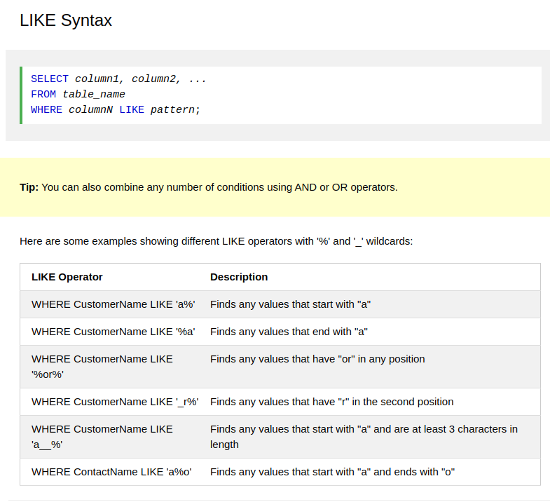


```SQL

mysql>

select title, author_fname
from books
where author_fname like '%da%';
+-------------------------------------------+--------------+
| title                                     | author_fname |
+-------------------------------------------+--------------+
| A Hologram for the King: A Novel          | Dave         |
| The Circle                                | Dave         |
| A Heartbreaking Work of Staggering Genius | Dave         |
| Oblivion: Stories                         | David        |
| Consider the Lobster                      | David        |
| 10% Happier                               | Dan          |
| fake_book                                 | Freida       |
+-------------------------------------------+--------------+
7 rows in set (0.00 sec)

```
- Case insensitive
- read as select title and author first name from books where author first name has anything - da - anything
- `WHERE author_lname LIKE 'Dave' ` is the same as `WHERE author_lname ='Dave'`

<br>

**Another example:**
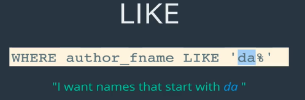
- searching reddit uses like, we dont want to retrieve anything exact

<br>

**Another example:**
- I want to select books where stock quantity is 4 characters long
- underscore is a way to specify exactly one character
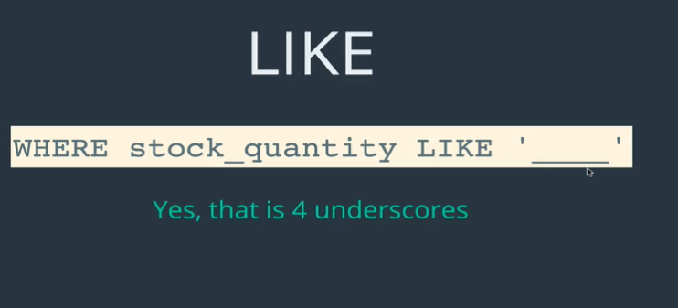
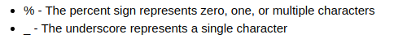

<br>


- we use an escape character


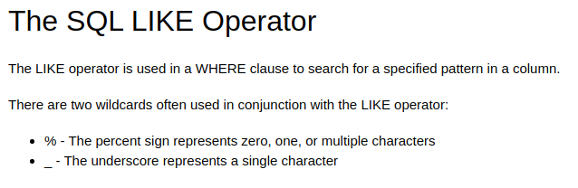

```java

mysql> select title from books where title like '%\_%'
    -> ;
+-----------+
| title     |
+-----------+
| fake_book |
+-----------+

```

<br>

### Refining Selection Exercises
**Example 1:**
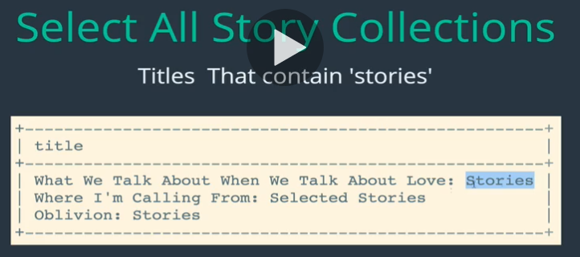


```sql
mysql> select title from books where title like '%stories%';
+-----------------------------------------------------+
| title                                               |
+-----------------------------------------------------+
| What We Talk About When We Talk About Love: Stories |
| Where I'm Calling From: Selected Stories            |
| Oblivion: Stories                                   |

```

<br>

**Example 2:**
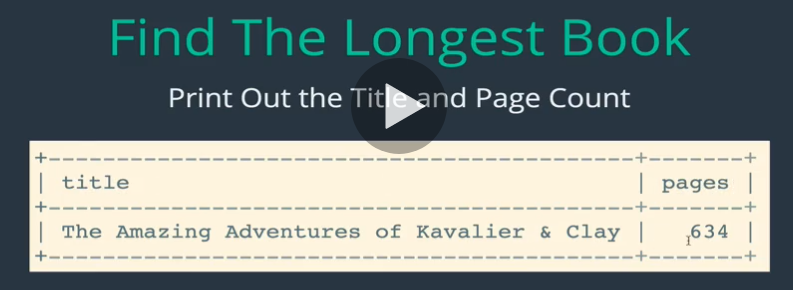


```sql
mysql> select title, pages from books where pages =(select MAX(pages) from books);
+-------------------------------------------+-------+
| title                                     | pages |
+-------------------------------------------+-------+
| The Amazing Adventures of Kavalier & Clay |   634 |
+-------------------------------------------+-------+
1 row in set (0.00 sec)

```


<br>

**Example 3:**
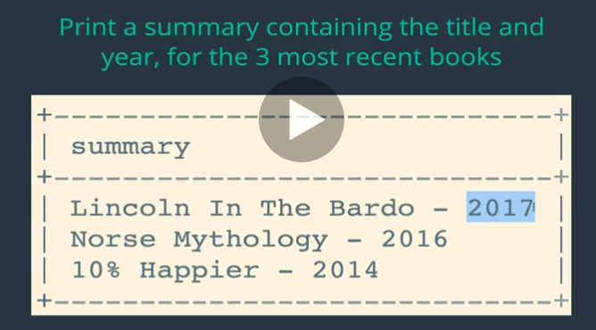


```sql
mysql> select concat(title, ' - ', released_year) as summary  from books order by released_year desc limit 3;
+-----------------------------+
| summary                     |
+-----------------------------+
| Lincoln In The Bardo - 2017 |
| Norse Mythology - 2016      |
| 10% Happier - 2014          |
+-----------------------------+
3 rows in set (0.00 sec)

```
<br>

**Example:**

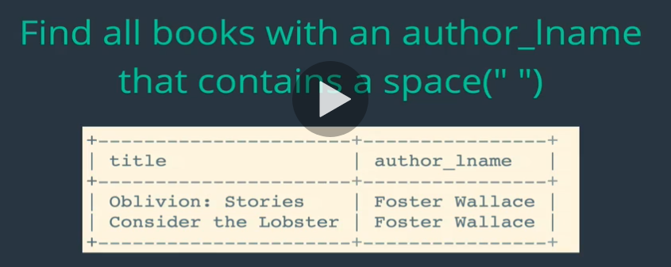

```sql
select title, author_lname from books where author_lname like '%; %'
```
<br>

**Example 4:**


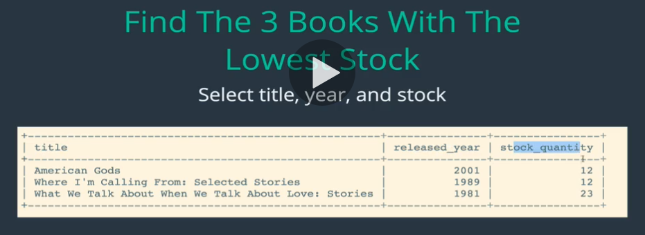

```sql
mysql> select title, released_year, stock_quantity from books order by stock_quantity asc limit 3;
+-----------------------------------------------------+---------------+----------------+
| title                                               | released_year | stock_quantity |
+-----------------------------------------------------+---------------+----------------+
| Where I'm Calling From: Selected Stories            |          1989 |             12 |
| American Gods                                       |          2001 |             12 |
| What We Talk About When We Talk About Love: Stories |          1981 |             23 |
+-----------------------------------------------------+---------------+----------------+

```

<br>

**Example 5:**

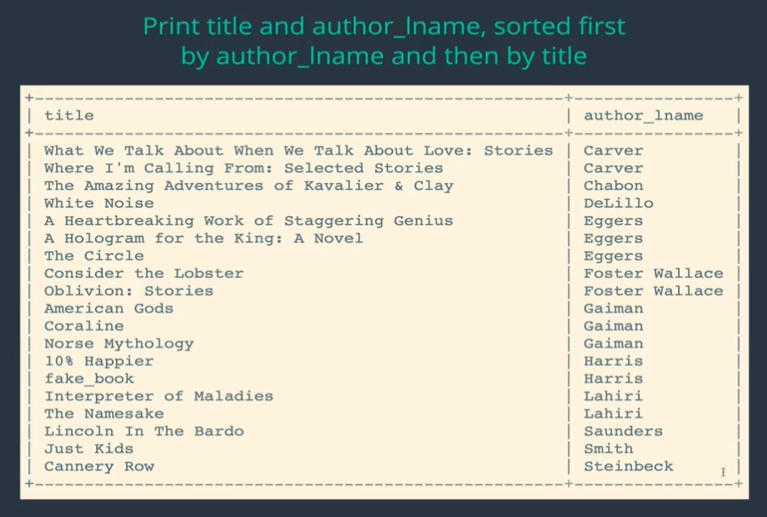


```sql

mysql> select title, author_lname from books order by author_lname, title;
+-----------------------------------------------------+----------------+
| title                                               | author_lname   |
+-----------------------------------------------------+----------------+
| What We Talk About When We Talk About Love: Stories | Carver         |
| Where I'm Calling From: Selected Stories            | Carver         |
| The Amazing Adventures of Kavalier & Clay           | Chabon         |
| White Noise                                         | DeLillo        |
| A Heartbreaking Work of Staggering Genius           | Eggers         |
| A Hologram for the King: A Novel                    | Eggers         |
| The Circle                                          | Eggers         |
| Consider the Lobster                                | Foster Wallace |
| Oblivion: Stories                                   | Foster Wallace |
| American Gods                                       | Gaiman         |
| Coraline                                            | Gaiman         |
| Norse Mythology                                     | Gaiman         |
| 10% Happier                                         | Harris         |
| fake_book                                           | Harris         |
| Interpreter of Maladies                             | Lahiri         |
| The Namesake                                        | Lahiri         |
| Lincoln In The Bardo                                | Saunders       |
| Just Kids                                           | Smith          |
| Cannery Row                                         | Steinbeck      |
+-----------------------------------------------------+----------------+
19 rows in set (0.00 sec)

```
<br>

**Example 6:**

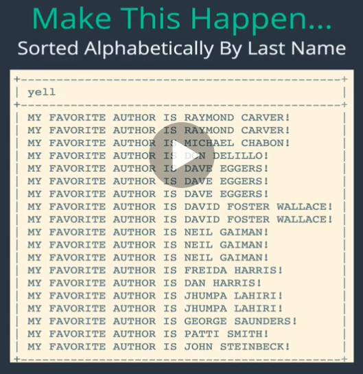

```sql
mysql> select concat('MY FAVORITE AUTHOR IS  ',UPPER(author_fname),' ',UPPER( author_lname), '!') as yell from books order by author_lname;
+----------------------------------------------+
| yell                                         |
+----------------------------------------------+
| MY FAVORITE AUTHOR IS  RAYMOND CARVER!       |
| MY FAVORITE AUTHOR IS  RAYMOND CARVER!       |
| MY FAVORITE AUTHOR IS  MICHAEL CHABON!       |
| MY FAVORITE AUTHOR IS  DON DELILLO!          |
| MY FAVORITE AUTHOR IS  DAVE EGGERS!          |
| MY FAVORITE AUTHOR IS  DAVE EGGERS!          |
| MY FAVORITE AUTHOR IS  DAVE EGGERS!          |
| MY FAVORITE AUTHOR IS  DAVID FOSTER WALLACE! |
| MY FAVORITE AUTHOR IS  DAVID FOSTER WALLACE! |
| MY FAVORITE AUTHOR IS  NEIL GAIMAN!          |
| MY FAVORITE AUTHOR IS  NEIL GAIMAN!          |
| MY FAVORITE AUTHOR IS  NEIL GAIMAN!          |
| MY FAVORITE AUTHOR IS  DAN HARRIS!           |
| MY FAVORITE AUTHOR IS  FREIDA HARRIS!        |
| MY FAVORITE AUTHOR IS  JHUMPA LAHIRI!        |
| MY FAVORITE AUTHOR IS  JHUMPA LAHIRI!        |
| MY FAVORITE AUTHOR IS  GEORGE SAUNDERS!      |
| MY FAVORITE AUTHOR IS  PATTI SMITH!          |
| MY FAVORITE AUTHOR IS  JOHN STEINBECK!       |
+----------------------------------------------+
19 rows in set (0.00 sec)

```
