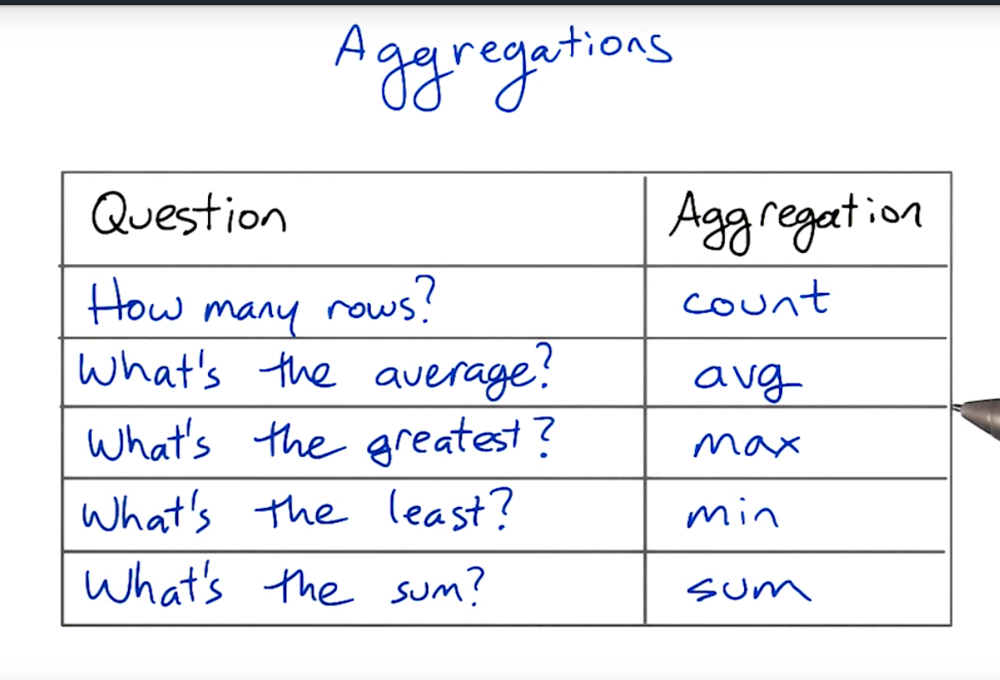
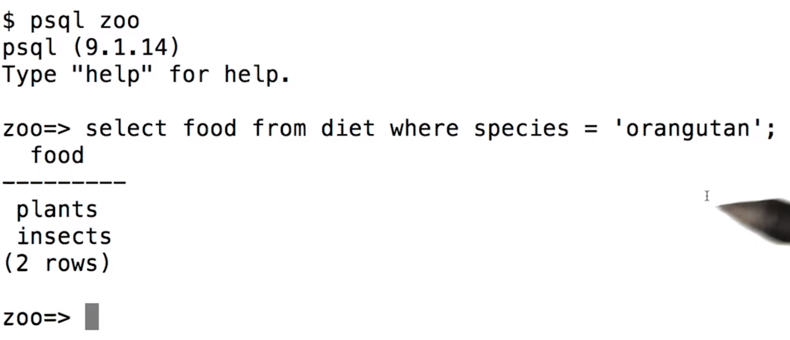

# What is a DB anyways

#### In Memory data storage
- temporary data
- stored in variables
- Gives us temporary storage while program runs
#### Durable Storage
- flat files on disks
  - text, XML, JSON
- databases
  - relational DB
  - key-values
- gives us permanent storage
- Why bother with DBs if we can also use a file to persist?
  - speed and ease
  - Multiple programs and users can access and modify data at the same time

###How do Relationals DB store data
- Tables
  - Collection of related entries
- Every column in a DB table will have a type associated to it

###Anatomy of a table

##### Aggregation
- a operation that summarizes multiple rows into a single row

- any time we ant to compute a single result from a set of values that is an aggregation

- why not make multiple columns? we do not know how much we would need to make in advance
- aggregate functions wont work

 

##### SELECT column1,.. FROM tableName WHERE condition

 
 

- DB will send back a results table
- result table: table sent back after a query which contains the info we asked for

- note: a table is returned

 
 

#### Related Tables
- in a DB we usually have multiple related tables

- a value with the same meaning can appear in different tables and have different column names
- we can derive new tables by linking up existing tables using joins
- in Table Pictures, id 3 refers to

###Uniqueness and Keys
- in a lot of databases we are storing unique entities
  - EX: individual people, locations, etc
- Whenever we want to unambiguously relate a row (entry/record) of one table to a row of another we need to have a unique value to talk about that things

- Examples: userId, CommentIds, etc

- country is a natural unique Key
- postal codes for cities is an example

- Drivers license is not, not everyone Driver
- StudentId is the best

####Primary and Foreign Key
- a Primary-Foreign Key relationship defines a One to Many relationship (1:n) between two tables in a RDB
- This key pair links two tables of a DB
- the Parent table has a primary key (key that uniquely defines each row of parent DB
  the Child Table has a Primary key, used for linking and a Foreign key (column which matches with the Primary key of Parent table) which links it to the Parent table

select name from animals where birthdate >= '1995-01-01' and birthdate <= '1998-12-31' and species ='llama'

# Part 2

#### Types in SQL

- text
- Integer
- date
  - always put a quote around dates

How would we find the names of all the animals that are not gorillas and not named Max?

SELECT name FROM Animals WHERE (NOT species ='gorillas') AND (NOT name = 'max')

